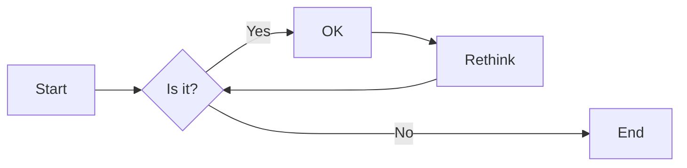
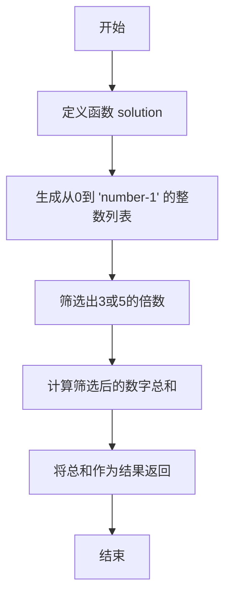
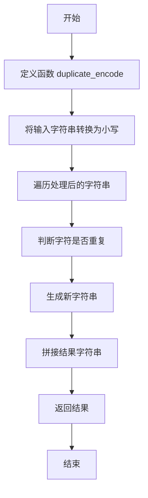
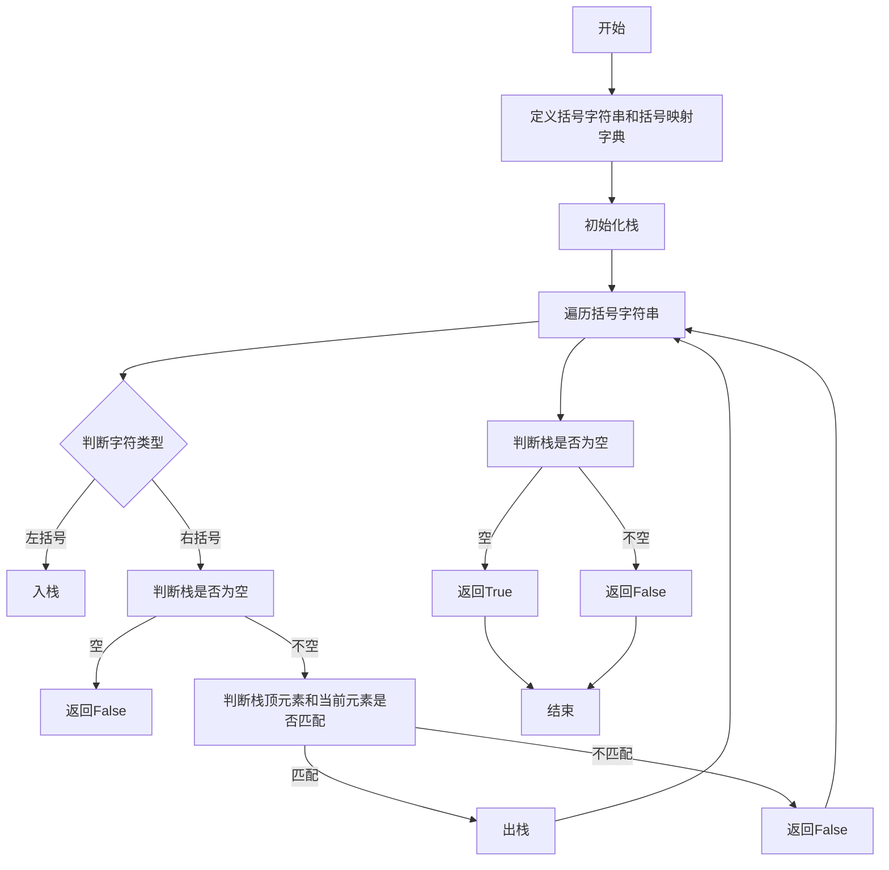
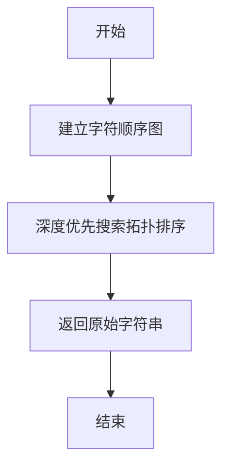
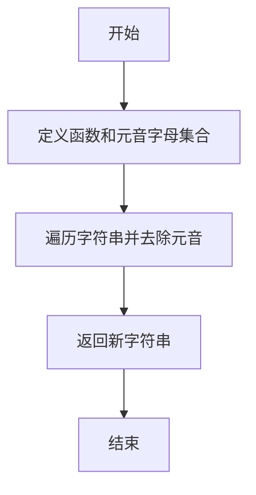

# 实验三 Python列表

班级： 21计科2

学号： B20210302217

姓名： 刘青

Github地址：<https://github.com/RonaWhite/python>

CodeWars地址：<https://www.codewars.com/users/RonaWhite>

---

## 实验目的

1. 学习Python的简单使用和列表操作
2. 学习Python中的if语句

## 实验环境

1. Git
2. Python 3.10
3. VSCode
4. VSCode插件

## 实验内容和步骤

### 第一部分

Python列表操作

完成教材《Python编程从入门到实践》下列章节的练习：

- 第3章 列表简介
- 第4章 操作列表
- 第5章 if语句

---

### 第二部分

在[Codewars网站](https://www.codewars.com)注册账号，完成下列Kata挑战：

---

#### 第一题：3和5的倍数（Multiples of 3 or 5）

难度： 6kyu

如果我们列出所有低于 10 的 3 或 5 倍数的自然数，我们得到 3、5、6 和 9。这些数的总和为 23. 完成一个函数，使其返回小于某个整数的所有是3 或 5 的倍数的数的总和。此外，如果数字为负数，则返回 0。

注意：如果一个数同时是3和5的倍数，应该只被算一次。

**提示：首先使用列表解析得到一个列表，元素全部是3或者5的倍数。
使用sum函数可以获取这个列表所有元素的和.**

代码提交地址：
<https://www.codewars.com/kata/514b92a657cdc65150000006>

---

#### 第二题： 重复字符的编码器（Duplicate Encoder）

难度： 6kyu

本练习的目的是将一个字符串转换为一个新的字符串，如果新字符串中的每个字符在原字符串中只出现一次，则为"("，如果该字符在原字符串中出现多次，则为")"。在判断一个字符是否是重复的时候，请忽略大写字母。

例如:

```python
"din"      =>  "((("
"recede"   =>  "()()()"
"Success"  =>  ")())())"
"(( @"     =>  "))(("
```

代码提交地址:
<https://www.codewars.com/kata/54b42f9314d9229fd6000d9c>

---

#### 第三题：括号匹配（Valid Braces）

难度：6kyu

写一个函数，接收一串括号，并确定括号的顺序是否有效。如果字符串是有效的，它应该返回True，如果是无效的，它应该返回False。
例如：

```python
"(){}[]" => True 
"([{}])" => True
 "(}" => False
 "[(])" => False 
"[({})](]" => False
```

**提示：
python中没有内置堆栈数据结构，可以直接使用`list`来作为堆栈，其中`append`方法用于入栈，`pop`方法可以出栈。**

代码提交地址
<https://www.codewars.com/kata/5277c8a221e209d3f6000b56>

---

#### 第四题： 从随机三元组中恢复秘密字符串(Recover a secret string from random triplets)

难度： 4kyu

有一个不为你所知的秘密字符串。给出一个随机三个字母的组合的集合，恢复原来的字符串。

这里的三个字母的组合被定义为三个字母的序列，每个字母在给定的字符串中出现在下一个字母之前。"whi "是字符串 "whatisup "的一个三个字母的组合。

作为一种简化，你可以假设没有一个字母在秘密字符串中出现超过一次。

对于给你的三个字母的组合，除了它们是有效的三个字母的组合以及它们包含足够的信息来推导出原始字符串之外，你可以不做任何假设。特别是，这意味着秘密字符串永远不会包含不出现在给你的三个字母的组合中的字母。

测试用例：

```python
secret = "whatisup"
triplets = [
  ['t','u','p'],
  ['w','h','i'],
  ['t','s','u'],
  ['a','t','s'],
  ['h','a','p'],
  ['t','i','s'],
  ['w','h','s']
]
test.assert_equals(recoverSecret(triplets), secret)
```

代码提交地址：
<https://www.codewars.com/kata/53f40dff5f9d31b813000774/train/python>

提示：

- 利用集合去掉`triplets`中的重复字母，得到字母集合`letters`，最后的`secret`应该由集合中的字母组成，`secret`长度也等于该集合。

```python
letters = {letter for triplet in triplets for letter in triplet }
length = len(letters)
```

- 创建函数`check_first_letter(triplets, first_letter)`，检测一个字母是不是secret的首字母，返回True或者False。
- 创建函数`remove_first_letter(triplets, first_letter)`,  从三元组中去掉首字母，返回新的三元组。
- 遍历字母集合letters，利用上面2个函数得到最后的结果`secret`。

---

#### 第五题： 去掉喷子的元音（Disemvowel Trolls）

难度： 7kyu

喷子正在攻击你的评论区!
处理这种情况的一个常见方法是删除喷子评论中的所有元音(字母：a,e,i,o,u)，以消除威胁。
你的任务是写一个函数，接收一个字符串并返回一个去除所有元音的新字符串。
例如，字符串 "This website is for losers LOL!"   将变成 "Ths wbst s fr lsrs LL!".

注意：对于这个Kata来说，y不被认为是元音。
代码提交地址：
<https://www.codewars.com/kata/52fba66badcd10859f00097e>

提示：

- 首先使用列表解析得到一个列表，列表中所有不是元音的字母。
- 使用字符串的join方法连结列表中所有的字母，例如：

```python
last_name = "lovelace"
letters = [letter for letter in last_name ]
print(letters) # ['l', 'o', 'v', 'e', 'l', 'a', 'c', 'e']
name = ''.join(letters) # name = "lovelace"
```

---

### 第三部分

使用Mermaid绘制程序流程图

安装VSCode插件：

- Markdown Preview Mermaid Support
- Mermaid Markdown Syntax Highlighting

使用Markdown语法绘制你的程序绘制程序流程图（至少一个），Markdown代码如下：


显示效果如下：



查看Mermaid流程图语法-->[点击这里](https://mermaid.js.org/syntax/flowchart.html)

使用Markdown编辑器（例如VScode）编写本次实验的实验报告，包括[实验过程与结果](#实验过程与结果)、[实验考查](#实验考查)和[实验总结](#实验总结)，并将其导出为 **PDF格式** 来提交。

## 实验过程与结果

### 第一部分 Python列表操作和if语句

### 第3章 列表简介

#### 3-1 姓名

```python
names = ['Roy', 'Rona', 'Lily']
 
print(names[0])
print(names[1])
print(names[2])
```

运行结果：

```python
Roy
Rona
Lily
```

#### 3-2 问候语

```python
names = ['Roy','Rona',"Lily"]
print(f"{names[0]},good morning!")
print(f"{names[1]},good morning!")
print(f"{names[2]},good morning!")
```

运行结果：

```python
Roy,good morning!
Rona,good morning!
Lily,good morning!
```

#### 3-3 自己的列表

```python
bicycles = ['car','Honda motorcycle']
print(f"I would like to own a {bicycles[0]}.")
print(f"I would like to own a {bicycles[1]}.")
```

运行结果：

```python
I would like to own a car.
I would like to own a Honda motorcycle.
```

#### 3-4 嘉宾名单

```python
guests = ['Fancy','Bob','Alice']
print(f"我想要邀请的客人是:{guests[0]},{guests[1]},{guests[2]}")
```

运行结果：

```python
我想要邀请的客人是:Fancy,Bob,Alice
```

#### 3-5 修改嘉宾名单

```python
guests = ['Fancy','Bob','Alice']
print(f"我想要邀请的客人是:{guests[0]},{guests[1]},{guests[2]}")
print(f"但是非常遗憾{guests[0]}无法赴约")
guests.pop(0)
guests.append('Sandra')
print(f"我想邀请的客人是:{guests[0]},{guests[1]},{guests[2]}")
```

运行结果：

```python
我想要邀请的客人是:Fancy,Bob,Alice
但是非常遗憾Fancy无法赴约
我想邀请的客人是:Bob,Alice,Sandra
```

#### 3-6 添加嘉宾

```python
guests = ['Fancy','Bob','Alice']
print(f"我想要邀请的客人是:{guests[0]},{guests[1]},{guests[2]}")

print(f"但是非常遗憾{guests[0]}无法赴约")
guests.pop(0)
guests.append('Sandra')

print(f"我想邀请的客人是:{guests[0]},{guests[1]},{guests[2]}")
print("但是我找到了一个更大的餐桌，我将还会邀请三位朋友")
guests.insert(0,'Cindy')
guests.insert(2,'David')
guests.append('Ella')
print(f"我想要邀请的客人是:{guests[0]},{guests[1]},{guests[2]},{guests[3]},{guests[4]},{guests[5]}")
```

运行结果：

```python
我想要邀请的客人是:Fancy,Bob,Alice
但是非常遗憾Fancy无法赴约
我想邀请的客人是:Bob,Alice,Sandra
但是我找到了一个更大的餐桌，我将还会邀请三位朋友
我想要邀请的客人是:Cindy,Bob,David,Alice,Sandra,Ella
```

#### 3-7 缩减名单

```python
guests = ['Fancy','Bob','Alice']
print(f"我想要邀请的客人是:{guests[0]},{guests[1]},{guests[2]}")
print(f"但是非常遗憾{guests[0]}无法赴约")
guests.pop(0)
guests.append('Sandra')

print(f"我想邀请的客人是:{guests[0]},{guests[1]},{guests[2]}")
print("但是我找到了一个更大的餐桌，我将还会邀请三位朋友")
guests.insert(0,'Cindy')
guests.insert(2,'David')
guests.append('Ella')

print(f"我想要邀请的客人是:{guests[0]},{guests[1]},{guests[2]},{guests[3]},{guests[4]},{guests[5]}")
print("由于一些原因，最后我只能邀请两位客人，非常抱歉")
print(f"我很抱歉无法邀请{guests[5]}你来共进晚餐")
guests.pop()
print(f"我很抱歉无法邀请{guests[4]}你来共进晚餐")
guests.pop()
print(f"我很抱歉无法邀请{guests[3]}你来共进晚餐")
guests.pop()
print(f"我很抱歉无法邀请{guests[2]}你来共进晚餐")
guests.pop()
print(f"{guests[1]},邀请你来共进晚餐")
print(f"{guests[0]},邀请你来共进晚餐")
del guests[1]
del guests[0]
print(guests)
```

运行结果：

```python
我想要邀请的客人是:Fancy,Bob,Alice
但是非常遗憾Fancy无法赴约
我想邀请的客人是:Bob,Alice,Sandra
但是我找到了一个更大的餐桌，我将还会邀请三位朋友    
我想要邀请的客人是:Cindy,Bob,David,Alice,Sandra,Ella
由于一些原因，最后我只能邀请两位客人，非常抱歉      
我很抱歉无法邀请Ella你来共进晚餐
我很抱歉无法邀请Sandra你来共进晚餐
我很抱歉无法邀请Alice你来共进晚餐
我很抱歉无法邀请David你来共进晚餐
Bob,邀请你来共进晚餐
Cindy,邀请你来共进晚餐
```

#### 3-8 放眼世界

```python
cities = ['beijing','yunnan','hangzhou','shanghai','anhui']
print(cities)
print(sorted(cities))
print(cities)
cities.reverse()
print(cities)
cities.reverse()
print(cities)
cities.sort()
print(cities)
cities.sort(reverse=True)
print(cities)
```

运行结果：

```python
['beijing', 'yunnan', 'hangzhou', 'shanghai', 'anhui']
['anhui', 'beijing', 'hangzhou', 'shanghai', 'yunnan']
['beijing', 'yunnan', 'hangzhou', 'shanghai', 'anhui']
['anhui', 'shanghai', 'hangzhou', 'yunnan', 'beijing']
['beijing', 'yunnan', 'hangzhou', 'shanghai', 'anhui']
['anhui', 'beijing', 'hangzhou', 'shanghai', 'yunnan']
['yunnan', 'shanghai', 'hangzhou', 'beijing', 'anhui']
```

#### 3-9 晚餐嘉宾

```python
guests = ['Fancy','Bob','Alice']
print(f"我想要邀请的客人是:{guests[0]},{guests[1]},{guests[2]}")
number = len(guests)
print(f"一共邀请了{number}位客人")
```

运行结果：

```python
我想要邀请的客人是:Fancy,Bob,Alice
一共邀请了3位客人
```

### 第4章 操作列表

#### 4-1 比萨

```python
pizzas = ["pizza_a","pizza_b","pizza_c"]
for pizza in pizzas:
    print("I Like" + pizza +"!")
print("I like pizza!")
```

运行结果：

```python
I Likepizza_a!
I Likepizza_b!
I Likepizza_c!
I like pizza!
```

#### 4-2 动物

```python
animals=["monkey","snake","rabbit"]
for animal in animals:
    print("My favourite animal is "+ animal +"!")
print("Any oftheseanimals would makea great pet!")
```

运行结果：

```python
My favourite animal is monkey!
My favourite animal is snake!
My favourite animal is rabbit!
Any oftheseanimals would makea great pet!
```

#### 4-3 数到20

```python
for a_number in range(1,21):
    print(a_number)
```

#### 4-4 一百万

```python
numbers = list(range(1,1000001))   #标题要求先创建一个列表
for number in numbers:
    print(number)
```

#### 4-5 计算1~1 000 000的总和

```python
b_numbers = list(range(1,1000001))
print(max(b_numbers))
print(min(b_numbers))
print("最大值为："+str(max(b_numbers))+"；"+"\n最小值为："+str(min(b_numbers))) #字符串只能和字符串拼接，不能直接和int类型拼接
print(sum(b_numbers))
```

运行结果：

```python
1000000
1
最大值为：1000000；
最小值为：1        
500000500000
```

#### 4-6 奇数

```python
c_numbers = list(range(1,21,2))
for c_number in c_numbers:
    print(c_number)
```

运行结果：

```python
1
3
5
7
9
11
13
15
17
19
```

#### 4-7 3的倍数

```python
numbers = []
for number in range(3,31,3):
    numbers.append(number)
print(numbers)  #仅将数字以一个列表形式打印

numbers = list(range(3,31,3))
for number in numbers:
    print(number)  #for循环代码块中必须有语句，否则会报错
print(numbers)  #先逐一打印数字，再将数字以一个列表形式打印
```

运行结果：

```python
[3, 6, 9, 12, 15, 18, 21, 24, 27, 30]
3
6
9
12
15
18
21
24
27
30
[3, 6, 9, 12, 15, 18, 21, 24, 27, 30]
```

#### 4-8 立方

```python
numbers = []
for number in range(1,11):
    number = number ** 3
    numbers.append(number)
    print(number)
print(numbers)
```

运行结果：

```python
1
8
27
64
125
216
343
512
729
1000
[1, 8, 27, 64, 125, 216, 343, 512, 729, 1000]
```

#### 4-9 立方解析

```python
numbers = [number **3 for number in range(1,11)]
print(numbers)
```

运行结果：

```python
[1, 8, 27, 64, 125, 216, 343, 512, 729, 1000]
```

#### 4-10 切片

```python
numbers = [number **2 for number in range(1,11)]
print("The first three items in the list are:"+str(numbers[:3]))
print("Three items from the middle of the list are:"+str(numbers[3:6]))
print("The last three items in the list are::"+str(numbers[-3:]))
```

运行结果：

```python
The first three items in the list are:[1, 4, 9]
Three items from the middle of the list are:[16, 25, 36]
The last three items in the list are::[64, 81, 100]
```

#### 4-11 你的比萨和我的比萨

```python
pizzas = ["pizza_a","pizza_b","pizza_c"]
friend_pizzas = pizzas[:]  #复制列表到friend_pizzas中

pizzas.append("pizza_new")
friend_pizzas.append("pizza_new_firend")

print("My favorite pizzas are:")
for pizza in pizzas:
    print(pizza)
    
print("My friend's favorite pizzas are:" )
for pizza in friend_pizzas:
    print(pizza)
```

运行结果：

```python
My favorite pizzas are:
pizza_a
pizza_b
pizza_c
pizza_new
My friend's favorite pizzas are:
pizza_a
pizza_b
pizza_c
pizza_new_firend
```

#### 4-12 使用多个循环

```python
pizzas = ["pizza_a","pizza_b","pizza_c"]
friend_pizzas = pizzas[:]  #复制列表到friend_pizzas中

pizzas.append("pizza_new")
friend_pizzas.append("pizza_new_firend")

print("My favorite pizzas are:")
for pizza in pizzas:
    print(pizza)
    
print("My friend's favorite pizzas are:" )
for pizza in friend_pizzas:
    print(pizza)
```

运行结果：

```python
My favorite pizzas are:
pizza_a
pizza_b
pizza_c
pizza_new
My friend's favorite pizzas are:
pizza_a
pizza_b
pizza_c
pizza_new_firend
```

#### 4-13 自助餐

```python
foods = ("rice","noodle","apple","meat","potato")

for food in foods:
    print(food)
    
#foods[0]="banana"   直接更改元素会报错 

foods = ("rice_a","noodle_a","apple","meat","potato")
for food in foods:
    print(food)
```

运行结果：

```python
rice
noodle
apple
meat
potato
rice_a
noodle_a
apple
meat
potato
```

#### 第5章 if语句

#### 5-1 条件测试

```python
car = 'audi'
print(car == 'subaru')
print(car == 'audi')
 
name = 'Louie'
print(name == 'link')
print(name == 'louie')
print(name.lower() == 'louie')
```

运行结果：

```python
False
True
False
False
True
```

#### 5-2 更多的条件测试

```python
name_1 = 'louie'
name_3 = 'Louie'
# 字符串比较
print(name_1 == name_3)
print(name_1 == name_3.lower())
 
num_1 = 5
num_2 = 9
# 数字比较
print(num_1 == num_2)
print(num_1 != num_2)
print(num_1 > num_2)
print(num_1 < num_2)
 
# 使用 and 和 or 来比较
if num_1 > 5 and num_2 > 5:
    print("This is true")
else:
    print("This is False")
 
if num_1 > 5 or num_2 > 5:
    print("This is true")
else:
    print("This is False")
 
names = ['louie', 'link', 'lisa', 'park']
name = 'links'
 
if name in names:
    print(name + " in the list names")
else:
    print(name + " not in the list names")
```

运行结果：

```python
False
True
False
True
False
True
This is False
This is true
links not in the list names
```

#### 5-3 外星人颜色

```python
alien_color = 'red'
 
if alien_color == 'green':
    print("You got 5 point!~")
else:
    print("Keep up the good work!!!")
```

运行结果：

```python
Keep up the good work!!!
```

#### 5-4 外星人颜色 #2

```python
alien_color = 'red'

if alien_color == 'green':
    print("You got 5 point!~")
else:
    print("You got 10 point!~")
```

运行结果：

```python
You got 10 point!~
```

#### 5-5 外星人颜色 #3

```python
alien_color = 'yellow'
 
if alien_color == 'green':
    print("You got 5 point!~")
elif alien_color == 'yellow':
    print("You got 10 point!~")
else:
    print("You got 15 point!~")
```

运行结果：

```python
You got 10 point!~
```

#### 5-6 人生的不同阶段

```python
age = 23
 
if age < 2:
    print("baby!~")
elif 2 <= age < 4:
    print("child")
elif 4 <= age < 13:
    print("children")
elif 13 <= age < 20:
    print("teenagers!~")
elif 20 <= age < 65:
    print("adults!~")
else:
    print("The elderly!~")
```

运行结果：

```python
adults!~
```

#### 5-7 喜欢的水果

```python
favorite_fruits = ['banana', 'apple', 'orange']
 
if "apple" in favorite_fruits:
    print("You really like apple!")
if "orange" in favorite_fruits:
    print("You really like orange!")
if "orange" in favorite_fruits:
    print("You really like orange!")
if "milk" in favorite_fruits:
    print("You really like milk!")
else:
    print("The pears not list")
```

运行结果：

```python
You really like apple!
You really like orange!
You really like orange!
The pears not list
```

#### 5-8 以特殊方式跟管理员打招呼

```python
user_names = ['admin', 'link', 'administrator', 'lisa', 'guest']
for user_name in user_names:
    # print("Welcome to " + user_name)
 
    if user_name == 'admin':
        print("Hello admin, would you like to see a status report?")
    else:
        print("Hello Eric, thank you for logging in again")
```

运行结果：

```python
Hello admin, would you like to see a status report?
Hello Eric, thank you for logging in again
Hello Eric, thank you for logging in again
Hello Eric, thank you for logging in again
Hello Eric, thank you for logging in again
```

#### 5-9 处理没有用户的情形

```python
user_names = ['admin', 'link', '', 'administrator', 'lisa', 'guest']
 
for user_name in user_names:
    if user_name == '':
        print("We need to find some users!")
    elif user_name == 'admin':
        print("Hello admin, would you like to see a status report?")
    else:
        print("Hello Eric, thank you for logging in again")
```

运行结果：

```python
Hello admin, would you like to see a status report?
Hello Eric, thank you for logging in again
We need to find some users!
Hello Eric, thank you for logging in again
Hello Eric, thank you for logging in again
Hello Eric, thank you for logging in again
```

#### 5-10 检查用户名

```python
current_users = ['ADMIN', 'link', 'administrator', 'lisa', 'guest']
new_users = ['admin', 'GUEST', 'Park', 'tom', 'jams']
new_current_users = []
 
for current_user in current_users:
    new_current_users.append(current_user.lower())
 
for new_user in new_users:
    if new_user.lower() in new_current_users:
        print("用户名: %s 已被使用，请重新输入！~" % new_user)
    else:
        print("Welcome to back!!\n" + new_user)
```

运行结果：

```python
用户名: admin 已被使用，请重新输入！~
用户名: GUEST 已被使用，请重新输入！~
Welcome to back!!
Park
Welcome to back!!
tom
Welcome to back!!
jams
```

#### 5-11 序数

```python
nums = ['1', '2', '3', '4', '5', '6', '7', '8', '9']
 
for num in nums:
    if num == "1":
        print("1st")
    elif num == "2":
        print("2nd")
    elif num == "3":
        print("3rd")
    else:
        print(num + "th")
```

运行结果：

```python
1st
2nd
3rd
4th
5th
6th
7th
8th
9th
```

### 第二部分 Codewars Kata挑战

#### 第一题: 3和5的倍数（Multiples of 3 or 5）

如果我们列出所有低于 10 的 3 或 5 倍数的自然数，我们得到 3、5、6 和 9。这些数的总和为 23. 完成一个函数，使其返回小于某个整数的所有是3 或 5 的倍数的数的总和。此外，如果数字为负数，则返回 0。

代码如下：

```python
def solution(number):
    
    # 从0到number-1的整数
    numbers = [i for i in range(number)]
    
    # 从0到number-1的整数中，3或者5的倍数
    multi3or5 =  [i for i in range(number) if i%3==0 or i%5==0]
    
    # 返回结果
    return sum(multi3or5)    
```

**解题过程描述：**  

1. **函数定义和输入验证**：
   首先，定义一个名为 `solution` 的函数，接受一个整数 `number` 作为参数。

2. **生成整数列表**：
   创建一个列表 `numbers`，包含从0到`number-1`的所有整数。这可以通过列表解析实现：`numbers = [i for i in range(number)]`。

3. **筛选出3或5的倍数**：
   使用列表解析，创建一个新列表 `multi3or5`，其中包含从0到`number-1`的所有是3或5的倍数的整数。这可以通过判断每个数是否能被3或5整除来实现：`multi3or5 = [i for i in range(number) if i % 3 == 0 or i % 5 == 0]`。

4. **计算总和并返回结果**：
   使用内置函数 `sum` 计算列表 `multi3or5` 中所有元素的总和，然后将该总和作为函数的返回值。

整个过程就是首先生成整数列表，然后筛选出符合条件的倍数，最后计算总和并返回。

#### 第二题: 重复字符的编码器（Duplicate Encoder）

本练习的目的是将一个字符串转换为一个新的字符串，如果新字符串中的每个字符在原字符串中只出现一次，则为"("，如果该字符在原字符串中出现多次，则为")"。在判断一个字符是否是重复的时候，请忽略大写字母。

代码如下：

```python
def duplicate_encode(word):
    # 用来保存括号的列表
    result = []
    
    # 将所有字符全部变成小写
    word = word.lower()
    
    # 遍历单词中所有的字符
    for c in word:
        # 如果该字符出现次数大于1次，在列表中添加`)`
        if word.count(c) > 1:
            result.append(')')
        # 如果该字符出现次数大于1次，在列表中添加`(`
        else:
            result.append('(') 
    
    # 将列表中的括号连接成字符串返回
    return ''.join(result)
```

**解题过程描述：**  

1. **函数定义和输入验证**：
   首先，定义一个名为 `duplicate_encode` 的函数，接受一个字符串 `word` 作为参数。

2. **转换为小写**：
   将输入的字符串 `word` 中的所有字符转换为小写，以保证不区分大小写。

3. **遍历字符并判断重复**：
   遍历处理后的字符串的每个字符。对于每个字符，检查在处理后的字符串中是否有多个该字符（重复出现），根据情况添加对应的字符 `'('` 或 `')'` 到结果列表中。

4. **拼接结果字符串**：
   将结果列表中的字符拼接成一个字符串，作为函数的返回值。

整个过程就是遍历原字符串，对于每个字符判断是否重复，并生成新字符串。

#### 第三题: 括号匹配（Valid Braces）

写一个函数，接收一串括号，并确定括号的顺序是否有效。如果字符串是有效的，它应该返回True，如果是无效的，它应该返回False。

代码如下：

```python
braces = "(){}[]" # 括号字符串
dict_braces = {'}': '{', ']': '[', ')': '('}

def validBraces(string):
    stack = [] # 用来保存括号的栈
    for c in string:
        # 如果是左括号，就入栈
        if c in '({[':
            stack.append(c)
        # 如果是右括号
        elif c in ')}]':
            # 如果栈为空，返回False
            if not stack:
                return False
            # 如果栈顶元素和当前元素不匹配，返回False
            if stack[-1] != dict_braces[c]:
                return False
            # 如果栈顶元素和当前元素匹配，就出栈
            else:
                stack.pop()
    # 如果栈为空，返回True
    if not stack:
        return True
    # 如果栈不为空，返回False
    else:
        return False
```

**解题过程描述：**  

1. **定义括号匹配规则**：
   定义了一个括号字符串 `braces`，以及一个字典 `dict_braces`，其中字典用于保存右括号和对应的左括号的映射关系。

2. **初始化栈**：
   创建一个栈 `stack`，用于保存括号。

3. **遍历括号字符串**：
   遍历输入的括号字符串，对于每个字符：
   - 如果是左括号（`(`, `{`, `[`），将其入栈。
   - 如果是右括号(`)`, `}`, `]`)，判断栈是否为空，若为空则返回`False`，否则判断栈顶元素和当前元素是否匹配。若匹配，则出栈；否则返回`False`。

4. **判断栈是否为空**：
   遍历结束后，判断栈是否为空，若为空则返回`True`，表示括号匹配成功；若不为空则返回`False`，表示括号不匹配。

整个过程就是通过遍历括号字符串，利用栈来匹配括号，若最终栈为空则表示括号匹配成功。

#### 第四题: 从随机三元组中恢复秘密字符串(Recover a secret string from random triplets)

有一个不为你所知的秘密字符串。给出一个随机三个字母的组合的集合，恢复原来的字符串。

这里的三个字母的组合被定义为三个字母的序列，每个字母在给定的字符串中出现在下一个字母之前。"whi "是字符串 "whatisup "的一个三个字母的组合。

作为一种简化，你可以假设没有一个字母在秘密字符串中出现超过一次。

对于给你的三个字母的组合，除了它们是有效的三个字母的组合以及它们包含足够的信息来推导出原始字符串之外，你可以不做任何假设。特别是，这意味着秘密字符串永远不会包含不出现在给你的三个字母的组合中的字母。

代码如下：

```python
def recoverSecret(triplets):
    # 创建字典用于存储字符的相对顺序
    graph = {}

    # 构建图，记录字符的相对顺序
    for triplet in triplets:
        for char in triplet:
            if char not in graph:
                graph[char] = set()
    
        graph[triplet[0]].add(triplet[1])
        graph[triplet[1]].add(triplet[2])

    # 使用深度优先搜索（DFS）拓扑排序获取字符的正确顺序
    visited = set()
    result = []

    def dfs(node):
        if node not in visited:
            visited.add(node)
            for neighbor in graph[node]:
                dfs(neighbor)
            result.append(node)

    for node in graph:
        dfs(node)

    # 返回拓扑排序的逆序，即原始字符串
    return ''.join(result[::-1])
```

**解题过程描述：**  

1. **建立字符顺序图**：
   - 首先，我们根据给定的三元组信息构建一个图，图中的节点为字符，边表示字符的相对顺序关系。我们将每个字符作为节点，然后根据三元组建立边，表示字符的相对顺序关系。

2. **深度优先搜索拓扑排序**：
   - 使用深度优先搜索（DFS）对图进行拓扑排序，得到每个字符的正确顺序。

3. **返回原始字符串**：
   - 返回拓扑排序的逆序，即为原始字符串。

整个过程就是通过构建字符顺序图，并使用拓扑排序得到字符的正确顺序，最终恢复原始字符串。

#### 第五题：去掉喷子的元音（Disemvowel Trolls）

喷子正在攻击你的评论区!
处理这种情况的一个常见方法是删除喷子评论中的所有元音(字母：a,e,i,o,u)，以消除威胁。
你的任务是写一个函数，接收一个字符串并返回一个去除所有元音的新字符串。
例如，字符串 "This website is for losers LOL!"   将变成 "Ths wbst s fr lsrs LL!".

代码如下：

```python
def disemvowel(string_):
    vowels = 'aeiouAEIOU'
    disemvoweled_string = ''.join([char for char in string_ if char not in vowels])
    return disemvoweled_string
```

**解题过程描述：**  

1. **定义函数和元音字母集合**：
   - 首先，定义一个名为 `disemvowel` 的函数，接受一个字符串 `string_` 作为参数。
   - 创建一个包含所有元音字母的集合 `vowels`，包括小写和大写的元音字母。

2. **遍历字符串并去除元音**：
   - 遍历输入字符串的每个字符，判断是否为元音字母，如果不是则将其添加到新字符串中。

3. **返回新字符串**：
   - 返回去除元音字母后的新字符串。

整个过程就是遍历字符串，将非元音字母连接起来，形成去除元音的新字符串，最终返回新字符串。

### 第三部分 使用Mermaid绘制程序流程图

#### 第一题: 3和5的倍数(Multiples of 3 or 5)



#### 第二题:重复字符的编码器（Duplicate Encoder）



#### 第三题： 括号匹配（Valid Braces）



#### 第四题:从随机三元组中恢复秘密字符串(Recover a secret string from random triplets)



#### 第五题: 去掉喷子的元音（Disemvowel Trolls）



## 实验考查

**1. Python中的列表可以进行哪些操作？**

Python中的列表（List）可以进行多种操作，包括但不限于：

1. **添加和移除元素**：
   - `append(item)`: 在列表末尾添加一个元素。
   - `extend(iterable)`: 将可迭代对象的元素追加到列表末尾。
   - `insert(index, item)`: 在指定位置插入一个元素。

2. **访问元素**：
   - 通过索引访问单个元素，例如 `my_list[index]`。
   - 使用切片（slice）来访问多个元素，例如 `my_list[start:end]`。

3. **修改元素**：
   - 通过索引直接赋值修改元素的值，例如 `my_list[index] = new_value`。

4. **列表操作**：
   - `sort()`: 对列表进行原地排序。
   - `reverse()`: 将列表中的元素逆序排列。
   - `count(item)`: 统计列表中某个元素出现的次数。

5. **移除元素**：
   - `remove(item)`: 移除列表中第一个匹配的元素。
   - `pop(index)`: 移除指定位置的元素并返回该元素。

6. **查询元素**：
   - `index(item)`: 返回元素首次出现的索引。

7. **列表长度和其他信息**：
   - `len()`: 返回列表中元素的个数。
   - `min()`: 返回列表中最小的元素。
   - `max()`: 返回列表中最大的元素.

8. **复制和合并**：
   - `copy()`: 创建列表的浅拷贝。
   - `+` 操作符: 用于合并两个列表。

9. **清空和删除**：
   - `clear()`: 清空列表中的所有元素。
   - `del`: 删除列表或指定位置的元素。

**2. 哪两种方法可以用来对Python的列表排序？这两种方法有和区别？**

在Python中，可以使用两种方法对列表进行排序：

1. **使用 `sorted()` 函数**：
   - `sorted(iterable, key=key, reverse=reverse)` 函数返回一个新的已排序的列表，不修改原始列表。
   - `key`: 可选参数，用于指定用于排序的函数。
   - `reverse`: 可选参数，如果设置为 `True`，则降序排序，默认为 `False`，即升序排序。

   示例：

   ```python
   my_list = [3, 1, 4, 1, 5, 9, 2, 6, 5, 3]
   sorted_list = sorted(my_list)
   print(sorted_list)  # 输出: [1, 1, 2, 3, 3, 4, 5, 5, 6, 9]
   ```

2. **使用 `sort()` 方法**：
   - `list.sort(key=key, reverse=reverse)` 方法原地对列表进行排序，会修改原始列表。
   - `key`: 可选参数，用于指定用于排序的函数。
   - `reverse`: 可选参数，如果设置为 `True`，则降序排序，默认为 `False`，即升序排序。

   示例：

   ```python
   my_list = [3, 1, 4, 1, 5, 9, 2, 6, 5, 3]
   my_list.sort()
   print(my_list)  # 输出: [1, 1, 2, 3, 3, 4, 5, 5, 6, 9]
   ```

**区别：**

- `sorted()` 函数返回一个新的已排序列表，不修改原始列表，而 `sort()` 方法会修改原始列表。
- `sorted()` 可以应用于任何可迭代对象（如列表、元组、字符串等），而 `sort()` 方法只能用于列表。
- `sorted()` 返回一个新的已排序列表，因此适用于对不可变序列进行排序，而 `sort()` 方法原地排序，适用于对可变序列进行排序，避免了额外的内存开销。

**3. 如何将Python列表逆序打印？**

要将Python列表逆序打印，可以通过以下两种方法实现：

1. **使用切片逆序打印**：
   可以使用切片操作逆序打印列表，将步长设为-1，这样可以从后往前逆序遍历列表。

   示例：

   ```python
   my_list = [1, 2, 3, 4, 5]
   reversed_list = my_list[::-1]
   print(reversed_list)  # 输出: [5, 4, 3, 2, 1]
   ```

2. **使用`reversed()`函数**：
   可以使用内置函数 `reversed()` 对列表进行逆序遍历。

   示例：

   ```python
   my_list = [1, 2, 3, 4, 5]
   for item in reversed(my_list):
       print(item)
   # 输出:
   # 5
   # 4
   # 3
   # 2
   # 1
   ```

这两种方法可以实现逆序打印列表的元素。第一种方法生成一个逆序的新列表，而第二种方法直接在循环中逆序遍历，不生成新的逆序列表。选择方法取决于具体的需求。

**4. Python中的列表执行哪些操作时效率比较高？哪些操作效率比较差？是否有类似的数据结构可以用来替代列表？**

在Python中，列表（List）是一种非常灵活和常用的数据结构，但不同的操作可能会有不同的效率。以下是一些列表操作的效率情况：

**高效操作**：

1. **索引访问和赋值**：通过索引访问和赋值列表元素的操作是高效的，时间复杂度为 O(1)。
2. **尾部操作**：在列表尾部进行添加和删除操作（`append()`、`pop()`、`extend()`等）也是高效的，时间复杂度为 O(1)。

**低效操作**：

1. **插入和删除中间元素**：在列表中间插入或删除元素（`insert()`、`pop(index)`等）是低效的，平均时间复杂度为 O(n)，因为必须移动元素以保持列表的顺序。
2. **合并列表**：使用 `+` 操作符合并两个列表时，需要创建一个新的列表，并将两个列表的元素复制到新列表中，效率较低，时间复杂度为 O(m+n)，其中 m 和 n 分别是两个列表的长度。

对于需要高效地在中间插入、删除或合并元素的操作，可以考虑使用其他数据结构，如链表（LinkedList）或双向链表（Doubly Linked List）。链表的插入、删除和合并操作可以在常量时间内完成，但访问元素的效率较低，需要线性时间。

在 Python 中，可以使用 `collections.deque` 来实现双向链表，它提供了高效的头尾操作，适合需要频繁在两端进行操作的场景。

总的来说，根据具体的操作需求选择合适的数据结构，以实现高效的操作。列表适用于大多数情况，但对于特定需求，可以考虑其他数据结构来提高效率。

**5. 阅读《Fluent Python》Chapter 2. An Array of Sequence - Tuples Are Not Just Immutable Lists小节（p30-p35）。总结该小节的主要内容。**

《Fluent Python》Chapter 2. An Array of Sequence - Tuples Are Not Just Immutable Lists 小节主要讨论了Python中元组（tuples）的特性、用法和与列表的区别。

主要内容总结如下：

1. **元组的不可变性**：
   - 元组是不可变的，一旦创建就不能修改。
   - 不可变性使得元组在某些场景下更加安全和可靠，不会意外被修改。

2. **创建元组**：
   - 元组可以用逗号分隔的项目创建，也可以用圆括号括起来。
   - 单个元素的元组需要在元素后面添加逗号，如 `(item,)`。

3. **元组拆包**：
   - 元组拆包是指将元组中的元素分配给多个变量。
   - 可以使用拆包功能方便地交换变量的值，例如 `a, b = b, a`。

4. **元组作为记录**：
   - 可以使用元组将数据组织在一起，形成记录（record）。
   - 通过拆包或者索引访问可以获取记录中的不同字段。

5. **元组拆包的高级用法**：
   - 元组拆包可以用于分离多个值，包括同时分离多个值或分离出头部和尾部的值。

6. **命名元组**：
   - `collections.namedtuple()` 可以用来创建带有字段名的元组，类似于具名属性。

7. **元组作为不可变列表**：
   - 元组可以看作是不可变的列表，但在性能上比列表更高效。
   - 元组可以作为字典的键，而列表不能。

8. **元组的大小和内存占用**：
   - 元组比列表更小，因为元组不需要存储额外的指向元素的指针。
   - 元组的不可变性使得解释器可以在不担心元组内容变化的情况下进行优化。

这些内容展示了元组作为一种不可变、高效、多功能的数据结构，以及如何利用元组的特性进行有效的编程和数据组织。

## 实验总结

本次实验主要围绕Python列表展开，重点学习了列表的基本操作、常用方法和应用场景。同时，在Codewars上完成了相关的编程练习，进一步加深了对Python列表的理解和运用。

在实验中，我掌握了以下知识和技能：

1. **Python列表的基本操作**：
   - 学习了如何创建列表，以及如何通过索引访问、切片、迭代等方式操作列表中的元素。

2. **Python列表的常用方法**：
   - 理解了常用方法如`append()`、`insert()`、`remove()`、`pop()`、`sort()`、`reverse()`等的使用场景和功能。

3. **Codewars练习**：
   - 在Codewars上完成了多道与Python列表相关的算法练习，包括处理三和五的倍数、括号匹配、去除字符串中的元音等，提高了对Python列表的应用能力。

总得来说，通过本次实验，我对Python中列表的使用有了更深入的理解，也进一步熟悉了Codewars上的算法练习。继续加强对Python语法的掌握，尤其是列表和字符串的操作。在未来的学习和实践中，我将继续深入研究Python的数据结构和算法，不断提高自己的编程水平。
