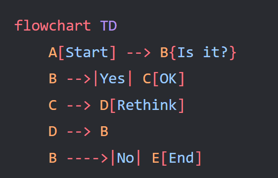

# 实验四 Python字典和while循环

班级： 21计科2

学号： B20210302217

姓名： 刘青

Github地址：<https://github.com/RonaWhite/python>

CodeWars地址：<https://www.codewars.com/users/RonaWhite>

---

## 实验目的

1. 学习Python字典
2. 学习Python用户输入和while循环

## 实验环境

1. Git
2. Python 3.10
3. VSCode
4. VSCode插件

## 实验内容和步骤

### 第一部分

Python列表操作

完成教材《Python编程从入门到实践》下列章节的练习：

- 第6章 字典
- 第7章 用户输入和while循环

---

### 第二部分

在[Codewars网站](https://www.codewars.com)注册账号，完成下列Kata挑战：

---

#### 第一题：淘气还是乖孩子（Naughty or Nice）

难度： 7kyu

圣诞老人要来镇上了，他需要你帮助找出谁是淘气的或善良的。你将会得到一整年的JSON数据，按照这个格式：

```python
{
    January: {
        '1': 'Naughty','2': 'Naughty', ..., '31': 'Nice'
    },
    February: {
        '1': 'Nice','2': 'Naughty', ..., '28': 'Nice'
    },
    ...
    December: {
        '1': 'Nice','2': 'Nice', ..., '31': 'Naughty'
    }
}
```

你的函数应该返回 "Naughty!"或 "Nice!"，这取决于在某一年发生的总次数（以较大者为准）。如果两者相等，则返回 "Nice！"。
代码提交地址：
<https://www.codewars.com/kata/5662b14e0a1fb8320a00005c>

---

#### 第二题： 观察到的PIN（The observed PIN）

难度：4kyu

好了，侦探，我们的一个同事成功地观察到了我们的目标人物，抢劫犯罗比。我们跟踪他到了一个秘密仓库，我们认为在那里可以找到所有被盗的东西。这个仓库的门被一个电子密码锁所保护。不幸的是，我们的间谍不确定他看到的密码，当罗比进入它时。

键盘的布局如下：

```python
┌───┬───┬───┐
│ 1 │ 2 │ 3 │
├───┼───┼───┤
│ 4 │ 5 │ 6 │
├───┼───┼───┤
│ 7 │ 8 │ 9 │
└───┼───┼───┘
    │ 0 │
    └───┘
```

他注意到密码1357，但他也说，他看到的每个数字都有可能是另一个相邻的数字（水平或垂直，但不是对角线）。例如，代替1的也可能是2或4。而不是5，也可能是2、4、6或8。

他还提到，他知道这种锁。你可以无限制地输入错误的密码，但它们最终不会锁定系统或发出警报。这就是为什么我们可以尝试所有可能的（*）变化。

*可能的意义是：观察到的PIN码本身和考虑到相邻数字的所有变化。

你能帮助我们找到所有这些变化吗？如果有一个函数，能够返回一个列表，其中包含一个长度为1到8位的观察到的PIN的所有变化，那就更好了。我们可以把这个函数命名为getPINs（在python中为get_pins，在C#中为GetPINs）。

但请注意，所有的PINs，包括观察到的PINs和结果，都必须是字符串，因为有可能会有领先的 "0"。我们已经为你准备了一些测试案例。
侦探，我们就靠你了!
代码提交地址：
<https://www.codewars.com/kata/5263c6999e0f40dee200059d>

---

#### 第三题： RNA到蛋白质序列的翻译（RNA to Protein Sequence Translation）

难度：6kyu

蛋白质是由DNA转录成RNA，然后转译成蛋白质的中心法则。RNA和DNA一样，是由糖骨架（在这种情况下是核糖）连接在一起的长链核酸。每个由三个碱基组成的片段被称为密码子。称为核糖体的分子机器将RNA密码子转译成氨基酸链，称为多肽链，然后将其折叠成蛋白质。

蛋白质序列可以像DNA和RNA一样很容易地可视化，作为大字符串。重要的是要注意，“停止”密码子不编码特定的氨基酸。它们的唯一功能是停止蛋白质的转译，因此它们不会被纳入多肽链中。“停止”密码子不应出现在最终的蛋白质序列中。为了节省您许多不必要（和乏味）的键入，已为您的氨基酸字典提供了键和值。

给定一个RNA字符串，创建一个将RNA转译为蛋白质序列的函数。注意：测试用例将始终生成有效的字符串。

```python
protein（'UGCGAUGAAUGGGCUCGCUCC'）
```

将返回`CDEWARS`

作为测试用例的一部分是一个真实世界的例子！最后一个示例测试用例对应着一种叫做绿色荧光蛋白的蛋白质，一旦被剪切到另一个生物体的基因组中，像GFP这样的蛋白质可以让生物学家可视化细胞过程！

Amino Acid Dictionary

```python
   # Your dictionary is provided as PROTEIN_DICT
   PROTEIN_DICT = {
    # Phenylalanine
    'UUC': 'F', 'UUU': 'F',
    # Leucine
    'UUA': 'L', 'UUG': 'L', 'CUU': 'L', 'CUC': 'L', 'CUA': 'L', 'CUG': 'L',
    # Isoleucine
    'AUU': 'I', 'AUC': 'I', 'AUA': 'I',
    # Methionine
    'AUG': 'M',
    # Valine
    'GUU': 'V', 'GUC': 'V', 'GUA': 'V', 'GUG': 'V',
    # Serine
    'UCU': 'S', 'UCC': 'S', 'UCA': 'S', 'UCG': 'S', 'AGU': 'S', 'AGC': 'S',
    # Proline
    'CCU': 'P', 'CCC': 'P', 'CCA': 'P', 'CCG': 'P',
    # Threonine
    'ACU': 'T', 'ACC': 'T', 'ACA': 'T', 'ACG': 'T',
    # Alanine
    'GCU': 'A', 'GCC': 'A', 'GCA': 'A', 'GCG': 'A',
    # Tyrosine
    'UAU': 'Y', 'UAC': 'Y',
    # Histidine
    'CAU': 'H', 'CAC': 'H',
    # Glutamine
    'CAA': 'Q', 'CAG': 'Q',
    # Asparagine
    'AAU': 'N', 'AAC': 'N',
    # Lysine
    'AAA': 'K', 'AAG': 'K',
    # Aspartic Acid
    'GAU': 'D', 'GAC': 'D',
    # Glutamic Acid
    'GAA': 'E', 'GAG': 'E',
    # Cystine
    'UGU': 'C', 'UGC': 'C',
    # Tryptophan
    'UGG': 'W',
    # Arginine
    'CGU': 'R', 'CGC': 'R', 'CGA': 'R', 'CGG': 'R', 'AGA': 'R', 'AGG': 'R',
    # Glycine
    'GGU': 'G', 'GGC': 'G', 'GGA': 'G', 'GGG': 'G',
    # Stop codon
    'UAA': 'Stop', 'UGA': 'Stop', 'UAG': 'Stop'
}
```

代码提交地址：
<https://www.codewars.com/kata/555a03f259e2d1788c000077>

---

#### 第四题： 填写订单（Thinkful - Dictionary drills: Order filler）

难度：8kyu

您正在经营一家在线业务，您的一天中很大一部分时间都在处理订单。随着您的销量增加，这项工作占用了更多的时间，不幸的是最近您遇到了一个情况，您接受了一个订单，但无法履行。

您决定写一个名为`fillable()`的函数，它接受三个参数：一个表示您库存的字典`stock`，一个表示客户想要购买的商品的字符串`merch`，以及一个表示他们想购买的商品数量的整数n。如果您有足够的商品库存来完成销售，则函数应返回`True`，否则应返回`False`。

有效的数据将始终被传入，并且n将始终大于等于1。

代码提交地址：
<https://www.codewars.com/kata/586ee462d0982081bf001f07/python>

---

#### 第五题： 莫尔斯码解码器（Decode the Morse code, advanced）

难度： 4kyu

在这个作业中，你需要为有线电报编写一个莫尔斯码解码器。
有线电报通过一个有按键的双线路运行，当按下按键时，会连接线路，可以在远程站点上检测到。莫尔斯码将每个字符的传输编码为"点"（按下按键的短按）和"划"（按下按键的长按）的序列。

在传输莫尔斯码时，国际标准规定：

- "点" - 1个时间单位长。
- "划" - 3个时间单位长。
- 字符内点和划之间的暂停 - 1个时间单位长。
- 单词内字符之间的暂停 - 3个时间单位长。
- 单词间的暂停 - 7个时间单位长。

但是，该标准没有规定"时间单位"有多长。实际上，不同的操作员会以不同的速度进行传输。一个业余人士可能需要几秒钟才能传输一个字符，一位熟练的专业人士可以每分钟传输60个单词，而机器人发射器可能会快得多。

在这个作业中，我们假设消息的接收是由硬件自动执行的，硬件会定期检查线路，如果线路连接（远程站点的按键按下），则记录为1，如果线路未连接（远程按键弹起），则记录为0。消息完全接收后，它会以一个只包含0和1的字符串的形式传递给你进行解码。

例如，消息`HEY JUDE`，即`···· · −·−−   ·−−− ··− −·· ·`可以如下接收：

```python
1100110011001100000011000000111111001100111111001111110000000000000011001111110011111100111111000000110011001111110000001111110011001100000011
```

如您所见，根据标准，这个传输完全准确，硬件每个"点"采样了两次。

因此，你的任务是实现两个函数：

函数decodeBits(bits)，应该找出消息的传输速率，正确解码消息为点（.）、划（-）和空格（字符之间有一个空格，单词之间有三个空格），并将它们作为一个字符串返回。请注意，在消息的开头和结尾可能会出现一些额外的0，确保忽略它们。另外，如果你无法分辨特定的1序列是点还是划，请假设它是一个点。

函数decodeMorse(morseCode)，它将接收上一个函数的输出，并返回一个可读的字符串。

注意：出于编码目的，你必须使用ASCII字符.和-，而不是Unicode字符。

莫尔斯码表已经预加载给你了（请查看解决方案设置，以获取在你的语言中使用它的标识符）。

```python
morseCodes(".--")  #to access the morse translation of ".--"
```

下面是Morse码支持的完整字符列表：

```javascript
A    ·–
B    –···
C    –·–·
D    –··
E    ·
F    ··–·
G    ––·
H    ····
I    ··
J    ·–––
K    –·–
L    ·–··
M    ––
N    –·
O    –––
P    ·––·
Q    ––·–
R    ·–·
S    ···
T    –
U    ··–
V    ···–
W    ·––
X    –··–
Y    –·––
Z    ––··
0    –––––
1    ·––––
2    ··–––
3    ···––
4    ····–
5    ·····
6    –····
7    ––···
8    –––··
9    ––––·
.    ·–·–·–
,    ––··––
?    ··––··
'    ·––––·
!    –·–·––
/    –··–·
(    –·––·
)    –·––·–
&    ·–···
:    –––···
;    –·–·–·
=    –···–
+    ·–·–·
-    –····–
_    ··––·–
"    ·–··–·
$    ···–··–
@    ·––·–·
```

代码提交地址：
<https://www.codewars.com/kata/decode-the-morse-code-advanced>

---

### 第三部分

使用Mermaid绘制程序流程图

安装VSCode插件：

- Markdown Preview Mermaid Support
- Mermaid Markdown Syntax Highlighting

使用Markdown语法绘制你的程序绘制程序流程图（至少一个），Markdown代码如下：



显示效果如下：


查看Mermaid流程图语法-->[点击这里](https://mermaid.js.org/syntax/flowchart.html)

使用Markdown编辑器（例如VScode）编写本次实验的实验报告，包括[实验过程与结果](#实验过程与结果)、[实验考查](#实验考查)和[实验总结](#实验总结)，并将其导出为 **PDF格式** 来提交。

## 实验过程与结果

### 第一部分 字典与Python用户输入和while循环

### 第6章 字典

#### 6-1 人

```python
person = {
    'first_name': 'Iverson',
    'last_name': 'Allen',
    'age': 32,
    'city': 'NYC',
    }

print(person['first_name'])
print(person['last_name'])
print(person['age'])
print(person['city'])
```

运行结果：

```python
Iverson
Allen
32
NYC
```

#### 6-2 喜欢的数字

```python
favorite_numbers = {
    'xiaoming': 21,
    'xiaohong': 1,
    'xiaofang': 6,
    'xianoli': 18,
    'xiaowang': 3,
    }

num = favorite_numbers['xiaoming']
print("xiaoming's favorite number is " + str(num) + ".")

num = favorite_numbers['xiaohong']
print("xiaohong's favorite number is " + str(num) + ".")

num = favorite_numbers['xiaofang']
print("xiaofang's favorite number is " + str(num) + ".")

num = favorite_numbers['xianoli']
print("xianoli's favorite number is " + str(num) + ".")

num = favorite_numbers['xiaowang']
print("xiaowang's favorite number is " + str(num) + ".")
```

运行结果：

```python
xiaoming's favorite number is 21.
xiaohong's favorite number is 1.
xiaofang's favorite number is 6.
xianoli's favorite number is 18.
xiaowang's favorite number is 3.
```

#### 6-3 词汇表

```python
#想出你在前面学过的 5 个编程词汇，将它们用作词汇表中的键，
#并将它们的含义作为值存储在词汇表中。

glossary = {
    'string': 'A series of characters.',
    'comment': 'A note in a program that the Python interpreter ignores.',
    'list': 'A collection of items in a particular order.',
    'loop': 'Work through a collection of items, one at a time.',
    'dictionary': "A collection of key-value pairs.",
    }
 
#以整洁的方式打印每个词汇及其含义。为此，你可以先打印词汇，在它后面加
#上一个冒号，再打印词汇的含义；也可在一行打印词汇，再使用换行符（\n）
#插入一个空行，然后在下一行以缩进的方式打印词汇的含义

word = 'string'
print("\n" + word.title() + ": " + glossary[word])

word = 'comment'
print("\n" + word.title() + ": " + glossary[word])

word = 'list'
print("\n" + word.title() + ": " + glossary[word])

word = 'loop'
print("\n" + word.title() + ": " + glossary[word])

word = 'dictionary'
print("\n" + word.title() + ": " + glossary[word])
```

运行结果：

```python
String: A series of characters.

Comment: A note in a program that the Python interpreter ignores.

List: A collection of items in a particular order.

Loop: Work through a collection of items, one at a time.

Dictionary: A collection of key-value pairs.
```

#### 6-4 词汇表2

```python
glossary = {
    'string': 'A series of characters.',
    'comment': 'A note in a program that the Python interpreter ignores.',
    'list': 'A collection of items in a particular order.',
    'loop': 'Work through a collection of items, one at a time.',
    'dictionary': "A collection of key-value pairs.",
    'key': 'The first item in a key-value pair in a dictionary.',
    'value': 'An item associated with a key in a dictionary.',
    'conditional test': 'A comparison between two values.',
    'float': 'A numerical value with a decimal component.',
    'boolean expression': 'An expression that evaluates to True or False.',
    }

for word, definition in glossary.items():
    print("\n" + word.title() + ": " + definition)
```

运行结果：

```python
String: A series of characters.

Comment: A note in a program that the Python interpreter ignores.

List: A collection of items in a particular order.

Loop: Work through a collection of items, one at a time.

Dictionary: A collection of key-value pairs.

Key: The first item in a key-value pair in a dictionary.

Value: An item associated with a key in a dictionary.

Conditional Test: A comparison between two values.

Float: A numerical value with a decimal component.

Boolean Expression: An expression that evaluates to True or False.
```

#### 6-5 河流

```python
#使用循环为每条河流打印一条消息，如“The Nile runs through Egypt.”。
rivers = {
    'nile' : 'egypt',
    'yangtze' : 'china',
    'amazon' : 'brazil',
}

for river, country in rivers.items():
    print('The ' + river.title() +' runs through ' 
    + country.title() + '.')

#使用循环将该字典中每条河流的名字都打印出来。
print("\nThe following rivers are included in this data set:")
for river in rivers.keys():
    print(river.title())
    
#使用循环将该字典包含的每个国家的名字都打印出来。    
print("\nThe following countries are included in this data set:")
for country in rivers.values():
    print(country.title())
```

运行结果：

```python
The Nile runs through Egypt.
The Yangtze runs through China.
The Amazon runs through Brazil.

The following rivers are included in this data set:
Nile
Yangtze
Amazon

The following countries are included in this data set:
Egypt
China
Brazil
```

#### 6-6 调查

```python
favorite_languages = {
    'jen': 'python',
    'sarah': 'c',
    'edward': 'ruby',
    'phil': 'python',
    }

coders = ['phil', 'josh', 'david', 'becca', 'sarah', 'matt', 'danielle']
for coder in coders:
    if coder in favorite_languages.keys():
        print("Thank you for taking the poll, " + coder.title() + "!")
    else:
        print(coder.title() + ", what's your favorite programming language?")
```

运行结果：

```python
Thank you for taking the poll, Phil!
Josh, what's your favorite programming language?
David, what's your favorite programming language?
Becca, what's your favorite programming language?
Thank you for taking the poll, Sarah!
Matt, what's your favorite programming language?
Danielle, what's your favorite programming language?
```

#### 6-7 人

```python
person_0 = {
    'first_name':'Iveron',
    'last_name':'Allen',
    'age':23,
    'city':'NYC'
    }

person_1 = {
    'first_name':'Jordan',
    'last_name':'Michael',
    'age':30,
    'city':'Chicago'
    }

person_2 = {
    'first_name':'Jianlian',
    'last_name':'Yi',
    'age':28,
    'city':'Guangdong'
    }

people = [person_0,person_1,person_2]

for person in people:
    name = person['first_name'].title() + " " + person['last_name'].title()
    age = str(person['age'])
    city = person['city'].title()
    
    print(name + ", of " + city + ", is " + age + " years old.")
```

运行结果：

```python
Iveron Allen, of Nyc, is 23 years old.
Jordan Michael, of Chicago, is 30 years old.
Jianlian Yi, of Guangdong, is 28 years old.
```

#### 6-8 宠物

```python
cloris = {
    'type' : 'dog',
    'host' : 'john'
}

brinkley = {
    'type' : 'cat',
    'host' : 'lucy',
}

pets = [cloris,brinkley]

for pet in pets:
    for key, value in pet.items():
        print(key + ": " + str(value))
```

运行结果：

```python
type: dog
host: john
type: cat
host: lucy
```

#### 6-9 喜欢的地方

```python
favorite_place = {
    'jen' : ['Beijing','Shanghai'],
    'sarah' : ['Dalian'],
    'edward' : ['Chengdu','Beijing','Nanjing'],
}

for name, citys in favorite_place.items():
    print('\n' + 'name:' + name)
    for city in citys:
        print('\t' + 'city: '+ city)
```

运行结果：

```python
name:jen
        city: Beijing
        city: Shanghai

name:sarah
        city: Dalian

name:edward
        city: Chengdu
        city: Beijing
        city: Nanjing
```

#### 6-10 喜欢的数字

```python
favorite_num = {
    'jen' : [2,5],
    'sarah' : [8],
    'edward' : [1,3,5],
}

for name, nums in favorite_num.items():
    print('\n' + 'name:' + name)
    for num in nums:
        print('\t' + 'num: '+ str(num))
```

运行结果：

```python
name:jen
        num: 2
        num: 5

name:sarah
        num: 8

name:edward
        num: 1
        num: 3
        num: 5
```

#### 6-11 城市

```python
cities = {
    'Beijing' : {
        'country' : 'China',
        'population' : 22000000,
        'fact' : 'aaaaa',
    },

    'Shanghai' : {
        'country' : 'China',
        'population' : 25000000,
        'fact' : 'bbbbbb',
    },

    'NewYork' : {
        'country' : 'America',
        'population' : 8500000,
        'fact' : 'cccccc',
    },
}

for city, city_infos in cities.items():
    print('\n' + 'city: ' + city)
    print('\t' + 'country: ' + city_infos['country'])
    print('\t' + 'population: '+ str(city_infos['population']))
    print('\t' + 'fact: '+ city_infos['fact'])
```

运行结果：

```python
city: Beijing
        country: China
        population: 22000000
        fact: aaaaa

city: Shanghai
        country: China
        population: 25000000
        fact: bbbbbb

city: NewYork
        country: America
        population: 8500000
        fact: cccccc
```

### 第7章 用户输入和while循环

#### 7-1 汽车租赁

```python
car = input('What kind of car do you want to rent?')
print('Let me see if I can find you a ' + car)
```

运行结果：

```python
What kind of car do you want to rent?Subaru
Let me see if I can find you a Subaru
```

#### 7-2 餐馆订位

```python
num = input('how many people?')
num = int(num)

if num > 8:
    print('Sorry,No seats.')
else:
    print('Your table is ready.')
```

运行结果：

```python
how many people?10
Sorry,No seats.
```

#### 7-3 10的整数倍

```python
number = input('Integer multiples of 10? :')
number = int(number)

if number % 10 == 0:
    print('yes')
else:
    print('no')
```

运行结果：

```python
Integer multiples of 10? :15
no
```

#### 7-4 比萨配料

```python
prompt = "\nWhat topping would you like on your pizza?"
prompt += "\nEnter 'quit' when you are finished: "

while True:
    topping = input(prompt)
    if topping != 'quit':
        print("  I'll add " + topping + " to your pizza.")
    else:
        break
```

运行结果：

```python
What topping would you like on your pizza?
Enter 'quit' when you are finished: fruit
  I'll add fruit to your pizza.

What topping would you like on your pizza?
Enter 'quit' when you are finished: seafood
  I'll add seafood to your pizza.

What topping would you like on your pizza?
Enter 'quit' when you are finished: quit
```

#### 7-5 电影票

```python
prompt = "How old are you?"
prompt += "\nEnter 'quit' when you are finished. "

while True:
    age = input(prompt)
    if age == 'quit':
        break
    age = int(age)

    if age < 3:
        print("  You get in free!")
    elif age < 13:
        print("  Your ticket is $10.")
    else:
        print("  Your ticket is $15.")
```

运行结果：

```python
How old are you?
Enter 'quit' when you are finished. 2
  You get in free!
How old are you?
Enter 'quit' when you are finished. 11
  Your ticket is $10.
How old are you?
Enter 'quit' when you are finished. 30
  Your ticket is $15.
How old are you?
Enter 'quit' when you are finished.
```

#### 7-6 三个出口

```python
#在 while 循环中使用条件测试来结束循环。
prompt = '\nTell me something, and I will repeat it back to you:'
prompt += "\nEnter 'quit' to end the game."

messsge = ''
while messsge != 'quit':
    messsge = input(prompt)
    if messsge != 'quit':
        print(messsge)


#使用变量 active 来控制循环结束的时机。
prompt = '\nTell me something, and I will repeat it back to you:'
prompt += "\nEnter 'quit' to end the game."

active = True
while active:
    messsge = input(prompt)
    if messsge == 'quit':
        active = False
    else:
        print(messsge)

# 使用 break 语句在用户输入'quit'时退出循环。
prompt = '\nTell me something, and I will repeat it back to you:'
prompt += "\nEnter 'quit' to end the game."

while True:
    city = input(prompt)
    if city == 'quit':
        break
    else:
        print(messsge)
```

运行结果：

```python
Tell me something, and I will repeat it back to you:
Enter 'quit' to end the game.hello
hello

Tell me something, and I will repeat it back to you:
Enter 'quit' to end the game.quit

Tell me something, and I will repeat it back to you:
Enter 'quit' to end the game.world
world

Tell me something, and I will repeat it back to you:
Enter 'quit' to end the game.quit

Tell me something, and I will repeat it back to you:
Enter 'quit' to end the game.python
quit

Tell me something, and I will repeat it back to you:
Enter 'quit' to end the game.quit
```

#### 7-7 无限循环

```python
while True:
    print("Hello World!")
```

#### 7-8 熟食店

```python
sandwich_orders = ['small_sandwich','middle_sandwich','big_sandwish']
finished_sandwiches=[]
while sandwich_orders:
    current_order = sandwich_orders.pop()
    print("I made your " + current_order)
    finished_sandwiches.append(current_order)

for finished_sandwich in finished_sandwiches:
    print(finished_sandwich +" has been made")
```

运行结果：

```python
I made your big_sandwish.
I made your middle_sandwich.
I made your small_sandwich.
big_sandwish has been made.
middle_sandwich has been made.
small_sandwich has been made.
```

#### 7-9 五香烟熏牛肉（pastrami）卖完了

```python
sandwich_orders = ['pastrami','pastrami','big_sandwish','pastrami']
print("The pastrami was sold out")
while 'pastrami' in sandwich_orders:
    sandwich_orders.remove('pastrami')
print(sandwich_orders)
```

运行结果：

```python
The pastrami was sold out
['big_sandwish']
```

#### 7-10 梦想的度假胜地

```python
polling_active = True

while polling_active:
    #提示输入调查者的名字和回答
    name = input("\nWhat's your name?")
    response = input("if you could visit one place in the world,where would u go?")

    #将答案存储在字典中
    responses[name] = response

    #看看是否还有人要参与调查
    repeat = input("Would you like to let another person respond? (yes/no)")
    if repeat == 'no':
        polling_active = False
```

运行结果：

```python
What's your name?john
if you could visit one place in the world,where would u go?Shanghai
Would you like to let another person respond? (yes/no)no
```

### 第二部分 Codewars Kata挑战

#### 第一题:淘气还是乖孩子（Naughty or Nice）

圣诞老人要来镇上了，他需要你帮助找出谁是淘气的或善良的。你将会得到一整年的JSON数据，按照这个格式：

```python
{
    January: {
        '1': 'Naughty','2': 'Naughty', ..., '31': 'Nice'
    },
    February: {
        '1': 'Nice','2': 'Naughty', ..., '28': 'Nice'
    },
    ...
    December: {
        '1': 'Nice','2': 'Nice', ..., '31': 'Naughty'
    }
}
```

你的函数应该返回 "Naughty!"或 "Nice!"，这取决于在某一年发生的总次数（以较大者为准）。如果两者相等，则返回 "Nice！"。

代码如下：

```python
def naughty_or_nice(data):
    naughty_count = 0
    nice_count = 0

    # 遍历每个月份
    for month, days in data.items():
        # 遍历该月的每一天
        for day, behavior in days.items():
            if behavior == 'Naughty':
                naughty_count += 1
            elif behavior == 'Nice':
                nice_count += 1

    # 比较Naughty和Nice的次数
    if naughty_count > nice_count:
        return "Naughty!"
    elif naughty_count < nice_count:
        return "Nice!"
    else:
        return "Nice!"

data = {
    'January': {
        '1': 'Naughty', '2': 'Naughty', '3': 'Nice',  # 填充更多数据
    },
    'February': {
        '1': 'Nice', '2': 'Naughty', '3': 'Nice',  # 填充更多数据
    },
    # 其他月份的数据
}

result = naughty_or_nice(data)
print(result)  # 输出 "Naughty!"或 "Nice!"
```

**解题过程描述：**

1. 首先，提供了一整年的JSON数据，其中包含了每个月的行为记录。每个月的行为数据都以键值对的形式存储，键表示月份，值是包含每天行为的字典。

2. 创建一个名为 `naughty_or_nice` 的函数，该函数接受一个包含一整年行为数据的字典作为输入。

3. 在函数内部，初始化了两个计数器，`naughty_count` 用于记录"Naughty"的次数，`nice_count` 用于记录"Nice"的次数。

4. 开始遍历每个月份。对于每个月，再次遍历该月的每一天。

5. 对于每一天，检查行为是"Naughty"还是"Nice"，并相应地更新计数器的值。

6. 一旦遍历了整个年度的数据，比较了"Naughty"和"Nice"的次数。如果"Naughty"次数多于"Nice"次数，返回 "Naughty!"。如果"Nice"次数多于"Naughty"次数，返回 "Nice!"。如果它们相等，返回 "Nice!"。

7. 最后，返回结果，这是一个字符串，表示整年的行为数据中哪种行为更多。

#### 第二题: 观察到的PIN（The observed PIN）

好了，侦探，我们的一个同事成功地观察到了我们的目标人物，抢劫犯罗比。我们跟踪他到了一个秘密仓库，我们认为在那里可以找到所有被盗的东西。这个仓库的门被一个电子密码锁所保护。不幸的是，我们的间谍不确定他看到的密码，当罗比进入它时。

键盘的布局如下：

```python
┌───┬───┬───┐
│ 1 │ 2 │ 3 │
├───┼───┼───┤
│ 4 │ 5 │ 6 │
├───┼───┼───┤
│ 7 │ 8 │ 9 │
└───┼───┼───┘
    │ 0 │
    └───┘
```

他注意到密码1357，但他也说，他看到的每个数字都有可能是另一个相邻的数字（水平或垂直，但不是对角线）。例如，代替1的也可能是2或4。而不是5，也可能是2、4、6或8。

他还提到，他知道这种锁。你可以无限制地输入错误的密码，但它们最终不会锁定系统或发出警报。这就是为什么我们可以尝试所有可能的（*）变化。

*可能的意义是：观察到的PIN码本身和考虑到相邻数字的所有变化。

你能帮助我们找到所有这些变化吗？如果有一个函数，能够返回一个列表，其中包含一个长度为1到8位的观察到的PIN的所有变化，那就更好了。我们可以把这个函数命名为getPINs（在python中为get_pins，在C#中为GetPINs）。

但请注意，所有的PINs，包括观察到的PINs和结果，都必须是字符串，因为有可能会有领先的 "0"。我们已经为你准备了一些测试案例。
侦探，我们就靠你了!

代码如下：

```python
def get_pins(observed):
    # 定义数字之间的映射关系
    adjacent_digits = {
        '0': ['0', '8'],
        '1': ['1', '2', '4'],
        '2': ['1', '2', '3', '5'],
        '3': ['2', '3', '6'],
        '4': ['1', '4', '5', '7'],
        '5': ['2', '4', '5', '6', '8'],
        '6': ['3', '5', '6', '9'],
        '7': ['4', '7', '8'],
        '8': ['5', '7', '8', '9', '0'],
        '9': ['6', '8', '9']
    }
    
    # 如果观察到的密码为空，直接返回空列表
    if not observed:
        return []

    # 递归函数，用于生成密码组合
    def generate_pins(observed, current_pin):
        if len(current_pin) == len(observed):
            # 当生成的密码长度与观察到的密码长度相等时，加入结果列表
            result.append(current_pin)
            return
        else:
            # 否则，继续生成密码
            current_digit = observed[len(current_pin)]
            for neighbor in adjacent_digits[current_digit]:
                generate_pins(observed, current_pin + neighbor)

    result = []
    generate_pins(observed, "")
    return result

# 示例用法
observed = "1357"
possible_pins = get_pins(observed)
print(possible_pins)  # 输出所有可能的密码组合
```

**解题过程描述：**

1. 首先，定义了一个数字之间的映射关系 `adjacent_digits`，其中包含每个数字及其相邻的数字。这个映射关系表示了每个数字在键盘上的相邻数字。

2. 创建一个名为 `get_pins` 的函数，它接受一个观察到的PIN作为输入。

3. 在函数内部，首先检查如果观察到的PIN为空，就直接返回一个空的列表，因为没有任何变化。

4. 然后，定义一个递归函数 `generate_pins`，该函数用于生成所有可能的密码组合。它有两个参数：`observed` 表示观察到的PIN，`current_pin` 表示当前生成的密码。

5. 在 `generate_pins` 函数中，检查当前生成的密码长度是否与观察到的密码长度相等。如果相等，表示已经生成了一个完整的密码，将其添加到结果列表中。

6. 如果长度不相等，取出 `observed` 中当前位置的数字，并查找它在 `adjacent_digits` 中的相邻数字。然后，对每个相邻数字，递归调用 `generate_pins`，将当前密码加上这个相邻数字。

7. 最后，初始化一个结果列表 `result`，并开始从观察到的PIN的第一个数字开始生成密码。在 `generate_pins` 函数的递归调用中，将不断生成密码，直到所有可能的密码组合都被生成。

8. 返回 `result`，它包含了观察到的PIN的所有可能变化的字符串列表。

这个解决方案利用递归和相邻数字的映射来生成所有可能的PIN密码变化，确保了所有PIN都以字符串形式返回，包括可能存在前导零的情况。

#### 第三题: RNA到蛋白质序列的翻译（RNA to Protein Sequence Translation）

蛋白质是由DNA转录成RNA，然后转译成蛋白质的中心法则。RNA和DNA一样，是由糖骨架（在这种情况下是核糖）连接在一起的长链核酸。每个由三个碱基组成的片段被称为密码子。称为核糖体的分子机器将RNA密码子转译成氨基酸链，称为多肽链，然后将其折叠成蛋白质。

蛋白质序列可以像DNA和RNA一样很容易地可视化，作为大字符串。重要的是要注意，“停止”密码子不编码特定的氨基酸。它们的唯一功能是停止蛋白质的转译，因此它们不会被纳入多肽链中。“停止”密码子不应出现在最终的蛋白质序列中。为了节省您许多不必要（和乏味）的键入，已为您的氨基酸字典提供了键和值。

给定一个RNA字符串，创建一个将RNA转译为蛋白质序列的函数。注意：测试用例将始终生成有效的字符串。

代码如下：

```python
def protein(rna):
    # 创建一个空字符串来存储翻译后的蛋白质序列
    protein_sequence = ""
    
    # 每次从RNA字符串中截取3个碱基，这对应一个codon
    for i in range(0, len(rna), 3):
        codon = rna[i:i+3]
        
        # 使用氨基酸字典查找codon对应的氨基酸
        amino_acid = PROTEIN_DICT[codon]
        
        # 如果氨基酸是Stop，则停止翻译
        if amino_acid == 'Stop':
            break
        
        # 否则将氨基酸添加到蛋白质序列中
        protein_sequence += amino_acid

    return protein_sequence
    
    # 测试
rna_sequence = 'UGCGAUGAAUGGGCUCGCUCC'
result = protein(rna_sequence)
print(result)  # 输出：'CDEWARS'
```

**解题过程描述：**

当解决这个题目时，需要将给定的RNA序列翻译成蛋白质序列，使用了一个已提供的氨基酸字典（PROTEIN_DICT）。具体解题步骤如下：

1. 创建一个空字符串 `protein_sequence`，以便将翻译后的蛋白质序列存储其中。

2. 遍历RNA序列，每次截取3个碱基，这三个碱基构成一个codon。我们使用一个循环来处理每个codon，循环变量 `i` 从0开始，以步长3递增。

3. 在每次循环迭代中，通过切片操作从RNA序列中提取一个codon。例如，对于 'UGCGAUGAAUGGGCUCGCUCC'，切片操作 'rna[i:i+3]' 会在第一个迭代中获得 'UGC'，然后是 'GAU'，以此类推。

4. 对于每个codon，使用氨基酸字典 `PROTEIN_DICT` 来查找它对应的氨基酸。例如，对于 'UGC'，查找字典中的值将返回 'C'，这是对应的氨基酸。

5. 我们检查所获得的氨基酸是否是 'Stop'，如果是 'Stop'，则停止翻译过程，因为这是一个终止信号，不会被包括在最终的蛋白质序列中。

6. 如果氨基酸不是 'Stop'，则将它添加到 `protein_sequence` 中。

7. 循环继续，处理下一个codon，重复步骤 3 到 6，直到整个RNA序列都被翻译。

8. 最后，返回 `protein_sequence`，这是翻译后的蛋白质序列。

这个解决方案的关键是利用氨基酸字典将RNA序列中的每个codon映射到相应的氨基酸，并在遇到Stop codon时终止翻译。这个过程确保了正确的蛋白质序列被生成。

#### 第四题: 填写订单（Thinkful - Dictionary drills: Order filler）

您正在经营一家在线业务，您的一天中很大一部分时间都在处理订单。随着您的销量增加，这项工作占用了更多的时间，不幸的是最近您遇到了一个情况，您接受了一个订单，但无法履行。

您决定写一个名为`fillable()`的函数，它接受三个参数：一个表示您库存的字典`stock`，一个表示客户想要购买的商品的字符串`merch`，以及一个表示他们想购买的商品数量的整数n。如果您有足够的商品库存来完成销售，则函数应返回`True`，否则应返回`False`。

有效的数据将始终被传入，并且n将始终大于等于1。

代码如下：

```python
def fillable(stock, merch, n):
    # 检查库存中是否存在所需商品
    if merch in stock:
        # 检查库存中所需商品的数量是否足够
        if stock[merch] >= n:
            # 库存足够，可以完成销售
            return True
    
    # 如果库存中没有所需商品或数量不足，无法完成销售
    return False

# 示例用法
stock = {
    'item1': 10,
    'item2': 5,
    'item3': 20
}

merchandise = 'item1'
quantity = 3

result = fillable(stock, merchandise, quantity)
print(result)  # 输出 True，可以完成销售
```

**解题过程描述：**

1. 问题描述了一个在线业务的情境，其中处理订单是一个重要的任务。随着业务量的增加，订单处理的时间成本也在增加，最近出现了无法履行订单的情况。

2. 需要编写一个名为 `fillable()` 的函数，它接受三个参数：表示库存的字典 `stock`，表示客户所需购买的商品 `merch`，以及表示客户所需购买的商品数量 `n`。该函数的任务是根据库存情况，判断是否可以完成销售，并根据结果返回`True`或`False`。

3. 在函数内部，首先检查库存中是否存在所需商品，这可以通过检查 `merch` 是否存在于 `stock` 字典的键中来实现。

4. 如果商品存在于库存中，继续检查库存中所需商品的数量是否足够，这可以通过比较 `stock[merch]`（库存中商品的数量）和 `n`（客户所需的数量）来实现。

5. 如果所需商品存在于库存中且数量足够，函数返回`True`，表示可以完成销售。

6. 如果所需商品不存在于库存中或数量不足，函数返回`False`，表示无法完成销售。

7. 最后，提供了一个使用示例，包括一个示例的库存字典 `stock`、所需商品 `merch` 和所需数量 `n`，并调用 `fillable()` 函数来判断是否可以完成销售。

#### 第五题: 莫尔斯码解码器（Decode the Morse code, advanced）

在这个作业中，你需要为有线电报编写一个莫尔斯码解码器。
有线电报通过一个有按键的双线路运行，当按下按键时，会连接线路，可以在远程站点上检测到。莫尔斯码将每个字符的传输编码为"点"（按下按键的短按）和"划"（按下按键的长按）的序列。

在传输莫尔斯码时，国际标准规定：

- "点" - 1个时间单位长。
- "划" - 3个时间单位长。
- 字符内点和划之间的暂停 - 1个时间单位长。
- 单词内字符之间的暂停 - 3个时间单位长。
- 单词间的暂停 - 7个时间单位长。

但是，该标准没有规定"时间单位"有多长。实际上，不同的操作员会以不同的速度进行传输。一个业余人士可能需要几秒钟才能传输一个字符，一位熟练的专业人士可以每分钟传输60个单词，而机器人发射器可能会快得多。

在这个作业中，我们假设消息的接收是由硬件自动执行的，硬件会定期检查线路，如果线路连接（远程站点的按键按下），则记录为1，如果线路未连接（远程按键弹起），则记录为0。消息完全接收后，它会以一个只包含0和1的字符串的形式传递给你进行解码。

代码如下：

```python
def decodeBits(bits):
    bits = bits.strip("0")
    unit = 0
    for bit in bits:
        if bit != "0":
            unit += 1
        else:
            break
    #unit now might be 1 unit or 3 units
    count = 1
    for i in range(1,len(bits)):
        if bits[i] == bits[i-1]:
            count += 1
        else:
            if count < unit:
                unit = count
                count = 1
            else:
                count = 1
    morse_code = ""
    
    words = bits.split("0"*7*unit)
    for word in words:
        characters = word.split("0"*3*unit)
        for character in characters:
            signs = character.split("0"*unit)
            for sign in signs:
                if sign == "1"*3*unit:
                    morse_code += "-"
                else:
                    morse_code += "."
            morse_code += " "
        morse_code += "   "
    return morse_code
            
def decodeMorse(morse_code):
    morse_code.strip()
    result = ""
    characters = morse_code.split(" ")
    for character in characters:
        if character != "":
            result += MORSE_CODE[character]
        else:
            result += " "
    return ' '.join(result.split())

```

**解题过程描述：**

**`decodeBits(bits)` 函数：**

1. `bits = bits.strip("0")`：去掉二进制串 `bits` 前后的所有零，确保在信号传输开始和结束时没有额外的零。
2. 计算时间单位 `unit`：遍历 `bits` 直到出现第一个非零字符，将这个字符和连续的零字符一起定义为 "时间单位"，`unit`。
3. 计算 `unit` 的真实值：遍历 `bits` 再次，计算连续相同字符的长度，并将其与 `unit` 进行比较。如果连续字符的长度小于 `unit`，则将其更新为 `unit` 的值。这有助于确定不同信号元素之间的时间单位。
4. 创建 `morse_code` 字符串：将 `bits` 拆分成单词、字符和信号元素，然后将信号元素（1、3单位的长脉冲）翻译为 Morse 电码（"." 和 "-"），使用 "0" 作为空格符，将单词之间的间距保留为 "   "。
5. 返回 `morse_code`，其中包含了输入二进制串的 Morse 电码。

**`decodeMorse(morse_code)` 函数：**

1. `morse_code.strip()`：删除 `morse_code` 字符串的前导和尾随空格，以确保正确定位 Morse 电码之间的间隔。
2. 初始化一个结果字符串 `result`，用于存储最终的解码消息。
3. 将 `morse_code` 拆分成 Morse 电码字符。
4. 遍历 Morse 电码字符，如果非空，将其转换为相应的英文字母（使用事先定义的 Morse 电码字典 `MORSE_CODE`），并将结果附加到 `result` 中。否则，添加一个空格。
5. 最后，通过去除额外的空格并返回 `result`，得到最终的解码消息。

总的来说，这段代码用于将输入的二进制串（代表摩尔斯电码信号）转换为可读的文本消息，先从二进制串转化为摩尔斯电码，然后再从摩尔斯电码转化为英文字母和空格组成的消息。这个过程确保了输入的信息可以被人类理解，以及消除了冗余的空格和零。

### 第三部分 使用Mermaid绘制程序流程图

#### 第一题: 淘气还是乖孩子（Naughty or Nice）


#### 第二题：观察到的PIN（The observed PIN）


#### 第三题：RNA到蛋白质序列的翻译（RNA to Protein Sequence Translation）


#### 第四题：填写订单（Thinkful - Dictionary drills: Order filler）


#### 第五题：莫尔斯码解码器（Decode the Morse code, advanced）


## 实验考查

请使用自己的语言并使用尽量简短代码示例回答下面的问题，这些问题将在实验检查时用于提问和答辩以及实际的操作。

**1. 字典的键和值有什么区别？**

字典是一种数据结构，由键-值对组成。在字典中，键（Key）和值（Value）有以下区别：

- 键（Key）是字典中用于唯一标识和访问值的标识符。键必须是唯一的，不可变的数据类型，通常是字符串、整数或元组。它们用于索引字典中的对应值。

- 值（Value）是与每个键相关联的数据，可以是任何数据类型，包括数字、字符串、列表、字典等。值是存储在字典中的实际信息或数据。

示例代码：

```python
# 创建一个简单的字典
person = {
    "name": "John",  # "name" 是键，"John" 是与之相关联的值
    "age": 30,        # "age" 是键，30 是与之相关联的值
    "city": "New York" # "city" 是键，"New York" 是与之相关联的值
}
```

在上述示例中，字典中的键是字符串（如 "name"、"age"、"city"），而相应的值是字符串和整数。键用于唯一标识每个值，以便在字典中检索或修改相关信息。

**2. 在读取和写入字典时，需要使用默认值可以使用什么方法？**

在读取和写入字典时，可以使用`get()`方法来处理默认值。`get()`方法允许你从字典中获取指定键的值，并提供一个默认值，以防在字典中找不到该键。这对于避免抛出`KeyError`异常很有用，尤其是在你不确定字典中是否存在指定键时。

示例代码：

```python
# 创建一个字典
person = {
    "name": "John",
    "age": 30,
    "city": "New York"
}

# 使用get()方法获取键的值
name = person.get("name", "Unknown")  # 如果存在键"name"，则返回对应的值，否则返回默认值"Unknown"
print(name)  # 输出: "John"

# 使用get()方法获取不存在的键的值，提供默认值
country = person.get("country", "Unknown")  # "country" 不在字典中，返回默认值"Unknown"
print(country)  # 输出: "Unknown"
```

在上述示例中，`get()`方法用于获取键"country"的值，但由于该键在字典中不存在，因此返回了指定的默认值"Unknown"。这有助于在读取字典时避免出现`KeyError`异常，使代码更健壮。

**3. Python中的while循环和for循环有什么区别？**

Python中的`while`循环和`for`循环是两种不同的循环结构，用于在程序中重复执行一组语句，但它们之间有一些关键区别：

1. **条件控制**：
   - `while`循环：`while`循环基于一个条件表达式，只要条件为真（`True`），循环会一直执行。你需要显式定义条件，循环将一直继续，直到条件变为假（`False`）才会停止。
   - `for`循环：`for`循环用于迭代遍历可迭代对象（例如列表、元组、字符串等），无需显式定义条件。它会自动遍历可迭代对象中的每个元素，并在遍历完所有元素后停止。

2. **迭代对象**：
   - `while`循环：通常用于需要在不确定条件下执行代码块的情况，条件通常在循环内部根据程序逻辑改变。
   - `for`循环：专门用于遍历可迭代对象中的元素，例如列表中的元素、字符串中的字符，或者使用`range()`函数生成的数字序列。

下面是两种循环的示例：

**使用`while`循环：**

```python
count = 0
while count < 5:
    print(f"Count is {count}")
    count += 1
```

**使用`for`循环：**

```python
fruits = ["apple", "banana", "cherry"]
for fruit in fruits:
    print(f"I like {fruit}")
```

总的来说，你可以根据具体的需求选择使用`while`循环或`for`循环。`while`循环适用于那些需要在某个条件为真时一直执行的情况，而`for`循环适用于遍历集合或序列中的元素。

**4. 阅读[PEP 636 – Structural Pattern Matching: Tutorial](https://peps.python.org/pep-0636/), 总结Python 3.10中新出现的match语句的使用方法。**

`match`语句是Python 3.10引入的一项新功能，用于结构化模式匹配，可以更轻松地处理复杂的数据结构，如列表、字典和自定义对象。以下是Python 3.10中`match`语句的主要使用方法：

1. **基本匹配**：`match`语句以一个表达式作为输入，并根据不同的模式匹配执行不同的代码块。这类似于`switch`或`case`语句，但更加强大和灵活。

   ```python
   from typing import Match

   def process_data(data: Match):
       match data:
           case 0:
               print("Data is zero")
           case int(n) if n > 0:
               print(f"Data is a positive integer: {n}")
           case str(s):
               print(f"Data is a string: {s}")
           case _:
               print("Data is something else")
   ```

2. **模式匹配**：可以使用模式来匹配数据，这些模式可以包括常量、绑定名、序列、映射、类型等。

   ```python
   match data:
       case 0:
           # 匹配0
           ...
       case int(n) if n > 0:
           # 匹配正整数
           ...
       case str(s):
           # 匹配字符串
           ...
       case [x, y, *rest]:
           # 匹配列表中至少有两个元素的情况
           ...
       case {'key': value}:
           # 匹配字典中具有指定键值对的情况
           ...
   ```

3. **名称绑定**：`match`语句允许将匹配的值绑定到名称，以便在匹配的代码块中使用。

   ```python
   match data:
       case int(n) as number:
           print(f"Found a number: {number}")
   ```

4. **模式条件**：可以在模式中添加条件，以便更精确地匹配数据。

   ```python
   match data:
       case int(n) if n > 10:
           print(f"Number greater than 10: {n}")
   ```

5. **异常处理**：`match`语句还可以用于异常处理，可以匹配异常类型并执行相应的处理代码块。

   ```python
   try:
       # 某些可能引发异常的操作
   except MatchError:
       # 匹配失败时的处理
   ```

总的来说，`match`语句为Python引入了更强大的模式匹配和更清晰的代码结构，使得处理复杂数据结构和异常更加容易和可读。它提供了许多新的方式来处理数据和异常，提高了代码的可维护性和可读性。

## 实验总结

在这次实验中，我学习了Python字典、用户输入、循环等知识点。通过完成教材中的对应练习、解决Codewars上的编程挑战和画出对应题目的mermaid流程图，我掌握了Python字典的基本用法和操作，理解了如何使用用户输入和循环来创建互动性的Python程序。

在Codewars编程挑战中：

- 第一题 "淘气还是乖孩子"（Naughty or Nice）要求根据一整年的JSON数据判断哪些人淘气，哪些人乖孩子。我学会了处理JSON数据和条件判断。
- 第二题 "观察到的PIN"（The observed PIN）涉及密码组合的生成，提高了我对字符串操作和递归的理解。
- 第三题 "RNA到蛋白质序列的翻译"（RNA to Protein Sequence Translation）要求根据RNA字符串翻译成蛋白质序列，我学会了使用字典来映射不同的密码子。
- 第四题 "填写订单"（Thinkful - Dictionary drills: Order filler）需要判断库存是否足够，我加强了对字典的应用。
- 第五题 "莫尔斯码解码器"（Decode the Morse code, advanced）涉及莫尔斯码解码，我学会了处理字符串的编码和解码。

总的来说，本次实验丰富了我的编程经验，加强了我对Python编程语言的掌握，提高了编程技巧和算法思维。通过解决编程挑战，我不仅学到了新的知识，还培养了解决问题的能力。使用Mermaid图的技能也使我的解题思维更加生动和清晰。