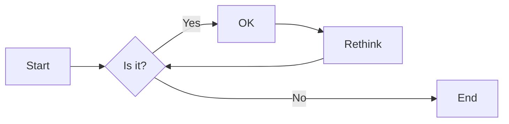
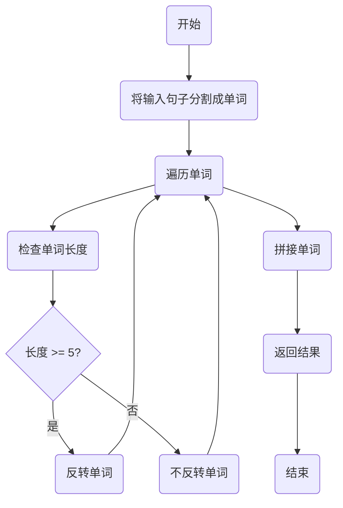
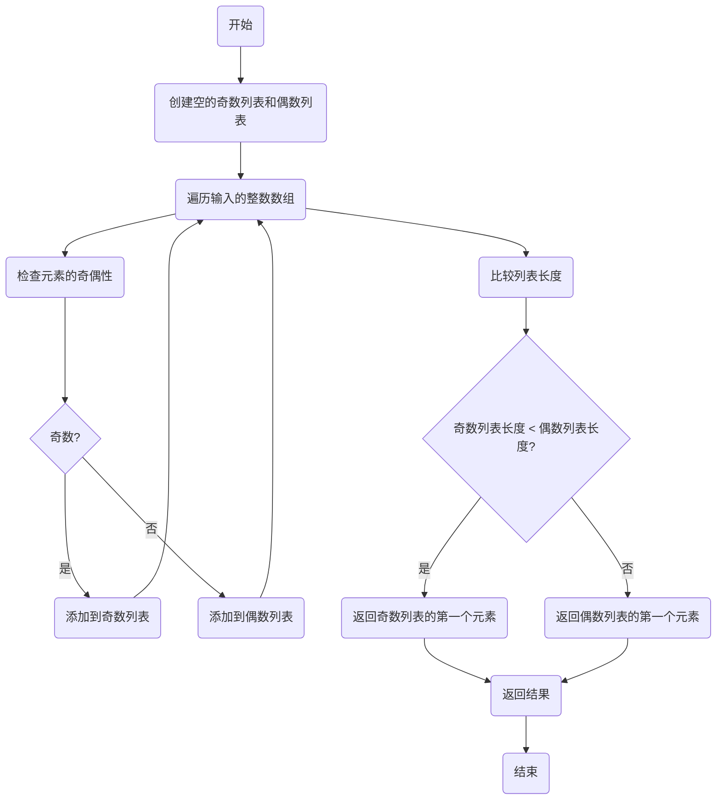
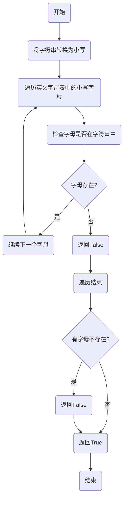
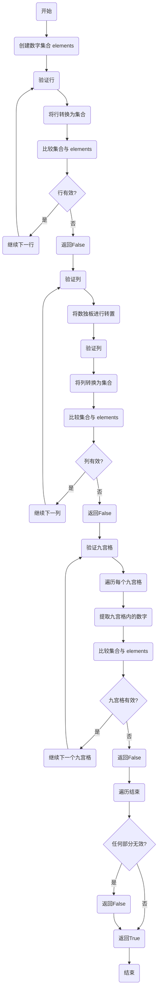
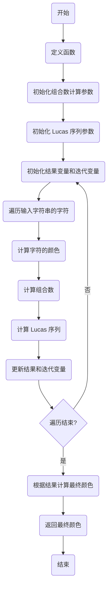

# 实验五 Python数据结构与数据模型

班级： 21计科2

学号： B20210302217

姓名： 刘青

Github地址：<https://github.com/RonaWhite/python>

CodeWars地址：<https://www.codewars.com/users/RonaWhite>

---

## 实验目的

1. 学习Python数据结构的高级用法
2. 学习Python的数据模型

## 实验环境

1. Git
2. Python 3.10
3. VSCode
4. VSCode插件

## 实验内容和步骤

### 第一部分

在[Codewars网站](https://www.codewars.com)注册账号，完成下列Kata挑战：

---

#### 第一题：停止逆转我的单词

难度： 6kyu

编写一个函数，接收一个或多个单词的字符串，并返回相同的字符串，但所有5个或更多的字母单词都是相反的（就像这个Kata的名字一样）。传入的字符串将只由字母和空格组成。只有当出现一个以上的单词时，才会包括空格。
例如：

```python
spinWords( "Hey fellow warriors" ) => returns "Hey wollef sroirraw" 
spinWords( "This is a test") => returns "This is a test" 
spinWords( "This is another test" )=> returns "This is rehtona test"
```

代码提交地址：
<https://www.codewars.com/kata/5264d2b162488dc400000001>

提示：

- 利用str的split方法可以将字符串分为单词列表
例如：

```python
words = "hey fellow warrior".split()
# words should be ['hey', 'fellow', 'warrior']
```

- 利用列表推导将长度大于等于5的单词反转(利用切片word[::-1])
- 最后使用str的join方法连结列表中的单词。

---

#### 第二题： 发现离群的数(Find The Parity Outlier)

难度：6kyu

给你一个包含整数的数组（其长度至少为3，但可能非常大）。该数组要么完全由奇数组成，要么完全由偶数组成，除了一个整数N。请写一个方法，以该数组为参数，返回这个 "离群 "的N。

例如：

```python
[2, 4, 0, 100, 4, 11, 2602, 36]
# Should return: 11 (the only odd number)

[160, 3, 1719, 19, 11, 13, -21]
# Should return: 160 (the only even number)
```

代码提交地址：
<https://www.codewars.com/kata/5526fc09a1bbd946250002dc>

---

#### 第三题： 检测Pangram

难度：6kyu

pangram是一个至少包含每个字母一次的句子。例如，"The quick brown fox jumps over the lazy dog "这个句子就是一个pangram，因为它至少使用了一次字母A-Z（大小写不相关）。

给定一个字符串，检测它是否是一个pangram。如果是则返回`True`，如果不是则返回`False`。忽略数字和标点符号。
代码提交地址：
<https://www.codewars.com/kata/545cedaa9943f7fe7b000048>

---

#### 第四题： 数独解决方案验证

难度：6kyu

数独背景

数独是一种在 9x9 网格上进行的游戏。游戏的目标是用 1 到 9 的数字填充网格的所有单元格，以便每一列、每一行和九个 3x3 子网格（也称为块）中的都包含数字 1 到 9。更多信息请访问：<http://en.wikipedia.org/wiki/Sudoku>

编写一个函数接受一个代表数独板的二维数组，如果它是一个有效的解决方案则返回 true，否则返回 false。数独板的单元格也可能包含 0，这将代表空单元格。包含一个或多个零的棋盘被认为是无效的解决方案。棋盘总是 9 x 9 格，每个格只包含 0 到 9 之间的整数。

代码提交地址：
<https://www.codewars.com/kata/63d1bac72de941033dbf87ae>

---

#### 第五题： 疯狂的彩色三角形

难度： 2kyu

一个彩色的三角形是由一排颜色组成的，每一排都是红色、绿色或蓝色。连续的几行，每一行都比上一行少一种颜色，是通过考虑前一行中的两个相接触的颜色而产生的。如果这些颜色是相同的，那么新的一行就使用相同的颜色。如果它们不同，则在新的一行中使用缺失的颜色。这个过程一直持续到最后一行，只有一种颜色被生成。

例如：

```python
Colour here:            G G        B G        R G        B R
Becomes colour here:     G          R          B          G
```

一个更大的三角形例子：

```python
R R G B R G B B
 R B R G B R B
  G G B R G G
   G R G B G
    B B R R
     B G R
      R B
       G
```

你将得到三角形的第一行字符串，你的工作是返回最后的颜色，这将出现在最下面一行的字符串。在上面的例子中，你将得到 "RRGBRGBB"，你应该返回 "G"。
限制条件： 1 <= length(row) <= 10 ** 5
输入的字符串将只包含大写字母'B'、'G'或'R'。

例如：

```python
triangle('B') == 'B'
triangle('GB') == 'R'
triangle('RRR') == 'R'
triangle('RGBG') == 'B'
triangle('RBRGBRB') == 'G'
triangle('RBRGBRBGGRRRBGBBBGG') == 'G'
```

代码提交地址：
<https://www.codewars.com/kata/5a331ea7ee1aae8f24000175>

提示：请参考下面的链接，利用三进制的特点来进行计算。
<https://stackoverflow.com/questions/53585022/three-colors-triangles>

---

### 第二部分

使用Mermaid绘制程序流程图

安装VSCode插件：

- Markdown Preview Mermaid Support
- Mermaid Markdown Syntax Highlighting

使用Markdown语法绘制你的程序绘制程序流程图（至少一个），Markdown代码如下：


显示效果如下：



查看Mermaid流程图语法-->[点击这里](https://mermaid.js.org/syntax/flowchart.html)

使用Markdown编辑器（例如VScode）编写本次实验的实验报告，包括[实验过程与结果](#实验过程与结果)、[实验考查](#实验考查)和[实验总结](#实验总结)，并将其导出为 **PDF格式** 来提交。

## 实验过程与结果

### 第一部分 Codewars Kata挑战

#### 第一题:停止逆转我的单词

难度： 6kyu

编写一个函数，接收一个或多个单词的字符串，并返回相同的字符串，但所有5个或更多的字母单词都是相反的（就像这个Kata的名字一样）。传入的字符串将只由字母和空格组成。只有当出现一个以上的单词时，才会包括空格。
例如：

```python
spinWords( "Hey fellow warriors" ) => returns "Hey wollef sroirraw" 
spinWords( "This is a test") => returns "This is a test" 
spinWords( "This is another test" )=> returns "This is rehtona test"
```

代码提交地址：
<https://www.codewars.com/kata/5264d2b162488dc400000001>
提示：

- 利用str的split方法可以将字符串分为单词列表
例如：

```python
words = "hey fellow warrior".split()
# words should be ['hey', 'fellow', 'warrior']
```

- 利用列表推导将长度大于等于5的单词反转(利用切片word[::-1])
- 最后使用str的join方法连结列表中的单词。

代码如下：

```python
def spin_words(sentence):
    # 将句子分割成单词
    words = sentence.split()
    
    # 遍历单词并反转长度大于等于5的单词
    for i in range(len(words)):
        if len(words[i]) >= 5:
            words[i] = words[i][::-1]  # 反转单词
    
    # 将反转后的单词用空格重新拼接成一个字符串
    result = ' '.join(words)
    
    return result
```

**解题过程描述：**

1. **分割句子为单词：** 首先，将输入的句子分割成单词。通过空格来实现，因为单词之间通常由空格分隔。

2. **遍历单词并反转：** 接下来，遍历这些单词。对于每个单词，检查它的长度是否大于或等于5个字符。如果是，反转这个单词。

3. **拼接单词为句子：** 在反转或不反转单词后，将这些单词重新拼接成一个新的句子。确保在拼接单词时使用空格分隔它们。

4. **返回结果：** 最后，返回拼接后的句子作为函数的输出。

---

#### 第二题: 发现离群的数(Find The Parity Outlier)

难度：6kyu

给你一个包含整数的数组（其长度至少为3，但可能非常大）。该数组要么完全由奇数组成，要么完全由偶数组成，除了一个整数N。请写一个方法，以该数组为参数，返回这个 "离群 "的N。

例如：

```python
[2, 4, 0, 100, 4, 11, 2602, 36]
# Should return: 11 (the only odd number)

[160, 3, 1719, 19, 11, 13, -21]
# Should return: 160 (the only even number)
```

代码提交地址：
<https://www.codewars.com/kata/5526fc09a1bbd946250002dc>

代码如下：

```python
def find_outlier(int):
    # 保存所有奇数
    odds = [x for x in int if x%2!=0]
    
    # 保存所有偶数
    evens= [x for x in int if x%2==0]
    
    # 比较偶数列表和奇数列表的长度，返回长度较小的列表的第一个元素
    return odds[0] if len(odds)<len(evens) else evens[0]
```

**解题过程描述：**

**1. 创建奇数和偶数列表：** 在函数中，首先创建两个空的列表 `odds` 和 `evens`，用于分别保存数组中的奇数和偶数。

**2. 遍历数组：** 遍历输入的整数数组 `int`，检查每个元素的奇偶性。如果元素是奇数（即取模2不等于0），则将其添加到 `odds` 列表中；如果元素是偶数（即取模2等于0），则将其添加到 `evens` 列表中。

**3. 比较列表长度：** 接下来，比较 `odds` 和 `evens` 列表的长度，因为只有一个元素是离群的。返回长度较小的列表的第一个元素作为离群的数。这是因为正常情况下，奇数列表（`odds`）和偶数列表（`evens`）中的元素数量都比较多，而离群的数只有一个，所以它在较短的列表中。

**4. 返回结果：** 最后，返回离群的数作为函数的输出。

---

#### 第三题: 检测Pangram

难度：6kyu

pangram是一个至少包含每个字母一次的句子。例如，"The quick brown fox jumps over the lazy dog "这个句子就是一个pangram，因为它至少使用了一次字母A-Z（大小写不相关）。

给定一个字符串，检测它是否是一个pangram。如果是则返回`True`，如果不是则返回`False`。忽略数字和标点符号。
代码提交地址：
<https://www.codewars.com/kata/545cedaa9943f7fe7b000048>

代码如下：

```python
def is_pangram(s):
    # 将字符串转换为小写
    s = s.lower()
    
    # 遍历所有小写字母，如果有字母不在字符串中，返回False
    for char in 'abcdefghijklmnopqrstuvwxyz':
        if char not in s:
            return False
        
    # 遍历结束，说明所有字母都在字符串中，返回True
    return True
```

**解题过程描述：**

**1. 转换为小写：** 首先，将输入的字符串转换为小写，以满足题目要求，使大小写不相关。

**2. 遍历字母表：** 遍历英文字母表中的所有小写字母（'abcdefghijklmnopqrstuvwxyz'）。对于每个字母，检查它是否在转换后的字符串中。如果有任何一个字母不在字符串中，返回 `False`，因为这意味着字符串不包含所有字母。

**3. 返回结果：** 如果遍历结束后没有返回 `False`，则说明输入的字符串包含了字母表中的每个字母至少一次，因此返回 `True`，表示这是一个 pangram。

---

#### 第四题: 数独解决方案验证

难度：6kyu

数独背景

数独是一种在 9x9 网格上进行的游戏。游戏的目标是用 1 到 9 的数字填充网格的所有单元格，以便每一列、每一行和九个 3x3 子网格（也称为块）中的都包含数字 1 到 9。更多信息请访问：<http://en.wikipedia.org/wiki/Sudoku>

编写一个函数接受一个代表数独板的二维数组，如果它是一个有效的解决方案则返回 true，否则返回 false。数独板的单元格也可能包含 0，这将代表空单元格。包含一个或多个零的棋盘被认为是无效的解决方案。棋盘总是 9 x 9 格，每个格只包含 0 到 9 之间的整数。

代码提交地址：
<https://www.codewars.com/kata/63d1bac72de941033dbf87ae>

代码如下：

```python
def validate_sudoku(board):
    
    # 利用集合进行比较 {1,2,3,4,5,6,7,8,9}
    elements = set(range(1, 10))
    
    # row
    for b in board:
        if set(b) != elements: 
            return False
    
    # column
    for b in zip(*board):   # zip(*board) 可以将矩阵转置
        if set(b) != elements: 
            return False
    
    # magic squares
    for i in range(3, 10, 3):
        for j in range(3, 10, 3):
            if elements != {(board[q][w]) for w in range(j-3, j) for q in range(i-3, i)}:
                return False
            
    return True
```

**解题过程描述：**

1. **创建集合：**创建一个包含数字1到9的集合 `elements`，用于后续比较。

2. **验证行：**遍历数独板的每一行，将其转换为一个集合并与 `elements` 集合进行比较，以确保每一行包含1到9的所有数字。如果有任何一行不符合要求，返回 `False`，表示数独不是一个有效解决方案。

3. **验证列：**通过将数独板进行转置（将行转换为列），然后用相同的方式验证每一列。对于每一列，将其转换为一个集合并与 `elements` 集合进行比较，以确保每一列包含1到9的所有数字。如果有任何一列不符合要求，返回 `False`，表示数独不是一个有效解决方案。

4. **验证九宫格：**遍历九个3x3的九宫格。对于每个九宫格，使用集合推导式来提取该九宫格内的数字，并将其与 `elements` 集合进行比较，以确保九宫格包含1到9的所有数字。如果有任何一个九宫格不符合要求，返回 `False`，表示数独不是一个有效解决方案。

5. **返回结果：**如果所有的行、列和九宫格都满足要求，最后返回 `True`，表示数独是一个有效解决方案。

---

#### 第五题: 疯狂的彩色三角形

难度： 2kyu

一个彩色的三角形是由一排颜色组成的，每一排都是红色、绿色或蓝色。连续的几行，每一行都比上一行少一种颜色，是通过考虑前一行中的两个相接触的颜色而产生的。如果这些颜色是相同的，那么新的一行就使用相同的颜色。如果它们不同，则在新的一行中使用缺失的颜色。这个过程一直持续到最后一行，只有一种颜色被生成。

例如：

```python
Colour here:            G G        B G        R G        B R
Becomes colour here:     G          R          B          G
```

一个更大的三角形例子：

```python
R R G B R G B B
 R B R G B R B
  G G B R G G
   G R G B G
    B B R R
     B G R
      R B
       G
```

你将得到三角形的第一行字符串，你的工作是返回最后的颜色，这将出现在最下面一行的字符串。在上面的例子中，你将得到 "RRGBRGBB"，你应该返回 "G"。
限制条件： 1 <= length(row) <= 10 ** 5
输入的字符串将只包含大写字母'B'、'G'或'R'。

例如：

```python
triangle('B') == 'B'
triangle('GB') == 'R'
triangle('RRR') == 'R'
triangle('RGBG') == 'B'
triangle('RBRGBRB') == 'G'
triangle('RBRGBRBGGRRRBGBBBGG') == 'G'
```

代码提交地址：
<https://www.codewars.com/kata/5a331ea7ee1aae8f24000175>

提示：请参考下面的链接，利用三进制的特点来进行计算。
<https://stackoverflow.com/questions/53585022/three-colors-triangles>

代码如下：

```python
fac = [1, 1, 2]

# 计算组合数 C(n, m) 在模3下的结果，inv(x) 表示取反，即0->0, 1->2, 2->1
def C(n, m):
    # 如果 n 小于 m，则返回 0
    if n < m:
        return 0
    # 返回组合数结果，注意取模3
    return fac[n] * fac[m] * fac[n - m] % 3

# 计算 Lucas 序列的第 n 项，n 和 m 是非负整数
def Lucas(n, m):
    ans = 1
    while m and ans:
        ans, n, m = ans * C(n % 3, m % 3) % 3, n // 3, m // 3
    return ans

# 计算最后一行的颜色
def triangle(row):
    i, ans, n = 0, 0, len(row) - 1
    # 如果只有一个字符，直接返回
    if not n:
        return row
    for c in row:
        # 更新 ans 和 i，根据字符的颜色计算 Lucas 序列的值
        ans, i = ans + (0 if c == 'R' else 1 if c == 'G' else 2) * Lucas(n, i), i + 1
    # 根据 ans 的值确定最终的颜色
    ans = (3 - ans % 3 if n & 1 else ans) % 3
    return 'R' if ans == 0 else 'G' if ans == 1 else 'B'

# 测试例子
print(triangle('GB'))       # 输出 'R'
print(triangle('RGBG'))     # 输出 'B'
print(triangle('RBRGBRB'))  # 输出 'G'
```

**解题过程描述：**

**1. 组合数计算：** 首先，定义了一个计算组合数的函数 `C(n, m)`。这个函数会在模3下计算组合数的结果，其中 `inv(x)` 表示取反，即0->0, 1->2, 2->1。这个函数会使用递归的方式计算组合数，注意取模3。

**2. Lucas 序列计算：** 接下来，定义了一个计算 Lucas 序列的函数 `Lucas(n, m)`。这个函数计算 Lucas 序列的第 n 项，其中 n 和 m 是非负整数。函数使用循环来计算 Lucas 序列，使用 `C` 函数来计算组合数。它会一直计算直到 m 和 ans 都为0。同样，注意取模3。

**3. 计算最后一行的颜色：** 在 `triangle` 函数中，首先初始化一些变量，包括 `ans` 用于存储计算结果，`i` 用于迭代，`n` 用于表示输入字符串的长度减1。如果只有一个字符，直接返回该字符。然后，通过迭代遍历输入字符串中的每个字符。根据字符的颜色，计算 Lucas 序列的值，并更新 `ans` 和 `i`。最后，根据 `ans` 的值确定最终的颜色，根据取模3的结果，将0映射为'R'，1映射为'G'，2映射为'B'，并返回最终的颜色。

### 第二部分 使用Mermaid绘制程序流程图

#### 第一题: 停止逆转我的单词



#### 第二题:发现离群的数(Find The Parity Outlier)



#### 第三题:检测Pangram



#### 第四题：数独解决方案验证



#### 第五题：疯狂的彩色三角形



## 实验考查

请使用自己的语言并使用尽量简短代码示例回答下面的问题，这些问题将在实验检查时用于提问和答辩以及实际的操作。

**1. 集合（set）类型有什么特点？它和列表（list）类型有什么区别？**

**集合（set）类型在Python中具有以下特点：**

- 集合是无序的：集合中的元素没有特定的顺序，不像列表一样有索引来访问元素。
- 集合中的元素是唯一的：每个元素只能在集合中出现一次，重复的元素会被自动去重。
- 集合是可变的：你可以向集合中添加或删除元素。

**与列表（list）类型的区别：**

- 列表是有序的，元素按照插入的顺序排列，而集合没有特定的顺序。
- 列表允许元素重复，而集合中的元素是唯一的。
- 集合通常用于执行集合操作，如并集、交集、差集等，而列表更常用于一般的数据存储和操作。
- 列表使用方括号 `[ ]` 来定义和访问元素，而集合使用大括号 `{ }` 或 `set()` 来定义，并使用 `add()` 和 `remove()` 方法来操作元素。

示例：

```python
# 创建一个列表
my_list = [1, 2, 3, 3, 4, 5]
print(my_list)  # 输出: [1, 2, 3, 3, 4, 5]

# 创建一个集合
my_set = {1, 2, 3, 3, 4, 5}
print(my_set)  # 输出: {1, 2, 3, 4, 5}

# 使用集合操作
set1 = {1, 2, 3}
set2 = {3, 4, 5}
union_set = set1 | set2  # 并集
print(union_set)  # 输出: {1, 2, 3, 4, 5}
```

总之，集合适用于需要唯一性和集合操作的情况，而列表适用于有序存储和可以包含重复元素的情况。

**2. 集合（set）类型主要有那些操作？**

集合（set）类型支持多种操作，用于执行集合论中的各种操作，如并集、交集、差集、对称差等。以下是一些主要的集合操作：

**1. 并集（Union）：** 获取两个集合的所有不重复元素的合并。

```python
set1 = {1, 2, 3}
set2 = {3, 4, 5}
union_set = set1 | set2
# 或使用 union() 方法
union_set = set1.union(set2)
```

**2. 交集（Intersection）：** 获取两个集合中共同存在的元素。

```python
set1 = {1, 2, 3}
set2 = {3, 4, 5}
intersection_set = set1 & set2
# 或使用 intersection() 方法
intersection_set = set1.intersection(set2)
```

**3. 差集（Difference）：** 获取一个集合中存在，而另一个集合中不存在的元素。

```python
set1 = {1, 2, 3}
set2 = {3, 4, 5}
difference_set = set1 - set2
# 或使用 difference() 方法
difference_set = set1.difference(set2)
```

**4. 对称差（Symmetric Difference）：** 获取两个集合中仅存在于其中一个集合中的元素。

```python
set1 = {1, 2, 3}
set2 = {3, 4, 5}
symmetric_difference_set = set1 ^ set2
# 或使用 symmetric_difference() 方法
symmetric_difference_set = set1.symmetric_difference(set2)
```

**5. 子集（Subset）和超集（Superset）：** 检查一个集合是否是另一个集合的子集或超集。

```python
set1 = {1, 2, 3}
set2 = {1, 2}
is_subset = set2.issubset(set1)
is_superset = set1.issuperset(set2)
```

**6. 添加元素：** 向集合中添加元素。

```python
my_set = {1, 2, 3}
my_set.add(4)
```

**7. 删除元素：** 从集合中删除元素。

```python
my_set = {1, 2, 3}
my_set.remove(2)
```

**8. 清空集合：** 移除集合中的所有元素。

```python
my_set = {1, 2, 3}
my_set.clear()
```

**9. 获取集合大小：** 获取集合中元素的数量。

```python
my_set = {1, 2, 3}
size = len(my_set)
```

这些是集合类型主要支持的操作。集合操作使得在处理不同数据集之间的关系时非常方便，例如数据去重、查找共同元素等。

**3. 使用`*`操作符作用到列表上会产生什么效果？为什么不能使用`*`操作符作用到嵌套的列表上？使用简单的代码示例说明。**

`*` 操作符在Python中用于复制或重复列表中的元素。当将 `*` 作用于列表时，它会复制列表中的元素。但是，如果将 `*` 作用于嵌套的列表，它将重复嵌套列表本身而不是列表中的元素。

**作用于普通列表的 `*` 操作：**

```python
my_list = [1, 2, 3]
duplicated_list = my_list * 3
print(duplicated_list)
```

输出结果：

```python
[1, 2, 3, 1, 2, 3, 1, 2, 3]
```

在这个示例中，`my_list` 是一个包含整数的列表，使用 `*` 操作符将其复制了三次，产生了一个包含九个元素的新列表 `duplicated_list`。

**作用于嵌套的列表的 `*` 操作：**

```python
nested_list = [[1, 2, 3]]
duplicated_nested_list = nested_list * 3
print(duplicated_nested_list)
```

输出结果：

```python
[[1, 2, 3], [1, 2, 3], [1, 2, 3]]
```

在这个示例中，`nested_list` 是一个包含一个嵌套列表的列表，使用 `*` 操作符将整个嵌套列表复制了三次，产生了一个包含三个相同嵌套列表的新列表 `duplicated_nested_list`。

**4. 总结列表,集合，字典的解析（comprehension）的使用方法。使用简单的代码示例说明。**

**列表解析 (List Comprehension):**

列表解析是一种简洁的方式来创建新的列表，通常基于现有的列表或可迭代对象。它的基本语法是在一个中括号内定义一个表达式，然后通过迭代可迭代对象的元素来生成新的列表。

示例：

```python
# 使用列表解析创建一个包含1到10的平方的列表
squares = [x**2 for x in range(1, 11)]
```

**集合解析 (Set Comprehension):**

集合解析与列表解析类似，但用大括号而不是中括号。它用于创建新的集合，并去除重复的元素。

示例：

```python
# 使用集合解析创建一个包含1到10的平方的集合
unique_squares = {x**2 for x in range(1, 11)}
```

**字典解析 (Dictionary Comprehension):**

字典解析用于创建新的字典。它也使用大括号，但包括键-值对的定义。

示例：

```python
# 使用字典解析创建一个包含1到5的数字及其平方的字典
squares_dict = {x: x**2 for x in range(1, 6)}
```

## 实验总结

在本次实验中，我学习和应用了以下知识和技巧：

1. **字符串处理**：在第一题 "停止逆转我的单词" 中，我学会了如何使用字符串的 `split` 和 `join` 方法来拆分和连接字符串。这在处理文本数据时非常有用。

2. **列表推导**：在第一题和第二题中，我使用了列表推导来处理列表中的元素。列表推导是一种强大的工具，可以快速生成新的列表，从而减少编写循环的复杂性。

3. **算法思想**：在第二题 "发现离群的数" 中，我使用了算法思想来找出离群的数。通过计算奇数和偶数的数量，我能够确定哪个数字是离群的。

4. **集合和集合操作**：在第四题 "数独解决方案验证" 中，我使用了集合来进行集合操作，以验证数独解决方案的有效性。集合是用于处理唯一元素的数据结构，非常适合这种任务。

5. **递归和循环**：在第五题 "疯狂的彩色三角形" 中，我使用了递归和循环来计算组合数和Lucas序列。这些是解决复杂计算问题的重要工具。

总的来说，这次实验帮助我巩固了Python的语法和数据结构的知识，同时也锻炼了我的问题解决和编程技能。这些知识和技巧对于解决各种编程问题都非常有用。
