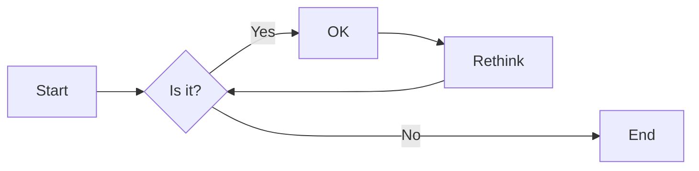
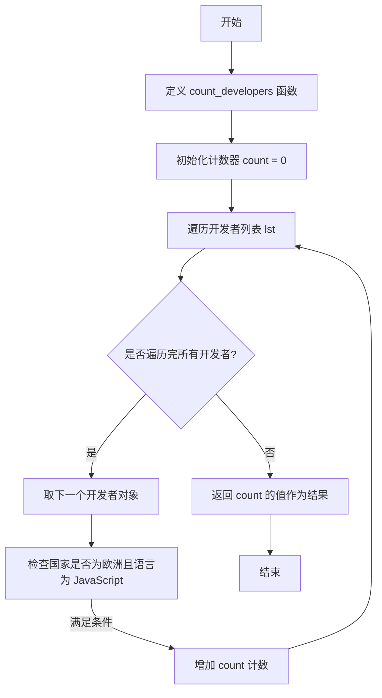
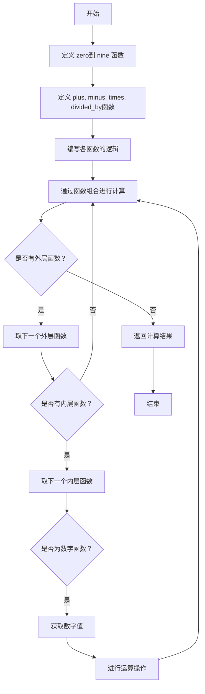
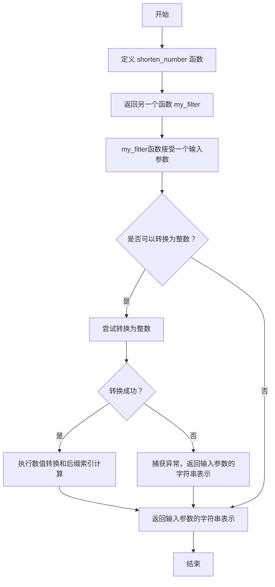
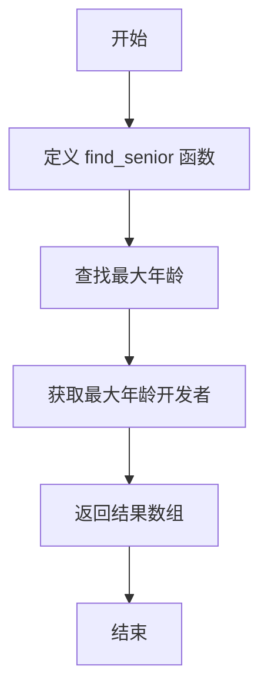
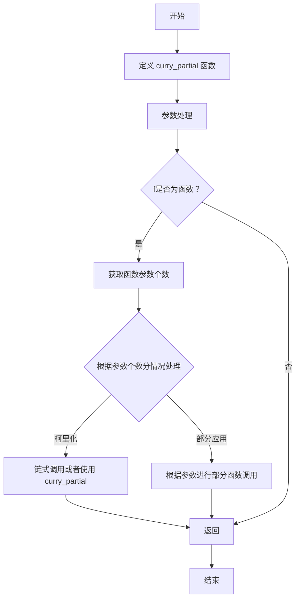

# 实验六 Python函数

班级： 21计科2

学号： B20210302217

姓名： 刘青

Github地址：<https://github.com/RonaWhite/python>

CodeWars地址：<https://www.codewars.com/users/RonaWhite>

---

## 实验目的

1. 学习Python函数的基本用法
2. 学习lambda函数和高阶函数的使用
3. 掌握函数式编程的概念和实践

## 实验环境

1. Git
2. Python 3.10
3. VSCode
4. VSCode插件

## 实验内容和步骤

### 第一部分

Python函数

完成教材《Python编程从入门到实践》下列章节的练习：

- 第8章 函数

---

### 第二部分

在[Codewars网站](https://www.codewars.com)注册账号，完成下列Kata挑战：

---

#### 第一题：编码聚会1

难度： 7kyu

你将得到一个字典数组，代表关于首次报名参加你所组织的编码聚会的开发者的数据。
你的任务是返回来自欧洲的JavaScript开发者的数量。
例如，给定以下列表：

```python
lst1 = [
  { 'firstName': 'Noah', 'lastName': 'M.', 'country': 'Switzerland', 'continent': 'Europe', 'age': 19, 'language': 'JavaScript' },
  { 'firstName': 'Maia', 'lastName': 'S.', 'country': 'Tahiti', 'continent': 'Oceania', 'age': 28, 'language': 'JavaScript' },
  { 'firstName': 'Shufen', 'lastName': 'L.', 'country': 'Taiwan', 'continent': 'Asia', 'age': 35, 'language': 'HTML' },
  { 'firstName': 'Sumayah', 'lastName': 'M.', 'country': 'Tajikistan', 'continent': 'Asia', 'age': 30, 'language': 'CSS' }
]
```

你的函数应该返回数字1。
如果，没有来自欧洲的JavaScript开发人员，那么你的函数应该返回0。

注意：
字符串的格式将总是"Europe"和"JavaScript"。
所有的数据将始终是有效的和统一的，如上面的例子。

这个卡塔是Coding Meetup系列的一部分，其中包括一些简短易行的卡塔，这些卡塔是为了让人们掌握高阶函数的使用。在Python中，这些方法包括：`filter`, `map`, `reduce`。当然也可以采用其他方法来解决这些卡塔。

[代码提交地址](https://www.codewars.com/kata/coding-meetup-number-1-higher-order-functions-series-count-the-number-of-javascript-developers-coming-from-europe)

---

#### 第二题： 使用函数进行计算

难度：5kyu

这次我们想用函数来写计算，并得到结果。让我们看一下一些例子：

```python
seven(times(five())) # must return 35
four(plus(nine())) # must return 13
eight(minus(three())) # must return 5
six(divided_by(two())) # must return 3
```

要求：

- 从0（"零"）到9（"九"）的每个数字都必须有一个函数。
- 必须有一个函数用于以下数学运算：加、减、乘、除。
- 每个计算都由一个操作和两个数字组成。
- 最外面的函数代表左边的操作数，最里面的函数代表右边的操作数。
- 除法应该是整数除法。

例如，下面的计算应该返回2，而不是2.666666...。

```python
eight(divided_by(three()))
```

代码提交地址：
<https://www.codewars.com/kata/525f3eda17c7cd9f9e000b39>

---

#### 第三题： 缩短数值的过滤器(Number Shortening Filter)

难度：6kyu

在这个kata中，我们将创建一个函数，它返回另一个缩短长数字的函数。给定一个初始值数组替换给定基数的 X 次方。如果返回函数的输入不是数字字符串，则应将输入本身作为字符串返回。

例子：

```python
filter1 = shorten_number(['','k','m'],1000)
filter1('234324') == '234k'
filter1('98234324') == '98m'
filter1([1,2,3]) == '[1,2,3]'
filter2 = shorten_number(['B','KB','MB','GB'],1024)
filter2('32') == '32B'
filter2('2100') == '2KB';
filter2('pippi') == 'pippi'
```

代码提交地址：
<https://www.codewars.com/kata/56b4af8ac6167012ec00006f>

---

#### 第四题： 编码聚会7

难度： 6kyu

您将获得一个对象序列，表示已注册参加您组织的下一个编程聚会的开发人员的数据。

您的任务是返回一个序列，其中包括最年长的开发人员。如果有多个开发人员年龄相同，则将他们按照在原始输入数组中出现的顺序列出。

例如，给定以下输入数组：

```python
list1 = [
  { 'firstName': 'Gabriel', 'lastName': 'X.', 'country': 'Monaco', 'continent': 'Europe', 'age': 49, 'language': 'PHP' },
  { 'firstName': 'Odval', 'lastName': 'F.', 'country': 'Mongolia', 'continent': 'Asia', 'age': 38, 'language': 'Python' },
  { 'firstName': 'Emilija', 'lastName': 'S.', 'country': 'Lithuania', 'continent': 'Europe', 'age': 19, 'language': 'Python' },
  { 'firstName': 'Sou', 'lastName': 'B.', 'country': 'Japan', 'continent': 'Asia', 'age': 49, 'language': 'PHP' },
]
```

您的程序应该返回如下结果：

```python
[
  { 'firstName': 'Gabriel', 'lastName': 'X.', 'country': 'Monaco', 'continent': 'Europe', 'age': 49, 'language': 'PHP' },
  { 'firstName': 'Sou', 'lastName': 'B.', 'country': 'Japan', 'continent': 'Asia', 'age': 49, 'language': 'PHP' },
]
```

注意：

- 输入的列表永远都包含像示例中一样有效的正确格式的数据，而且永远不会为空。

代码提交地址：
<https://www.codewars.com/kata/582887f7d04efdaae3000090>

---

#### 第五题： Currying versus partial application

难度： 4kyu

[Currying versus partial application](https://2ality.com/2011/09/currying-vs-part-eval.html)是将一个函数转换为具有更小arity(参数更少)的另一个函数的两种方法。虽然它们经常被混淆，但它们的工作方式是不同的。目标是学会区分它们。

Currying

是一种将接受多个参数的函数转换为以每个参数都只接受一个参数的一系列函数链的技术。

Currying接受一个函数：

```python
f：X × Y → R
```

并将其转换为一个函数：

```python
f'：X → (Y → R)
```

我们不再使用两个参数调用f，而是使用第一个参数调用f'。结果是一个函数，然后我们使用第二个参数调用该函数来产生结果。因此，如果非curried f被调用为：

```python
f(3, 5)
```

那么curried f'被调用为：

```python
f'(3)(5)
```

示例
给定以下函数：

```python
def add(x, y, z):
  return x + y + z
```

我们可以以普通方式调用：

```python
add(1, 2, 3) # => 6
```

但我们可以创建一个curried版本的add(a, b, c)函数：

```python
curriedAdd = lambda a: (lambda b: (lambda c: add(a,b,c)))
curriedAdd(1)(2)(3) # => 6
```

Partial application
是将一定数量的参数固定到函数中，从而产生另一个更小arity(参数更少)的函数的过程。

部分应用接受一个函数：

```python
f：X × Y → R
```

和一个固定值x作为第一个参数，以产生一个新的函数

```python
f'：Y → R
```

f'与f执行的操作相同，但只需要填写第二个参数，这就是其arity比f的arity少一个的原因。可以说第一个参数绑定到x。

示例:

```python
partialAdd = lambda a: (lambda *args: add(a,*args))
partialAdd(1)(2, 3) # => 6
```

你的任务是实现一个名为curryPartial()的通用函数，可以进行currying或部分应用。

例如：

```python
curriedAdd = curryPartial(add)
curriedAdd(1)(2)(3) # => 6

partialAdd = curryPartial(add, 1)
partialAdd(2, 3) # => 6
```

我们希望函数保持灵活性。

所有下面这些例子都应该产生相同的结果：

```python
curryPartial(add)(1)(2)(3) # =>6 
curryPartial(add, 1)(2)(3) # =>6 
curryPartial(add, 1)(2, 3) # =>6 
curryPartial(add, 1, 2)(3) # =>6 
curryPartial(add, 1, 2, 3) # =>6 
curryPartial(add)(1, 2, 3) # =>6 
curryPartial(add)(1, 2)(3) # =>6 
curryPartial(add)()(1, 2, 3) # =>6 
curryPartial(add)()(1)()()(2)(3) # =>6 

curryPartial(add)()(1)()()(2)(3, 4, 5, 6) # =>6 
curryPartial(add, 1)(2, 3, 4, 5) # =>6 

curryPartial(curryPartial(curryPartial(add, 1), 2), 3) # =>6
curryPartial(curryPartial(add, 1, 2), 3) # =>6
curryPartial(curryPartial(add, 1), 2, 3) # =>6
curryPartial(curryPartial(add, 1), 2)(3) # =>6
curryPartial(curryPartial(add, 1)(2), 3) # =>6
curryPartial(curryPartial(curryPartial(add, 1)), 2, 3) # =>6
```

代码提交地址：
<https://www.codewars.com/kata/53cf7e37e9876c35a60002c9>

---

### 第三部分

使用Mermaid绘制程序流程图

安装VSCode插件：

- Markdown Preview Mermaid Support
- Mermaid Markdown Syntax Highlighting

使用Markdown语法绘制你的程序绘制程序流程图（至少一个），Markdown代码如下：


显示效果如下：



查看Mermaid流程图语法-->[点击这里](https://mermaid.js.org/syntax/flowchart.html)

使用Markdown编辑器（例如VScode）编写本次实验的实验报告，包括[实验过程与结果](#实验过程与结果)、[实验考查](#实验考查)和[实验总结](#实验总结)，并将其导出为 **PDF格式** 来提交。

## 实验过程与结果

### 第一部分 Python函数

### 第8章 函数

#### 8-1 消息

```python
def display_message():
    print("hello")

display_message()
```

运行结果：

```python
hello
```

#### 8-2 喜欢的图书

```python
def favorite_book(title):
    print(f"One of my favorite books {title} in Wonderland")

favorite_book('a')
```

运行结果：

```python
One of my favorite books a in Wonderland
```

#### 8-3 T恤

```python
def make_shirt(chima,T_str):
    print(f"T恤的尺码:{chima} 字样:{T_str}")

make_shirt(11,'a')
make_shirt(chima=11,T_str='b')
make_shirt(T_str='c',chima=111)
```

运行结果：

```python
T恤的尺码:11 字样:a
T恤的尺码:11 字样:b
T恤的尺码:111 字样:c
```

#### 8-4 大号T恤

```python
def make_shirt(chima,T_str='I love Python'):
    print(f"T恤的尺码:{chima} 字样:{T_str}")

make_shirt(11)
make_shirt(chima=11,T_str='b')
make_shirt(T_str='c',chima=111)
```

运行结果：

```python
T恤的尺码:11 字样:I love Python
T恤的尺码:11 字样:b
T恤的尺码:111 字样:c
```

#### 8-5 城市

```python
def describe_city(city='Reykjavik is in Iceland'):
    print(city)

describe_city()
describe_city('aaa')
```

运行结果：

```python
Reykjavik is in Iceland
aaa
```

#### 8-6 城市名

```python
def city_country(name,country):
    return f"{name},{country}"
hold='yes'
city_countrys=[]
while hold=='yes':
    name=input("城市的名称：")
    country=input("所属国家：")
    city_countrys.append(city_country(name,country))
    hold=input("是否继续输入：\'yes or no\'")
for cc in city_countrys:
    print(cc)
```

运行结果：

```python
城市的名称：长沙 
所属国家：中国
是否继续输入：'yes or no'no
长沙,中国
```

#### 8-7 专辑

```python
def make_album(people_name,music_name,music_digit=0):
    information = {}
    information[people_name]=music_name
    if music_digit!=0:
        information['digit']=music_digit
    return information

print(make_album('a','b'))
print(make_album('c','d'))
print(make_album('m','n',10))
```

运行结果：

```python
{'a': 'b'}
{'c': 'd'}
{'m': 'n', 'digit': 10}
```

#### 8-8 用户的专辑

```python
def make_album(people_name,music_name,music_digit=0):
    information = {}
    information[people_name]=music_name
    if music_digit!=0:
        information['digit']=music_digit
    return information

ct='y'
while ct=='y':
    people_name=input("输入歌手名字：")
    music_name=input("输入歌曲名字：")
    print(make_album(people_name,music_name))
    ct=input("是否继续：\'y or n\'")
```

运行结果：

```python
输入歌手名字：周杰伦
输入歌曲名字：七里香
{'周杰伦': '七里香'}
是否继续：'y or n'n 
```

#### 8-9 魔术师

```python
def show_magicians(name):
    for a in name:
        print(a)
name=['a','b']
show_magicians(name)
```

运行结果：

```python
a
b
```

#### 8-10 了不起的魔术师

```python
def show_magicians(name):
    for a in name:
        print(a)
def make_great(lt):
    while lt:
        name_change.append(lt.pop()+" the Great")


name=['a','b']
name_change=[]
make_great(name)
show_magicians(name)
show_magicians(name_change)
```

运行结果：

```python
b the Great
a the Great
```

#### 8-11 不变的魔术师

```python
def show_magicians(name):
    for a in name:
        print(a)
def make_great(lt):
    while lt:
        name_change.append(lt.pop()+" the Great")


name=['a','b']
name_change=[]
make_great(name[:])
show_magicians(name)
show_magicians(name_change)
```

运行结果：

```python
a
b
b the Great
a the Great
```

#### 8-12 三明治

```python
def sandswith_food(food):
    for n,m in food.items():
        print(f"{n}:{m}")
food={
    'aaa':'Az'
    }
sandswith_food(food)
```

运行结果：

```python
aaa:Az
```

#### 8-13 用户简介

```python
def build_profile(first,last,**user_info):
    user_info['first_name']=first
    user_info['last_name']=last
    return user_info

user_profile=build_profile('liu','yi zheng',location='princeton',field='physics')
print(user_profile)
```

运行结果：

```python
{'location': 'princeton', 'field': 'physics', 'first_name': 'liu', 'last_name': 'yi zheng'}
```

#### 8-14 汽车

```python
def make_car(creat,byts,**car):
    car['a']=creat
    car['b']=byts
    return car
car=make_car('subaru','outback',color='blue',tow_package=True)
print(car)
```

运行结果：

```python
{'color': 'blue', 'tow_package': True, 'a': 'subaru', 'b': 'outback'}
```

### 第二部分 Codewars Kata挑战

#### 第一题： 编码聚会1

难度： 7kyu

你将得到一个字典数组，代表关于首次报名参加你所组织的编码聚会的开发者的数据。
你的任务是返回来自欧洲的JavaScript开发者的数量。
例如，给定以下列表：

```python
lst1 = [
  { 'firstName': 'Noah', 'lastName': 'M.', 'country': 'Switzerland', 'continent': 'Europe', 'age': 19, 'language': 'JavaScript' },
  { 'firstName': 'Maia', 'lastName': 'S.', 'country': 'Tahiti', 'continent': 'Oceania', 'age': 28, 'language': 'JavaScript' },
  { 'firstName': 'Shufen', 'lastName': 'L.', 'country': 'Taiwan', 'continent': 'Asia', 'age': 35, 'language': 'HTML' },
  { 'firstName': 'Sumayah', 'lastName': 'M.', 'country': 'Tajikistan', 'continent': 'Asia', 'age': 30, 'language': 'CSS' }
]
```

你的函数应该返回数字1。
如果，没有来自欧洲的JavaScript开发人员，那么你的函数应该返回0。

[代码提交地址](https://www.codewars.com/kata/coding-meetup-number-1-higher-order-functions-series-count-the-number-of-javascript-developers-coming-from-europe)

代码如下：

```python
def count_developers(lst):
    # 初始化计数器
    count = 0

    # 遍历开发者列表
    for developer in lst:
        # 检查开发者国家是否在欧洲并且使用的编程语言是 JavaScript
        if developer['continent'] == 'Europe' and developer['language'] == 'JavaScript':
            count += 1  # 满足条件的开发者数量加一

    return count
```

**解题过程描述：**

1. **函数定义：** 首先，定义了一个名为 `count_developers` 的函数。

2. **计数器初始化：** 在函数内部创建了一个变量 `count`，初始值为 0，用于统计满足条件的 JavaScript 开发者来自欧洲的数量。

3. **遍历开发者列表：** 使用 `for` 循环遍历了给定的开发者列表 `lst` 中的每个开发者对象。

4. **条件检查：** 在循环中，针对每个开发者对象执行条件检查：
   - 检查开发者的国家是否在欧洲，即 `developer['continent'] == 'Europe'`。
   - 验证开发者是否使用的编程语言是 JavaScript，即 `developer['language'] == 'JavaScript'`。

5. **计数：** 如果某个开发者同时满足国家是欧洲且编程语言是 JavaScript的条件，将计数器 `count` 的值增加 1。

6. **返回结果：** 函数返回计数器 `count` 的值，代表满足条件的 JavaScript 开发者来自欧洲的数量。

#### 第二题：使用函数进行计算

难度：5kyu

这次我们想用函数来写计算，并得到结果。让我们看一下一些例子：

```python
seven(times(five())) # must return 35
four(plus(nine())) # must return 13
eight(minus(three())) # must return 5
six(divided_by(two())) # must return 3
```

要求：

- 从0（"零"）到9（"九"）的每个数字都必须有一个函数。
- 必须有一个函数用于以下数学运算：加、减、乘、除。
- 每个计算都由一个操作和两个数字组成。
- 最外面的函数代表左边的操作数，最里面的函数代表右边的操作数。
- 除法应该是整数除法。

例如，下面的计算应该返回2，而不是2.666666...。

```python
eight(divided_by(three()))
```

代码提交地址：
<https://www.codewars.com/kata/525f3eda17c7cd9f9e000b39>

代码如下：

```python
def zero(func=None):
    return 0 if not func else func(0)

def one(func=None):
    return 1 if not func else func(1)

def two(func=None):
    return 2 if not func else func(2)

def three(func=None):
    return 3 if not func else func(3)

def four(func=None):
    return 4 if not func else func(4)

def five(func=None):
    return 5 if not func else func(5)

def six(func=None):
    return 6 if not func else func(6)

def seven(func=None):
    return 7 if not func else func(7)

def eight(func=None):
    return 8 if not func else func(8)

def nine(func=None):
    return 9 if not func else func(9)

# 运算函数
def plus(x):
    return lambda y: y + x

def minus(x):
    return lambda y: y - x

def times(x):
    return lambda y: y * x

def divided_by(x):
    return lambda y: y // x if x != 0 else "Cannot divide by zero"
```

**解题过程描述：**

1. **定义函数：** 首先，需要定义函数来表示从 0 到 9 的数字以及加减乘除等数学运算。

2. **数字函数：** 需要创建 `zero()` 到 `nine()` 这十个函数，每个函数返回相应的数字。

3. **运算函数：** 还需要创建 `plus()`、`minus()`、`times()` 和 `divided_by()` 这四个函数来表示加、减、乘、除操作。

4. **函数组合：** 每个计算都包含一个操作和两个数字。最外层函数表示左操作数，最内层函数表示右操作数。

5. **整数除法：** 要求除法是整数除法，即返回整数结果而非小数。

#### 第三题：缩短数值的过滤器(Number Shortening Filter)

难度：6kyu

在这个kata中，我们将创建一个函数，它返回另一个缩短长数字的函数。给定一个初始值数组替换给定基数的 X 次方。如果返回函数的输入不是数字字符串，则应将输入本身作为字符串返回。

代码提交地址：
<https://www.codewars.com/kata/56b4af8ac6167012ec00006f>

代码如下：

```python
def shorten_number(suffixes, base):
    # 定义一个函数
    def my_filter(data):
        try:
            # 将函数输入转换为整数
            number = int(data)
            
        # 如果输入的数据不能转换为整数，直接转换为str返回
        except (TypeError, ValueError):
            return str(data)
        else:
            # i用来跟踪suffixes列表的索引
            i = 0
            
            # 每次循环将输入的数字除以base，索引i+1
            # 如果除以base等于0或者索引等于len(suffixes)-1，结束循环
            while number//base > 0 and i < len(suffixes)-1:
                number //= base
                i += 1
            return str(number) + suffixes[i]     

    # 返回值是一个函数
    return my_filter

filter1 = shorten_number(['','k','m'],1000)
print(filter1('234324'))  # == '234k'
print(filter1('98234324')) # == '98m'
print(filter1([1,2,3])) # == '[1,2,3]'

filter2 = shorten_number(['B','KB','MB','GB'],1024)
print(filter2('32')) # == '32B'
print(filter2('2100'))  # == '2KB';
print(filter2('pippi')) # == 'pippi'
```

**解题过程描述：**

1. **定义函数和处理输入：** 首先，定义了 `shorten_number` 函数，该函数接受 `suffixes` 和 `base` 作为参数，并返回一个函数 `my_filter`。
2. **my_filter函数逻辑：** 这个函数尝试将输入转换为整数，如果转换失败（比如输入不是可以转换为整数的字符串），则捕获异常并返回输入参数的字符串表示。
3. **数值转换和后缀索引计算：** 如果输入可以成功转换为整数，循环执行除法操作直到商为0或者达到索引边界。这个过程根据基数和后缀列表计算并返回缩短后的数字和相应的后缀。

#### 第四题：编码聚会7

难度： 6kyu

您将获得一个对象序列，表示已注册参加您组织的下一个编程聚会的开发人员的数据。

您的任务是返回一个序列，其中包括最年长的开发人员。如果有多个开发人员年龄相同，则将他们按照在原始输入数组中出现的顺序列出。

代码提交地址：
<https://www.codewars.com/kata/582887f7d04efdaae3000090>

代码如下：

```python
def find_senior(lst): 
    
    # 利用生成器作为max函数的参数，找到最大的年龄
    mage = max(a['age'] for a in lst)
    
    # 利用列表推导返回结果
    return [a for a in lst if a['age']==mage]
```

**解题过程描述：**

1. **查找最大年龄：** 首先，使用列表推导式和 `max()` 函数查找给定开发者列表中的最大年龄。

2. **获取最大年龄开发者：** 接下来，使用列表推导式筛选出年龄等于最大年龄的开发者对象，并将其作为结果返回。

#### 第五题：Currying versus partial application

难度： 4kyu

[Currying versus partial application](https://2ality.com/2011/09/currying-vs-part-eval.html)是将一个函数转换为具有更小arity(参数更少)的另一个函数的两种方法。虽然它们经常被混淆，但它们的工作方式是不同的。目标是学会区分它们。

你的任务是实现一个名为curryPartial()的通用函数，可以进行currying或部分应用。

代码提交地址：
<https://www.codewars.com/kata/53cf7e37e9876c35a60002c9>

代码如下：

```python
def curry_partial(f, *args):  
    
    # 如果f不是函数，直接返回
    if not callable(f): 
        return f

    # 查看函数f需要的参数个数
    num_args = f.__code__.co_argcount

    # 如果f函数不需要参数，说明f是curry_partial函数
    if num_args == 0:
        return f(*args)

    if len(args) >= num_args:
        return f(*args[:num_args])

    def inner(*params):    
        all_args = [*args, *params]

        # 如果没有参数，这是curry函数，使用链式调用
        if not args:
            return curry_partial(f, *all_args)

        # 如果第一个参数不是函数，这是curry函数，使用链式调用        
        if not callable(args[0]):
            return curry_partial(f, *all_args)

        # 如果第一个参数是函数，这是partial函数，使用部分函数调用
        fn = args[0]
        num_args2 = fn.__code__.co_argcount

        # 如果fn函数不需要参数，说明fn是curry_partial函数
        if num_args2 == 0:
            return fn(*all_args)

        if len(all_args) >= num_args2:
            return fn(*all_args[:num_args2])
        else:
            return curry_partial(fn, *all_args)
        
    return inner

# 定义一个三个数的加法
add = lambda a,b,c: a+b+c    
a,b,c = 1,2,3

# partial调用
print(curry_partial(curry_partial(curry_partial(add, a), b), c))

# curry调用
print(curry_partial(add)(a)(b)(c))
```

**解题过程描述：**

1. **参数处理：** `curry_partial()` 函数接受一个函数 `f` 和一系列参数 `*args`。
2. **判断 `f` 函数：** 首先，判断给定的 `f` 是否为函数，如果不是，直接返回。
3. **查看函数参数个数：** 使用 `f.__code__.co_argcount` 查看函数 `f` 需要的参数个数。
4. **分情况处理：** 根据参数个数和当前参数传递情况，分别处理柯里化和部分应用的情况。
5. **内部函数 `inner()`：** 定义一个内部函数 `inner()`，根据参数个数和已传递的参数，决定是继续进行柯里化还是进行部分应用，并返回对应的结果。

### 第三部分 使用Mermaid绘制程序流程图

#### 第一题: 编码聚会1



#### 第二题: 使用函数进行计算



#### 第三题: 缩短数值的过滤器(Number Shortening Filter)



#### 第四题: 编码聚会7



#### 第五题: Currying versus partial application



## 实验考查

请使用自己的语言并使用尽量简短代码示例回答下面的问题，这些问题将在实验检查时用于提问和答辩以及实际的操作。

**1. 什么是函数式编程范式？**

函数式编程是一种编程范式，它强调使用函数作为基本的构建块，并将计算视为函数求值的过程。函数式编程重视函数的纯粹性（无副作用）、不可变性以及将函数作为第一类对象来操作。这意味着函数可以作为参数传递给其他函数，也可以作为返回值返回。

**2. 什么是lambda函数？请举例说明**。

lambda函数是一种匿名函数，它可以在一行内定义，通常用于简单的、不需要重复使用的函数。它的基本结构为 `lambda 参数列表: 表达式`。

**lambda函数的示例：**

在下面这个例子中，定义了一个lambda函数 `add`，它接受两个参数 `x` 和 `y`，并返回它们的和：

```python
add = lambda x, y: x + y
result = add(3, 5)  # 结果为 8
```

在这里，`lambda x, y: x + y` 表示一个匿名函数，它接受两个参数 `x` 和 `y`，并返回它们的和。然后将这个lambda函数赋值给变量 `add`，并使用 `add(3, 5)` 来调用它，得到的结果是8。

lambda函数通常用于一次性的简单函数需求，可以在代码中直接定义和使用，不需要单独定义一个函数名称，从而简化了代码结构。

**3. 什么是高阶函数？常用的高阶函数有哪些？这些高阶函数如何工作？使用简单的代码示例说明。**

高阶函数是能够接受其他函数作为参数，或者将函数作为返回值的函数。常见的高阶函数包括 `map()`、`filter()` 和 `reduce()`。

- `map()` 函数：将一个函数应用于序列的每个元素，并返回结果组成的新序列。

  ```python
  # 示例：将列表中的每个元素平方
  numbers = [1, 2, 3, 4]
  squared = list(map(lambda x: x ** 2, numbers))  # 结果为 [1, 4, 9, 16]
  ```

- `filter()` 函数：使用给定函数过滤序列，返回满足条件的元素组成的新序列。

  ```python
  # 示例：过滤列表中的偶数
  numbers = [1, 2, 3, 4, 5, 6]
  even_numbers = list(filter(lambda x: x % 2 == 0, numbers))  # 结果为 [2, 4, 6]
  ```

- `reduce()` 函数：对序列中的元素依次进行累积计算，最终返回一个值。

  ```python
  # 示例：计算列表中所有元素的和
  from functools import reduce  # 在 Python 3 中需要导入 functools 模块
  numbers = [1, 2, 3, 4, 5]
  total = reduce(lambda x, y: x + y, numbers)  # 结果为 15
  ```

这些函数能够接收其他函数作为参数，并对序列进行处理或者组合，进而实现丰富的功能。

## 实验总结

在这次实验中，我学习和使用到了以下知识：

### 函数式编程范式

- **函数作为第一类对象：** 理解了函数在函数式编程中的重要性，它们可以像其他数据类型一样进行操作。
- **纯函数和不可变性：** 掌握了函数式编程中函数的纯粹性和数据不可变性的概念，这有助于编写更易于调试和推理的代码。

### Lambda函数

- **匿名函数的使用：** 学习了lambda函数的语法和用法，它们是一种简洁的方式定义匿名函数。
- **应用场景：** 了解了lambda函数常用于简单且一次性的函数需求，可以提高代码的简洁性和可读性。

### 高阶函数

- **map、filter和reduce函数：** 了解了高阶函数的概念及其应用，如 `map()`、`filter()` 和 `reduce()`，这些函数能够接收其他函数作为参数，对序列进行处理或组合。

### 编程思想和技巧

- **函数式编程思想：** 理解了函数式编程的核心思想，强调函数作为基本构建块、纯函数和不可变性。
- **Lambda函数的应用：** 学会了使用lambda函数简化代码结构，特别适用于简单且一次性的函数需求。
- **高阶函数的使用：** 了解和运用了map、filter和reduce等高阶函数，对序列进行转换和操作。

这次实验帮助我更好地理解了函数式编程的概念和实践，学会了使用lambda函数和高阶函数来简化和优化代码。同时也加深了我对函数式编程范式的理解，并且在编程实践中能更加灵活地运用这些概念和技巧。
