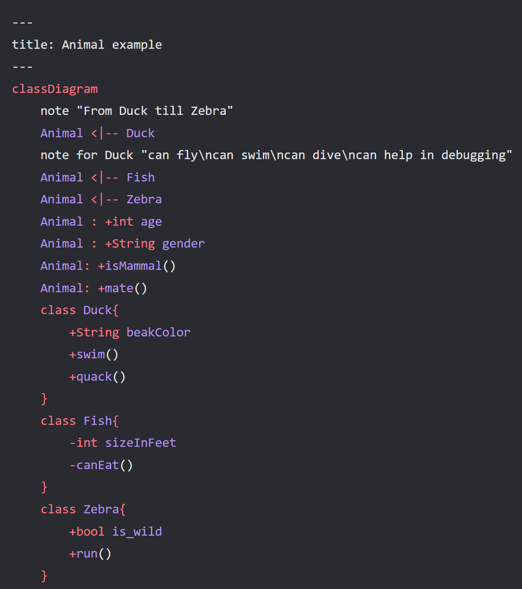
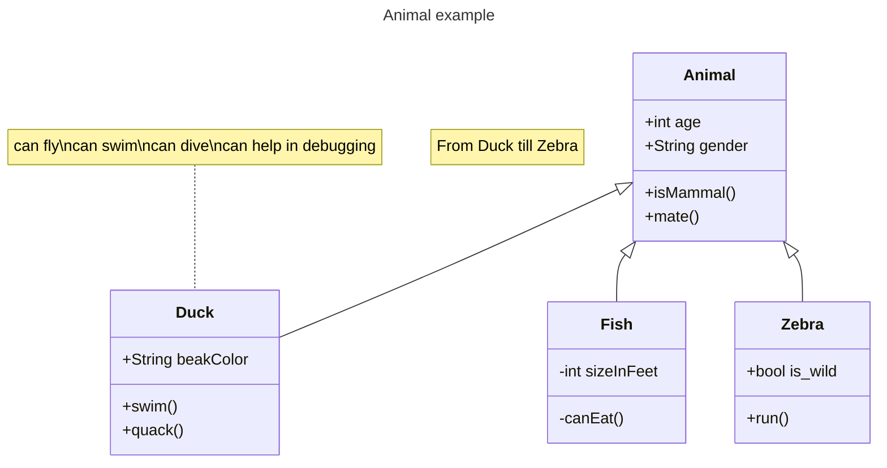
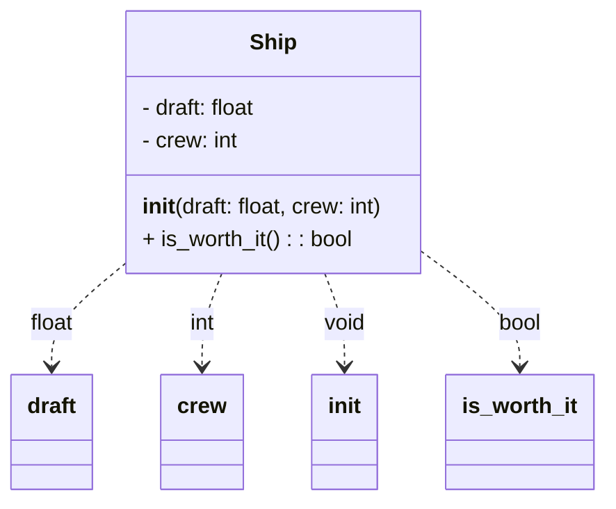
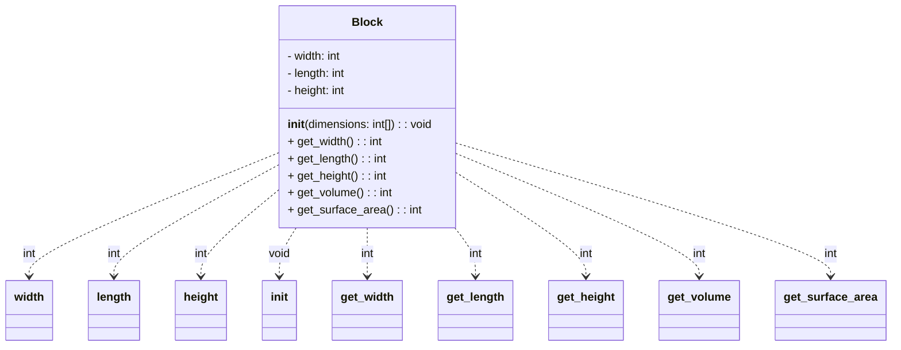
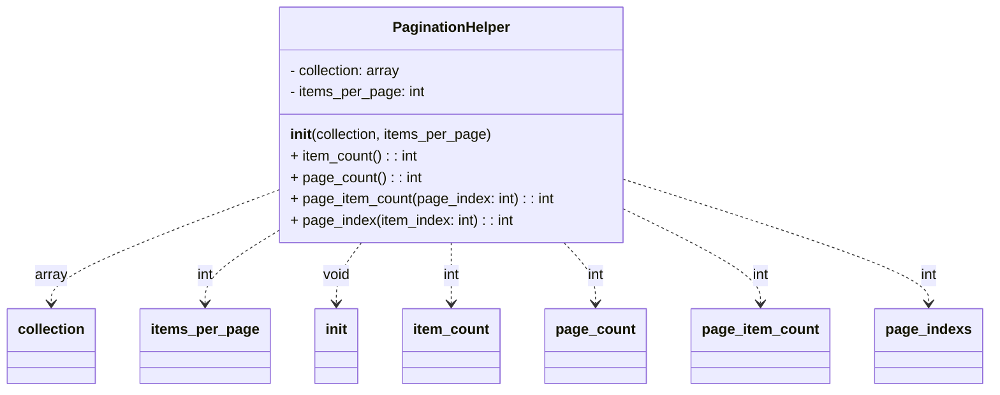
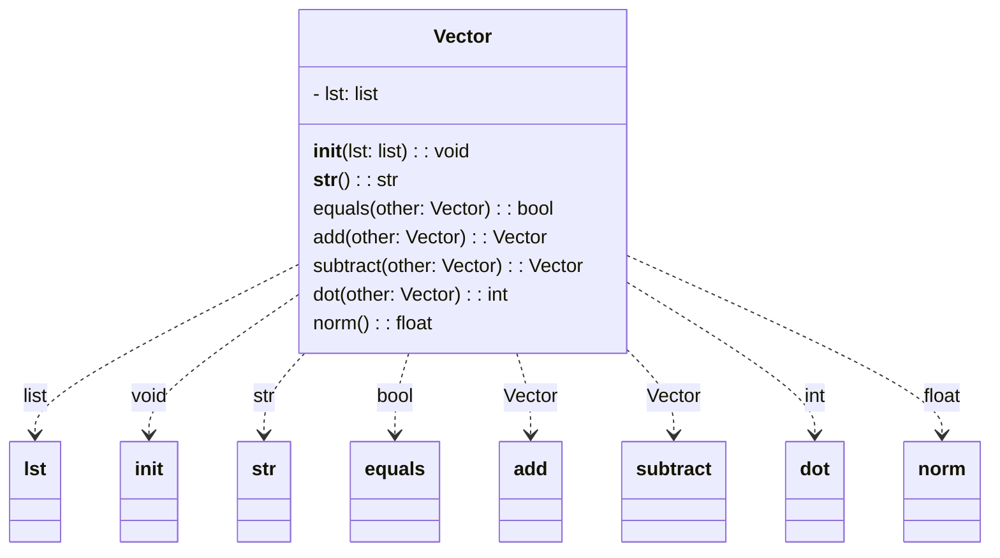
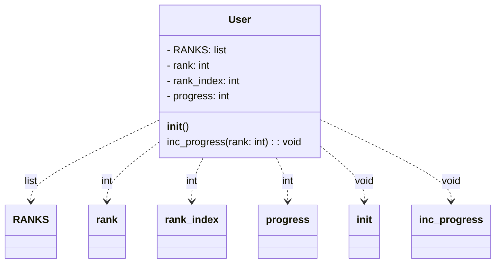

# 实验七 Python面向对象编程

班级： 21计科2

学号： B20210302217

姓名： 刘青

Github地址：<https://github.com/RonaWhite/python>

CodeWars地址：<https://www.codewars.com/users/RonaWhite>

---

## 实验目的

1. 学习Python类和继承的基础知识
2. 学习namedtuple和DataClass的使用

## 实验环境

1. Git
2. Python 3.10
3. VSCode
4. VSCode插件

## 实验内容和步骤

### 第一部分

Python面向对象编程

完成教材《Python编程从入门到实践》下列章节的练习：

- 第9章 类

---

### 第二部分

在[Codewars网站](https://www.codewars.com)注册账号，完成下列Kata挑战：

---

#### 第一题：面向对象的海盗

难度： 8kyu

啊哈，伙计!

你是一个小海盗团的首领。而且你有一个计划。在OOP的帮助下，你希望建立一个相当有效的系统来识别船上有大量战利品的船只。
对你来说，不幸的是，现在的人很重，那么你怎么知道一艘船上装的是黄金而不是人呢？

你首先要写一个通用的船舶类。

```python
class Ship:
    def __init__(self, draft, crew):
        self.draft = draft
        self.crew = crew
```

每当你的间谍看到一艘新船进入码头，他们将根据观察结果创建一个新的船舶对象。

- `draft`吃水 - 根据船在水中的高度来估计它的重量
- `crew`船员 - 船上船员的数量

`Titanic = Ship(15, 10)`

任务

你可以访问船舶的 "draft(吃水) "和 "crew(船员)"。"draft(吃水) "是船的总重量，"船员 "是船上的人数。
每个船员都会给船的吃水增加1.5个单位。如果除去船员的重量后，吃水仍然超过20，那么这艘船就值得掠夺。任何有这么重的船一定有很多战利品!
添加方法
`is_worth_it`
来决定这艘船是否值得掠夺。

例如：

```python
Titanic.is_worth_it()
False
```

祝你好运，愿你能找到金子!

代码提交地址：
<https://www.codewars.com/kata/54fe05c4762e2e3047000add>

---

#### 第二题： 搭建积木

难度：7kyu

写一个创建Block的类（Duh.）
构造函数应该接受一个数组作为参数，这个数组将包含3个整数，其形式为`[width, length, height]`，Block应该由这些整数创建。

定义这些方法:

- `get_width()` return the width of the `Block`
- `get_length()` return the length of the `Block`
- `get_height()` return the height of the `Block`
- `get_volume()` return the volume of the `Block`
- `get_surface_area()` return the surface area of the `Block`

例子：

```python
b = Block([2,4,6]) # create a `Block` object with a width of `2` a length of `4` and a height of `6`
b.get_width() # return 2    
b.get_length() # return 4
b.get_height() # return 6
b.get_volume() # return 48
b.get_surface_area() # return 88
```

注意： 不需要检查错误的参数。

代码提交地址：
<https://www.codewars.com/kata/55b75fcf67e558d3750000a3>

---

#### 第三题： 分页助手

难度：5kyu

在这个练习中，你将加强对分页的掌握。你将完成PaginationHelper类，这是一个实用类，有助于查询与数组有关的分页信息。
该类被设计成接收一个值的数组和一个整数，表示每页允许多少个项目。集合/数组中包含的值的类型并不相关。

下面是一些关于如何使用这个类的例子：

```python
helper = PaginationHelper(['a','b','c','d','e','f'], 4)
helper.page_count() # should == 2
helper.item_count() # should == 6
helper.page_item_count(0)  # should == 4
helper.page_item_count(1) # last page - should == 2
helper.page_item_count(2) # should == -1 since the page is invalid

# page_index takes an item index and returns the page that it belongs on
helper.page_index(5) # should == 1 (zero based index)
helper.page_index(2) # should == 0
helper.page_index(20) # should == -1
helper.page_index(-10) # should == -1 because negative indexes are invalid
```

代码提交地址：
<https://www.codewars.com/kata/515bb423de843ea99400000a>

---

#### 第四题： 向量（Vector）类

难度： 5kyu

创建一个支持加法、减法、点积和向量长度的向量（Vector）类。

举例来说：

```python
a = Vector([1, 2, 3])
b = Vector([3, 4, 5])
c = Vector([5, 6, 7, 8])

a.add(b)      # should return a new Vector([4, 6, 8])
a.subtract(b) # should return a new Vector([-2, -2, -2])
a.dot(b)      # should return 1*3 + 2*4 + 3*5 = 26
a.norm()      # should return sqrt(1^2 + 2^2 + 3^2) = sqrt(14)
a.add(c)      # raises an exception
```

如果你试图对两个不同长度的向量进行加减或点缀，你必须抛出一个错误。
向量类还应该提供：

- 一个 `__str__` 方法，这样 `str(a) === '(1,2,3)'
- 一个equals方法，用来检查两个具有相同成分的向量是否相等。

注意：测试案例将利用用户提供的equals方法。

代码提交地址：
<https://www.codewars.com/kata/526dad7f8c0eb5c4640000a4>

---

#### 第五题： Codewars风格的等级系统

难度： 4kyu

编写一个名为User的类，用于计算用户在类似于Codewars使用的排名系统中的进步量。

业务规则：

- 一个用户从等级-8开始，可以一直进步到8。
- 没有0（零）等级。在-1之后的下一个等级是1。
- 用户将完成活动。这些活动也有等级。
- 每当用户完成一个有等级的活动，用户的等级进度就会根据活动的等级进行更新。
- 完成活动获得的进度是相对于用户当前的等级与活动的等级而言的。
- 用户的等级进度从零开始，每当进度达到100时，用户的等级就会升级到下一个等级。
- 在上一等级时获得的任何剩余进度都将被应用于下一等级的进度（我们不会丢弃任何进度）。例外的情况是，如果没有其他等级的进展（一旦你达到8级，就没有更多的进展了）。
- 一个用户不能超过8级。
- 唯一可接受的等级值范围是-8,-7,-6,-5,-4,-3,-2,-1,1,2,3,4,5,6,7,8。任何其他的值都应该引起错误。

逻辑案例：

- 如果一个排名为-8的用户完成了一个排名为-7的活动，他们将获得10的进度。
- 如果一个排名为-8的用户完成了排名为-6的活动，他们将获得40的进展。
- 如果一个排名为-8的用户完成了排名为-5的活动，他们将获得90的进展。
- 如果一个排名-8的用户完成了排名-4的活动，他们将获得160个进度，从而使该用户升级到排名-7，并获得60个进度以获得下一个排名。
- 如果一个等级为-1的用户完成了一个等级为1的活动，他们将获得10个进度（记住，零等级会被忽略）。

代码案例：

```python
user = User()
user.rank # => -8
user.progress # => 0
user.inc_progress(-7)
user.progress # => 10
user.inc_progress(-5) # will add 90 progress
user.progress # => 0 # progress is now zero
user.rank # => -7 # rank was upgraded to -7
```

代码提交地址：
<https://www.codewars.com/kata/51fda2d95d6efda45e00004e>

---

### 第三部分

使用Mermaid绘制程序的**类图**

安装VSCode插件：

- Markdown Preview Mermaid Support
- Mermaid Markdown Syntax Highlighting

使用Markdown语法绘制你的程序绘制程序类图（至少一个），Markdown代码如下：



显示效果如下：



查看Mermaid类图的语法-->[点击这里](https://mermaid.js.org/syntax/classDiagram.html)

使用Markdown编辑器（例如VScode）编写本次实验的实验报告，包括[实验过程与结果](#实验过程与结果)、[实验考查](#实验考查)和[实验总结](#实验总结)，并将其导出为 **PDF格式** 来提交。

## 实验过程与结果

### 第一部分 Python面向对象编程

#### 9-1 餐馆

```python
class Restaurant():
    def __init__(self, restaurant_name, cuisine_name):
        self.restaurant_name = restaurant_name
        self.cuisine_name = cuisine_name

    def describe_restaurant(self):
        print("\nRestaurant name: " + self.restaurant_name.title())
        print("Cuisine name: " + self.cuisine_name.title())

    def open_restaurant(self):
        print("\n" + self.restaurant_name.title() + " is opening")


restaurant = Restaurant('beijing restaurant', 'traditional food')
print(restaurant.restaurant_name + "," + restaurant.cuisine_name)
restaurant.describe_restaurant()
restaurant.open_restaurant()
```

运行结果：

```python
beijing restaurant,traditional food

Restaurant name: Beijing Restaurant
Cuisine name: Traditional Food

Beijing Restaurant is opening
```

#### 9-2 三家餐馆

```python
class Restaurant:
    def __init__(self, restaurant_name, cuisine_name):
        self.restaurant_name = restaurant_name
        self.cuisine_name = cuisine_name

    def describe_restaurant(self):
        print("\nRestaurant name: " + self.restaurant_name.title())
        print("Cuisine name: " + self.cuisine_name.title())

    def open_restaurant(self):
        print("\n" + self.restaurant_name.title() + " is opening")


beijing_restaurant = Restaurant('beijing restaurant', 'beijing food')
lanzhou_restaurant = Restaurant('lanzhou restaurant', 'lanzhou food')
sichuan_restaurant = Restaurant('sichuan restaurant', 'sichuan food')

beijing_restaurant.describe_restaurant()
lanzhou_restaurant.describe_restaurant()
sichuan_restaurant.describe_restaurant()
```

运行结果：

```python
Restaurant name: Beijing Restaurant
Cuisine name: Beijing Food

Restaurant name: Lanzhou Restaurant       
Cuisine name: Lanzhou Food

Restaurant name: Sichuan Restaurant       
Cuisine name: Sichuan Food
```

#### 9-3 用户

```python
class User:
    def __init__(self, first, last, age, location):
        self.first_name = first
        self.last_name = last
        self.age = age
        self.location = location

    def describe_user(self):
        print("\nUser info:")
        name = self.last_name.title() + " " + self.first_name.title()
        print("\tName: " + name)
        print("\tAge: " + str(self.age))
        print("\tLocation: " + self.location.title())

    def greet_user(self):
        name = self.last_name.title() + " " + self.first_name.title()
        print("\nHi, " + name + "! Nice to see you again!")


zhangsan = User('san', 'zhang', 22, 'shanghai')
lisi = User('si', 'li', 33, 'beijing')
wangwu = User('wu', 'wang', 44, 'sichuan')

zhangsan.describe_user()
zhangsan.greet_user()
lisi.describe_user()
lisi.greet_user()
wangwu.describe_user()
wangwu.greet_user()
```

运行结果：

```python
User info:
        Name: Zhang San
        Age: 22
        Location: Shanghai

Hi, Zhang San! Nice to see you again!

User info:
        Name: Li Si
        Age: 33
        Location: Beijing

Hi, Li Si! Nice to see you again!

User info:
        Name: Wang Wu
        Age: 44
        Location: Sichuan

Hi, Wang Wu! Nice to see you again!
```

#### 9-4 就餐人数

```python
class Restaurant:
    def __init__(self, restaurant_name, cuisine_name):
        self.restaurant_name = restaurant_name
        self.cuisine_name = cuisine_name
        self.number_served = 0

    def describe_restaurant(self):
        print("\nRestaurant name: " + self.restaurant_name.title())
        print("Cuisine name: " + self.cuisine_name.title())
        print("Number served: " + str(self.number_served))

    def open_restaurant(self):
        print("\n" + self.restaurant_name.title() + " is opening")

    def set_number_served(self, number):
        self.number_served = number
        print("Number served: " + str(self.number_served))

    def increment_number_served(self, number):
        self.number_served = number
        print("Number wanter to serve: " + str(self.number_served))


restaurant = Restaurant('beijing restaurant', 'traditional food')
print(restaurant.number_served)
restaurant.number_served = 10
print(restaurant.number_served)

restaurant.set_number_served(20)
restaurant.increment_number_served(30)
```

运行结果：

```python
0
10
Number served: 20
Number wanter to serve: 30
```

#### 9-5 尝试登录次数

```python
class User:
    def __init__(self, first, last, age, location):
        self.first_name = first
        self.last_name = last
        self.age = age
        self.location = location
        self.login_attempts = 0

    def describe_user(self):
        print("\nUser info:")
        name = self.last_name.title() + " " + self.first_name.title()
        print("\tName: " + name)
        print("\tAge: " + str(self.age))
        print("\tLocation: " + self.location.title())

    def greet_user(self):
        name = self.last_name.title() + " " + self.first_name.title()
        print("\nHi, " + name + "! Nice to see you again!")

    def increment_login_attempts(self):
        self.login_attempts += 1

    def reset_login_attempts(self):
        self.login_attempts = 0


user = User('san', 'zhang', 22, 'shanghai')
for i in range(10):
    user.increment_login_attempts()
print(user.login_attempts)
user.reset_login_attempts()
print(user.login_attempts)
```

运行结果：

```python
10
0
```

#### 9-6 冰淇淋小店

```python
class Restaurant:
    def __init__(self, restaurant_name, cuisine_name):
        self.restaurant_name = restaurant_name
        self.cuisine_name = cuisine_name
        self.number_served = 0

    def describe_restaurant(self):
        print("\nRestaurant name: " + self.restaurant_name.title())
        print("Cuisine name: " + self.cuisine_name.title())
        print("Number served: " + str(self.number_served))

    def open_restaurant(self):
        print("\n" + self.restaurant_name.title() + " is opening")

    def set_number_served(self, number):
        self.number_served = number


class IceCreamStand(Restaurant):
    def __init__(self, restaurant_name, cuisine_name):
        super(IceCreamStand, self).__init__(restaurant_name, cuisine_name)
        self.flavors = ['chocolate', 'strawberry', 'vanilla']

    def show_flavors(self):
        print("\nDifferent flavors in " + self.restaurant_name.title() + ":")
        for flavor in self.flavors:
            print("\t" + flavor.title() + " IceCream")


icecreamStand = IceCreamStand('love live icecream', 'ice cuisine')
icecreamStand.show_flavors()
```

运行结果：

```python
Different flavors in Love Live Icecream:
        Chocolate IceCream
        Strawberry IceCream
        Vanilla IceCream
```

#### 9-7 管理员

```python
class User:
    def __init__(self, first, last, age, location):
        self.first_name = first
        self.last_name = last
        self.age = age
        self.location = location
        self.login_attempts = 0

    def describe_user(self):
        print("\nUser info:")
        name = self.last_name.title() + " " + self.first_name.title()
        print("\tName: " + name)
        print("\tAge: " + str(self.age))
        print("\tLocation: " + self.location.title())

    def greet_user(self):
        name = self.last_name.title() + " " + self.first_name.title()
        print("\nHi, " + name + "! Nice to see you again!")

    def increment_login_attempts(self):
        self.login_attempts += 1

    def reset_login_attempts(self):
        self.login_attempts = 0


class Admin(User):
    def __init__(self, first, last, age, location):
        super().__init__(first, last, age, location)
        self.privileges = ["can add post", "can delete post", "can ban user"]

    def show_privileges(self):
        name = self.last_name.title() + " " + self.first_name.title()
        print("\nHello, " + name + "! You have the following privileges:")
        for privilege in self.privileges:
            print("\t" + privilege.title())


admin = Admin('liu', 'zhao', '18', 'chengdu')
admin.show_privileges()
```

运行结果：

```python
Hello, Zhao Liu! You have the following privileges:
        Can Add Post
        Can Delete Post
        Can Ban User
```

#### 9-8 权限

```python
class Privileges:
    def __init__(self):
        self.privileges = ["can add post", "can delete post", "can ban user"]

    def show_privileges(self):
        print("You have the following privileges:")
        for privilege in self.privileges:
            print("\t" + privilege.title())


class User:
    def __init__(self, first, last, age, location):
        self.first_name = first
        self.last_name = last
        self.age = age
        self.location = location
        self.login_attempts = 0

    def describe_user(self):
        print("\nUser info:")
        name = self.last_name.title() + " " + self.first_name.title()
        print("\tName: " + name)
        print("\tAge: " + str(self.age))
        print("\tLocation: " + self.location.title())

    def greet_user(self):
        name = self.last_name.title() + " " + self.first_name.title()
        print("\nHi, " + name + "! Nice to see you again!")

    def increment_login_attempts(self):
        self.login_attempts += 1

    def reset_login_attempts(self):
        self.login_attempts = 0


class Admin(User):
    def __init__(self, first, last, age, location):
        super().__init__(first, last, age, location)
        self.privileges = Privileges()


admin = Admin('liu', 'zhao', '18', 'chengdu')
admin.privileges.show_privileges()
```

运行结果：

```python
You have the following privileges:
        Can Add Post
        Can Delete Post
        Can Ban User
```

#### 9-9 电瓶升级

```python
class Battery:
    def __init__(self, battery_size=70):
        self.battery_size = battery_size

    def describe_battery(self):
        print("This car has a " + str(self.battery_size) + "-kwh battery.")

    def get_range(self):
        if self.battery_size == 70:
            range = 240
        elif self.battery_size == 85:
            range = 270

        message = "This car can go approximately " + str(range) + " miles on a full charge."
        print(message)

    def upgrade_battery(self):
        if self.battery_size != 85:
            self.battery_size = 85


class Car:
    def __init__(self, make, model, year):
        self.make = make
        self.model = model
        self.year = year
        self.odometer_reading = 0

    def get_descriptive_name(self):
        long_name = str(self.year) + ' ' + self.make + ' ' + self.model
        return long_name.title()

    def read_odometer(self):
        print("This car has " + str(self.odometer_reading) + " miles on it.")

    def update_odometer(self, mileage):
        if mileage >= self.odometer_reading:
            self.odometer_reading = mileage
        else:
            print("You can't roll back an odometer!")

    def increment_odometer(self, miles):
        self.odometer_reading += miles


class ElectricCar(Car):
    def __init__(self, make, model, year):
        super().__init__(make, model, year)
        self.battery = Battery()


my_car = ElectricCar('tesla', 'model s', '2022')
# print(my_car.get_descriptive_name())
# my_car.battery.describe_battery()
my_car.battery.get_range()
my_car.battery.upgrade_battery()
# my_car.battery.describe_battery()
my_car.battery.get_range()
```

运行结果：

```python
This car can go approximately 240 miles on a full charge.
This car can go approximately 270 miles on a full charge.
```

#### 9-10 导入Restaurant类

Restaurant.py：

```python
class Restaurant:
    def __init__(self, restaurant_name, cuisine_name):
        self.restaurant_name = restaurant_name
        self.cuisine_name = cuisine_name
        self.number_served = 0

    def describe_restaurant(self):
        print("\nRestaurant name: " + self.restaurant_name.title())
        print("Cuisine name: " + self.cuisine_name.title())
        print("Number served: " + str(self.number_served))

    def open_restaurant(self):
        print("\n" + self.restaurant_name.title() + " is opening")

    def set_number_served(self, number):
        self.number_served = number
```

```python
from restaurant import Restaurant

restaurant = Restaurant('beijing restaurant', 'traditional food')
print(restaurant.restaurant_name + "," + restaurant.cuisine_name)
restaurant.describe_restaurant()
restaurant.open_restaurant()
```

#### 9-11 导入Admin类

user_privileges_admin.py：

```python
class Privileges:
    def __init__(self):
        self.privileges = ["can add post", "can delete post", "can ban user"]

    def show_privileges(self):
        print("\nYou have the following privileges:")
        for privilege in self.privileges:
            print("\t" + privilege.title())


class User:
    def __init__(self, first, last, age, location):
        self.first_name = first
        self.last_name = last
        self.age = age
        self.location = location
        self.login_attempts = 0

    def describe_user(self):
        print("\nUser info:")
        name = self.last_name.title() + " " + self.first_name.title()
        print("\tName: " + name)
        print("\tAge: " + str(self.age))
        print("\tLocation: " + self.location.title())

    def greet_user(self):
        name = self.last_name.title() + " " + self.first_name.title()
        print("\nHi, " + name + "! Nice to see you again!")

    def increment_login_attempts(self):
        self.login_attempts += 1

    def reset_login_attempts(self):
        self.login_attempts = 0


class Admin(User):
    def __init__(self, first, last, age, location):
        super().__init__(first, last, age, location)
        self.privileges = Privileges()
```

#### 9-12 多个模块

user.py：

```python
class User:
    def __init__(self, first, last, age, location):
        self.first_name = first
        self.last_name = last
        self.age = age
        self.location = location
        self.login_attempts = 0

    def describe_user(self):
        print("\nUser info:")
        name = self.last_name.title() + " " + self.first_name.title()
        print("\tName: " + name)
        print("\tAge: " + str(self.age))
        print("\tLocation: " + self.location.title())

    def greet_user(self):
        name = self.last_name.title() + " " + self.first_name.title()
        print("\nHi, " + name + "! Nice to see you again!")

    def increment_login_attempts(self):
        self.login_attempts += 1

    def reset_login_attempts(self):
        self.login_attempts = 0
```

privileges_admin.py：

```python
from user import User


class Privileges:
    def __init__(self):
        self.privileges = ["can add post", "can delete post", "can ban user"]

    def show_privileges(self):
        print("\nYou have the following privileges:")
        for privilege in self.privileges:
            print("\t" + privilege.title())


class Admin(User):
    def __init__(self, first, last, age, location):
        super().__init__(first, last, age, location)
        self.privileges = Privileges()
```

```python
from privileges_admin import Admin


admin = Admin('liu', 'zhao', '18', 'chengdu')
admin.privileges.show_privileges()
```

#### 9-13 使用OrderedDict

```python
from collections import OrderedDict


vocabulary = OrderedDict()

vocabulary['accumulator'] = '累加器'
vocabulary['algorithm'] = '算法'
vocabulary['array'] = '数组'
vocabulary['branch'] = '分支'
vocabulary['breakpoint'] = '断点'

for word, meaning in vocabulary.items():
    print(word + ":" + meaning)
```

运行结果：

```python
accumulator:累加器
algorithm:算法
array:数组
branch:分支
breakpoint:断点
```

#### 9-14 骰子

```python
from random import randint
x = randint(1, 6)

from random import randint


class Die:
    def __init__(self, sides=6):
        self.sides = sides

    def roll_die(self):
        x = randint(1, self.sides)
        print(x)


die_6 = Die()
print("\nThe results of a 6-sized die:")
for i in range(10):
    die_6.roll_die()

die_10 = Die(sides=10)
print("\nThe results of a 10-sized die:")
for i in range(10):
    die_10.roll_die()

die_20 = Die(sides=20)
print("\nThe results of a 20-sized die:")
for i in range(10):
    die_20.roll_die()
```

运行结果：

```python
The results of a 6-sized die:
3
3
2
2
2
6
2
6
2
3

The results of a 10-sized die:
6
7
8
8
2
2
6
5
3
1

The results of a 20-sized die:
12
9
2
11
18
4
17
12
9
7
```

#### 9-15 Python Module of the Week

```python
import time

print('The time is      :', time.ctime())
later = time.time() + 15
print('15 secs from now :', time.ctime(later))
```

运行结果：

```python
The time is      : Mon Nov 20 08:30:26 2023
15 secs from now : Mon Nov 20 08:30:41 2023
```

### 第二部分 Codewars Kata挑战

#### 第一题: 面向对象的海盗

啊哈，伙计!

你是一个小海盗团的首领。而且你有一个计划。在OOP的帮助下，你希望建立一个相当有效的系统来识别船上有大量战利品的船只。
对你来说，不幸的是，现在的人很重，那么你怎么知道一艘船上装的是黄金而不是人呢？

祝你好运，愿你能找到金子!

代码提交地址：
<https://www.codewars.com/kata/54fe05c4762e2e3047000add>

---

代码如下：

```python
class Ship:
    def __init__(self, draft, crew):
        self.draft = draft
        self.crew = crew
    
    def is_worth_it(self):
        ship_weight_without_crew = self.draft - (self.crew * 1.5)
        return ship_weight_without_crew > 20
```

**解题过程描述：**

1. **创建Ship类：** 首先，创建一个名为Ship的类，这个类有两个属性：船只重量(draft)和船员数量(crew)。
2. **编写is_worth_it方法：** 需要在Ship类中添加一个方法 `is_worth_it()`。这个方法的作用是根据船只重量和船员数量的规则来判断船只是否值得掠夺。
3. **判断船只是否值得掠夺：** 在is_worth_it方法中，计算船只去除船员重量后的实际重量，并检查这个重量是否大于20，以确定船只是否值得掠夺。

#### 第二题：搭建积木

写一个创建Block的类（Duh.）
构造函数应该接受一个数组作为参数，这个数组将包含3个整数，其形式为`[width, length, height]`，Block应该由这些整数创建。

定义这些方法:

- `get_width()` return the width of the `Block`
- `get_length()` return the length of the `Block`
- `get_height()` return the height of the `Block`
- `get_volume()` return the volume of the `Block`
- `get_surface_area()` return the surface area of the `Block`

注意： 不需要检查错误的参数。

代码提交地址：
<https://www.codewars.com/kata/55b75fcf67e558d3750000a3>

---

代码如下：

```python
class Block:
    def __init__(self, dimensions):
        # 初始化方法，接受一个包含三个整数的数组 [width, length, height]
        self.width = dimensions[0]  # 设置宽度
        self.length = dimensions[1]  # 设置长度
        self.height = dimensions[2]  # 设置高度

    def get_width(self):
        # 返回 Block 的宽度
        return self.width

    def get_length(self):
        # 返回 Block 的长度
        return self.length

    def get_height(self):
        # 返回 Block 的高度
        return self.height

    def get_volume(self):
        # 返回 Block 的体积（宽 × 长 × 高）
        return self.width * self.length * self.height

    def get_surface_area(self):
        # 返回 Block 的表面积（2 × (宽 × 长 + 宽 × 高 + 长 × 高)）
        return 2 * (self.width * self.length + self.width * self.height + self.length * self.height)

```

**解题过程描述：**

1. **理解问题：** 阅读题目要求，需创建一个名为Block的类，构造函数接受一个包含三个整数的数组 [width, length, height]，并定义几个方法来获取 Block 的属性和计算其体积以及表面积。
2. **创建Block类：** 定义一个名为Block的类。
3. **构造函数（\_\_init\_\_）：** 接受一个数组作为参数，并从中获取宽度、长度和高度。
4. **编写get_width方法：** 返回Block的宽度。
5. **编写get_length方法：** 返回Block的长度。
6. **编写get_height方法：** 返回Block的高度。
7. **编写get_volume方法：** 计算并返回Block的体积（宽 × 长 × 高）。
8. **编写get_surface_area方法：** 计算并返回Block的表面积（2 × (宽 × 长 + 宽 × 高 + 长 × 高)）。

#### 第三题：分页助手

在这个练习中，你将加强对分页的掌握。你将完成PaginationHelper类，这是一个实用类，有助于查询与数组有关的分页信息。
该类被设计成接收一个值的数组和一个整数，表示每页允许多少个项目。集合/数组中包含的值的类型并不相关。

代码提交地址：
<https://www.codewars.com/kata/515bb423de843ea99400000a>

---

代码如下：

```python
class PaginationHelper:
    def __init__(self, collection, items_per_page):
        # 初始化方法，接受一个值数组和每页允许的项数
        self.collection = collection
        self.items_per_page = items_per_page

    def item_count(self):
        # 返回值数组的总项数
        return len(self.collection)

    def page_count(self):
        # 返回值数组可以分成的总页数
        return -(-len(self.collection) // self.items_per_page)

    def page_item_count(self, page_index):
        # 返回特定页的项数，若页数无效则返回-1
        if page_index < 0 or page_index >= self.page_count():
            return -1
        if page_index == self.page_count() - 1:
            return len(self.collection) % self.items_per_page or self.items_per_page
        return self.items_per_page

    def page_index(self, item_index):
        # 根据项的索引返回所在页数，若索引无效则返回-1
        if item_index < 0 or item_index >= len(self.collection):
            return -1
        return item_index // self.items_per_page
```

**解题过程描述：**

1. **创建PaginationHelper类：** 定义一个名为PaginationHelper的类。
2. **构造函数（\_\_init\_\_）：** 接收一个值数组和每页允许的项数作为参数，并初始化实例属性。
3. **编写item_count方法：** 返回值数组的总项数。
4. **编写page_count方法：** 计算并返回值数组可以分成的总页数。
5. **编写page_item_count方法：** 返回特定页的项数，若页数无效则返回-1。
6. **编写page_index方法：** 根据项的索引返回所在页数，若索引无效则返回-1。

#### 第四题：向量（Vector）类

创建一个支持加法、减法、点积和向量长度的向量（Vector）类。

如果你试图对两个不同长度的向量进行加减或点缀，你必须抛出一个错误。
向量类还应该提供：

- 一个 `__str__` 方法，这样 `str(a) === '(1,2,3)'
- 一个equals方法，用来检查两个具有相同成分的向量是否相等。

注意：测试案例将利用用户提供的equals方法。

代码提交地址：
<https://www.codewars.com/kata/526dad7f8c0eb5c4640000a4>

---

代码如下：

```python
import math

class Vector:
    def __init__(self, lst):
        self.lst = lst

    def __str__(self):
        # 返回向量的字符串表示形式
        return '(' + ','.join(map(str, self.lst)) + ')'

    def equals(self, other):
        # 检查两个向量的分量是否相等
        return self.lst == other.lst

    def add(self, other):
        # 向量加法操作
        if len(self.lst) != len(other.lst):
            raise ValueError("Vectors must have the same length")
        return Vector([x + y for x, y in zip(self.lst, other.lst)])

    def subtract(self, other):
        # 向量减法操作
        if len(self.lst) != len(other.lst):
            raise ValueError("Vectors must have the same length")
        return Vector([x - y for x, y in zip(self.lst, other.lst)])

    def dot(self, other):
        # 向量点乘操作
        if len(self.lst) != len(other.lst):
            raise ValueError("Vectors must have the same length")
        return sum(x * y for x, y in zip(self.lst, other.lst))

    def norm(self):
        # 计算向量的范数
        return math.sqrt(sum(x**2 for x in self.lst))
```

**解题过程描述：**

1. **创建Vector类：** 定义一个名为Vector的类。
2. **构造函数（\_\_init\_\_）：** 接收一个表示向量的列表作为参数，并初始化实例属性。
3. **编写add方法：** 实现向量的加法，若两个向量长度不同则抛出异常。
4. **编写subtract方法：** 实现向量的减法，若两个向量长度不同则抛出异常。
5. **编写dot方法：** 实现向量的点积计算，若两个向量长度不同则抛出异常。
6. **编写norm方法：** 计算向量的范数。
7. **编写\_\_str\_\_方法：** 返回向量的字符串表示。
8. **编写equals方法：** 检查两个向量是否相等。

#### 第五题：Codewars风格的等级系统

编写一个名为User的类，用于计算用户在类似于Codewars使用的排名系统中的进步量。

代码提交地址：
<https://www.codewars.com/kata/51fda2d95d6efda45e00004e>

---

代码如下：

```python
class User:
    def __init__(self):
        # 用户可能的排名列表
        self.RANKS = [-8, -7, -6, -5, -4, -3, -2, -1, 1, 2, 3, 4, 5, 6, 7, 8]
        # 用户的当前排名
        self.rank = -8
        # 用户当前排名在 RANKS 列表中的索引
        self.rank_index = 0
        # 用户当前的进度
        self.progress = 0
        
    def inc_progress(self, rank):
        # 获取传入排名在 RANKS 列表中的索引
        rank_index = self.RANKS.index(rank)
        
        # 根据排名差异来更新用户的进度
        if rank_index == self.rank_index:
            self.progress += 3
        elif rank_index == self.rank_index - 1:
            self.progress += 1
        elif rank_index > self.rank_index:
            difference = rank_index - self.rank_index
            self.progress += 10 * difference * difference
            
        # 处理用户的进度超过100的情况
        while self.progress >= 100:
            self.rank_index += 1
            self.rank = self.RANKS[self.rank_index]
            self.progress -= 100    
        
        # 当用户达到最高排名时，进度归零并结束函数
        if self.rank == 8:
            self.progress = 0
            return
```

**解题过程描述：**

1. **初始化 User 类：** 创建 User 类，设置初始排名列表和用户初始状态。
2. **定义 inc_progress 方法：** 实现根据不同情况增加用户的进度，并根据进度升级排名，直至进度达到升级要求。
3. **更新用户状态：** 在满足升级条件时，更新用户的排名和进度。

### 第三部分 使用Mermaid绘制程序流程图

#### 第一题:  面向对象的海盗



这个类图描述了 `Ship` 类的结构，包括 `draft` 和 `crew` 作为私有属性，以及 `__init__` 构造函数和 `is_worth_it` 方法。

#### 第二题: 搭建积木



这个类图描述了 `Block` 类的结构，包括 `width`、`length` 和 `height` 作为私有属性，以及 `__init__` 构造函数和 `get_width`、`get_length`、`get_height`、`get_volume` 和 `get_surface_area` 方法。

#### 第三题: 分页助手



这个类图展示了 `PaginationHelper` 类的结构和方法之间的关系。箭头表示了类与类之间的依赖关系和方法调用关系，使得整个结构更加清晰。

#### 第四题: 向量（Vector）类



这是描述 `Vector` 类结构的类图，包括 `lst` 作为私有属性，以及 `__init__` 构造函数和 `__str__`、`equals`、`add`、`subtract`、`dot` 和 `norm` 方法。

#### 第五题: Codewars风格的等级系统



这是描述 `User` 类结构的类图，包括 `RANKS`、`rank`、`rank_index` 和 `progress` 作为私有属性，以及 `__init__` 构造函数和 `inc_progress` 方法。

## 实验考查

### 1. Python的类中__init__方法起什么作用？

`__init__` 方法是一个特殊的方法，在创建类的实例时自动调用。它用于初始化对象的属性或执行其他必要的设置操作。这个方法允许在实例化类时传递参数，并为对象设置初始状态。

示例代码：

```python
class Person:
    def __init__(self, name, age):
        self.name = name
        self.age = age

person = Person("Alice", 30)
print(person.name)  # 输出：Alice
print(person.age)   # 输出：30
```

### 2. Python语言中如何继承父类和改写（override）父类的方法

要继承父类，可以在子类的类定义中将父类作为参数传递，并在子类中调用父类的方法。要改写（override）父类的方法，只需在子类中重新定义该方法即可。

示例代码：

```python
class Animal:
    def make_sound(self):
        print("Some generic sound")

class Dog(Animal):
    def make_sound(self):
        print("Bark! Bark!")

dog = Dog()
dog.make_sound()  # 输出：Bark! Bark!
```

### 3. Python类有那些特殊的方法？它们的作用是什么？请举三个例子并编写简单的代码说明。

Python类有许多特殊的方法（也称为魔术方法），它们以双下划线开头和结尾。这些方法用于执行特定的操作，如初始化、对象表示、运算符重载等。

三个常用的特殊方法示例：

- `__init__`: 初始化方法，在创建对象时进行初始化。
- `__str__`: 定义对象的字符串表示形式，通过 `str()` 或 `print()` 调用。
- `__add__`: 重载加法运算符 + ，允许自定义对象相加的行为。

示例代码：

```python
class Point:
    def __init__(self, x, y):
        self.x = x
        self.y = y
    
    def __str__(self):
        return f"Point({self.x}, {self.y})"
    
    def __add__(self, other):
        return Point(self.x + other.x, self.y + other.y)

point1 = Point(1, 2)
point2 = Point(3, 4)

print(point1)         # 输出：Point(1, 2)
print(point1 + point2) # 输出：Point(4, 6)
```

## 实验总结

在这次实验中，我学习并运用了以下知识：

1. **Python类与对象：** 了解了如何创建类和对象，以及类的构造函数 `__init__` 的作用，用于初始化对象的属性。
2. **继承和方法覆盖：** 熟悉了如何继承父类并改写（override）父类的方法，通过在子类中重新定义方法来实现不同行为。
3. **特殊方法（魔术方法）：** 了解了Python中的特殊方法（以 `__` 开头和结尾），如 `__str__` 用于自定义对象的字符串表示，`__add__` 用于重载加法运算符等。
4. **异常处理：** 掌握了如何使用异常处理机制来捕获和处理程序中可能出现的错误，提高了代码的健壮性。

这些知识帮助我更好地理解面向对象编程（OOP）的概念，并通过实践加深了对Python中类与对象的应用。同时，也掌握了一些常用的编程技巧，提高了代码的可维护性和可读性。
