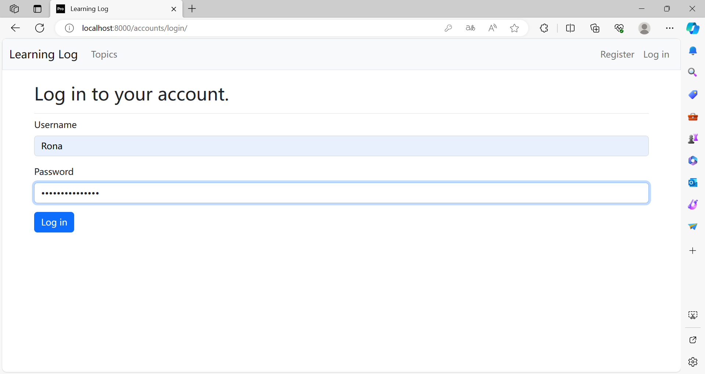
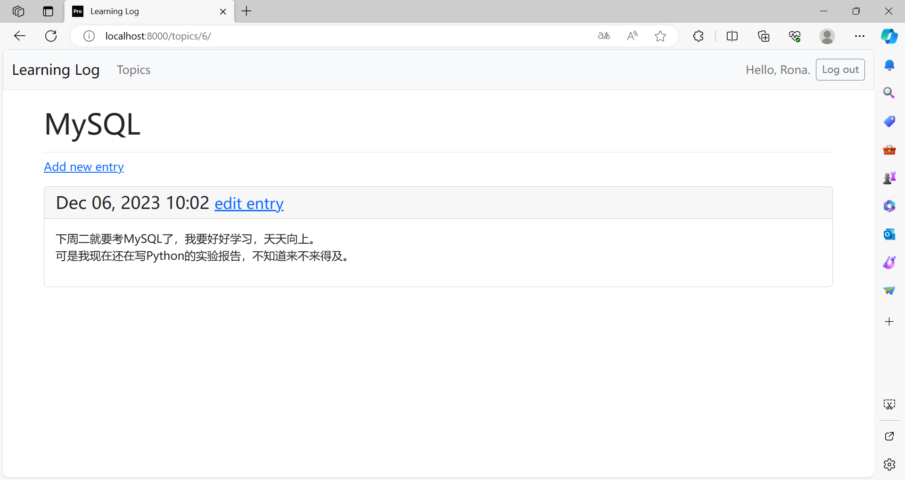
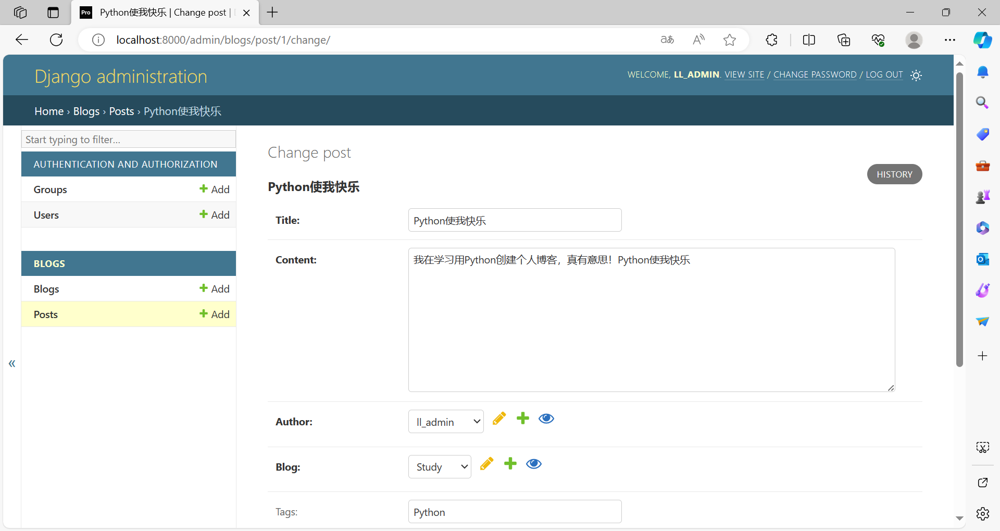

# 《Python程序设计基础》程序设计作品说明书

题目： 学习笔记Web应用程序

学院： 21计科2

姓名： 刘青

学号： B20210302217

指导教师： 周景

起止日期：2023.11.10-2023.12.10


## 摘要

本项目旨在开发一个基于Django框架的学习笔记Web应用程序，以满足用户对学习笔记管理的需求。本文主要涵盖了系统的需求分析、功能设计、用户问题解决方案以及项目总结。在需求分析中，描述了系统主要需要实现的功能，包括Web应用程序搭建、学习笔记页面设计、用户账户管理等；同时也探讨了该应用程序能解决的用户问题，如学习笔记整理、便捷学习体验以及数据安全与隐私保护。

在项目实现过程中，主要完成了Django框架的应用、用户界面设计、用户账户系统建立和样式美化等工作。关键词包括Django框架、学习笔记、用户账户、样式设计和部署。通过这些关键步骤的实现，本项目提供了一个安全、高效的学习笔记管理平台，为用户提供了便捷的学习体验，同时确保了用户数据的安全性和隐私保护。

**关键词**：Django框架，学习笔记，用户账户，Bootstrap，部署


## 第1章 需求分析

### 1.1 主要功能需求

这个项目的核心在于满足用户对于学习笔记管理的各种需求。具体而言，项目将重点实现以下核心功能：

#### 1. 创建 Web 应用程序

- 搭建基于Django框架的Web应用程序，确保用户能够通过浏览器访问该应用程序。

#### 2. 学习笔记主页及其他页面

- 设计和实现学习笔记的主页，包含用户的笔记列表，以便用户能够轻松查看和管理自己的笔记内容。同时，还需创建其他页面，例如笔记详情页、个人账户页面等，为用户提供更多操作，方便管理学习笔记。

#### 3. 用户数据输入和账户管理

- 允许用户输入笔记相关的数据，例如标题、内容等信息，以便记录他们的学习心得和笔记。同时，实现用户账户系统，使用户可以注册、登录和注销，并确保用户只能访问和管理属于自己的数据，确保数据安全性和隐私性。

#### 4. 学习笔记样式设置

- 使用诸如 Bootstrap 等前端框架，为学习笔记应用程序设计并应用合适的样式，提升用户界面的外观和交互体验。这将增强用户的满意度，使其更愿意使用该应用程序进行学习笔记的管理和分享。


### 1.2 用户问题解决方案

这个应用程序致力于解决用户在学习笔记管理方面遇到的问题，包括但不限于：

#### 1. **便捷的学习笔记管理**：
   - 用户可以轻松创建、编辑和管理自己的学习笔记，包括添加标题、内容等信息，记录学习心得和笔记。

#### 2. **易于访问和操作的 Web 应用程序**：
   - 通过浏览器，用户能够方便地访问和操作学习笔记应用程序，无论是在桌面还是移动设备上。

#### 3. **个性化的用户体验**：
   - 提供个人账户页面和笔记详情页等其他页面，为用户提供更多操作，使其能够管理和查看自己的学习笔记。

#### 4. **数据安全和隐私保护**：
   - 用户可以注册账户、登录和注销，确保他们只能访问和管理属于自己的数据，保障数据的安全性和隐私性。

#### 5. **提升用户满意度和外观**：
   - 使用 Bootstrap 等前端框架设计应用程序样式，增强用户界面的外观和交互体验，使用户更愿意使用该应用程序进行学习笔记的管理和分享。

#### 6. **Web 应用程序的部署**：
   - 将应用程序部署到远程服务器，确保所有人都可以通过互联网访问，提供更广泛的服务范围。

#### 7. **提供学习资源和互动功能**：
   - 通过创建学习笔记主页等页面，展示用户的笔记列表，并提供搜索功能等，帮助用户更好地管理学习笔记和查找所需资源。

综合而言，这个项目致力于构建一个方便用户管理学习笔记的 Web 应用程序，并提供安全、个性化和友好的用户体验，旨在解决用户在学习笔记管理方面的各种需求和问题。


## 第2章 分析与设计


### 2.1 系统架构

系统架构设计是项目中的基石，它描述了系统的整体结构和各个部分之间的关系。该项目的系统架构如下：

**前端层：**

- **用户界面(UI)：** 响应式设计是核心，以确保在不同设备上（桌面、平板、手机）都能提供良好的用户体验。该项目使用HTML、CSS和JavaScript构建界面元素，采用Bootstrap、React等前端框架来快速搭建并增强界面。
- **交互组件：** 包括表单、按钮、导航栏、搜索栏等，确保用户能轻松浏览、创建和管理学习笔记。该项目通过AJAX或其他技术实现异步加载，提升页面响应速度。

**后端层：**

- **Web 应用框架（Django）：** Django提供了强大的功能，包括但不限于处理URL路由、管理视图函数、数据库交互（使用Django ORM进行数据库操作）、管理用户认证和权限等。视图函数负责处理用户请求并返回相应的内容或页面。
- **数据库：** 选择了适合需求的数据库SQLite，设计数据库模型，存储用户信息、学习笔记内容、标签等数据。通过Django ORM进行数据库的管理和操作，确保数据的完整性和一致性。

**其他层：**

- **用户认证系统：** 提供安全的用户注册、登录、注销功能，并管理用户权限。使用Django内置的身份验证系统或其他认证库来确保用户数据的安全性。
- **部署服务器：** 使用适当的部署工具（例如Docker、Heroku、AWS等）将应用程序部署到远程服务器。使用HTTPS协议保障数据传输的安全性，并配置服务器以确保应用程序的可用性和性能。


### 2.2 系统流程

系统流程描述了整个项目的运作流程，包括用户操作和系统的响应。以下是一个简化的系统流程示例：

1. **用户访问应用程序首页：**
   - 用户访问应用程序的首页，这是学习笔记的主要入口。首页的设计注重简洁性和导航性，使用户能轻松找到所需功能。
   - 针对已登录用户，首页展示其个人信息，为用户提供快速访问。
   - 对于未登录用户，首页呈现登录注册模块，引导用户创建账户或者直接登录。
2. **用户注册和登录：**
   - 注册流程设计用户友好，引导新用户填写基本信息，如用户名、密码等。
   - 登录功能采用安全加密措施，用户输入凭据后，系统进行身份验证，确认用户身份并授予相应权限。
3. **笔记创建与管理：**
   - 用户在登录后可以方便地创建新的学习笔记，填写标题、内容等信息。界面设计着重于简洁的编辑器，让用户专注于笔记内容。
   - 对于已有笔记的用户，系统提供清晰的笔记管理界面，支持编辑、保存和删除操作，帮助用户更好地组织笔记。
4. **个人账户管理：**
   - 提供注销账户的选项，确保用户拥有完全的控制权。
5. **交互式界面功能：**
   - 用户界面设计注重交互性，表单设计简单明了，按钮和链接明确标识，提供友好的操作反馈，确保用户能轻松完成所需操作。
6. **数据交互和存储：**
   - 应用程序通过Django后端与数据库进行数据交互。后端负责验证和处理用户提交的数据，确保数据的正确性和完整性。
   - 数据存储和管理通过Django ORM进行，系统对数据的增、删、改、查操作实行严格的权限控制和数据验证，保障数据安全和隐私。


### 2.3 **系统模块**

#### 2.3.1 用户认证模块

用户认证模块负责处理用户的注册、登录、登出等认证相关功能。

#### 注册功能

注册页面允许新用户填写必要的信息以创建新账户。通过 Django 提供的 `UserCreationForm`，用户可以输入用户名和密码等信息，系统将验证并创建新的用户账户。注册页面的模板文件 `register.html` 与后端视图函数 `register()` 相对应。如果注册信息有效，系统会自动将用户登录，并重定向到主页。

```python
# 注册页面的视图函数示例
def register(request):
    if request.method != 'POST':
        form = UserCreationForm()
    else:
        form = UserCreationForm(data=request.POST)
        if form.is_valid():
            new_user = form.save()
            login(request, new_user)
            return redirect('learning_logs:index')
    context = {'form': form}
    return render(request, 'registration/register.html', context)
```

#### 登录功能

已注册用户可以通过输入用户名和密码进行登录。登录页面 `login.html` 允许用户提供凭据以验证身份，并且模板文件中的相关链接与用户身份状态相对应。如果用户已登录，页面将显示欢迎信息和退出选项。

```html
# 登录页面的模板文件示例
<form action="" method='post'>
    
    
    
</form>
```

#### 注销功能

注销功能允许已登录的用户安全退出系统。在用户点击退出链接时，系统会终止用户的会话并将其重定向回应用程序的指定页面。这个功能在模板文件中与登录页面相对应，并在后端视图函数中进行处理。

在导航栏或个人账户相关页面中，如果用户已登录，则会显示退出选项。点击退出选项将触发注销视图函数，结束用户的会话并将其重定向到应用程序的指定页面，使用户成功退出系统。

```python
# 注销视图函数示例
from django.contrib.auth import logout

def logout_view(request):
    """退出登录"""
    logout(request)
    return redirect('learning_logs:index')
```

这些功能结合了 Django 的身份验证系统和前端页面，为用户提供了安全和便捷的注册、登录、注销功能。在登录成功后，用户将获得访问应用程序功能的权限。


#### 2.3.2 笔记管理模块

笔记管理模块负责处理用户学习笔记的创建、编辑和删除等操作，让用户可以对笔记进行灵活管理。

##### 新主题和新条目

用户可以通过添加新主题和新条目来记录学习笔记的内容。在模板文件中，`new_topic.html` 和 `new_entry.html` 分别提供了用户友好的界面来添加新的主题和条目。

```html
<!-- new_topic.html 示例 -->
<form action="" method='post'>
    
    {{ form.as_p }}

    <button name="submit">Add Topic</button>
</form>
```

```html
<!-- new_entry.html 示例 -->
<form action="" method='post'>
    
    {{ form.as_p }}

    <button name="submit">Add Entry</button>
</form>
```

##### 编辑条目

用户可以对已有的条目进行编辑。模板文件 `edit_entry.html` 提供了编辑条目的界面，而后端视图函数处理了这些操作。

```python
# 编辑条目的视图函数示例
@login_required
def edit_entry(request, entry_id):
    """编辑既有的条目"""
    entry = Entry.objects.get(id=entry_id)
    topic = entry.topic
    if topic.owner != request.user:
        raise Http404
    
    if request.method != 'POST':
        form = EntryForm(instance=entry)
    else:
        form = EntryForm(instance=entry, data=request.POST)
        if form.is_valid():
            form.save()
            return redirect('learning_logs:topic', topic_id=topic.id)

    context = {'entry': entry, 'topic': topic, 'form': form}
    return render(request, 'learning_logs/edit_entry.html', context)
```

以上代码示例说明了如何处理编辑条目的功能。用户可以在界面上修改条目内容，并通过表单提交来保存所做的更改。

##### 笔记管理与权限控制

对于已登录用户，系统通过验证当前用户与条目所属主题的拥有者是否匹配来保证用户只能编辑和删除属于自己的笔记内容。这种权限控制确保了数据的安全性和完整性。


#### 2.3.3 页面生成模块

这个模块涉及到根据用户请求来动态生成页面，展示用户的学习笔记数据。它包括了一系列视图函数和模板文件，用于呈现不同页面的内容。以下是一些包含的功能和代码示例：

```python
# 示例视图函数
@login_required
def topics(request):
    """显示所有的主题"""
    topics = Topic.objects.filter(owner=request.user).order_by('date_added')
    context = {'topics': topics}
    return render(request, 'learning_logs/topics.html', context)

@login_required
def topic(request, topic_id):
    """显示单个主题及其所有的条目"""
    topic = Topic.objects.get(id=topic_id)
    # 确认请求的主题属于当前用户
    if topic.owner != request.user:
        raise Http404
    
    entries = topic.entry_set.order_by('-date_added')
    context = {'topic': topic, 'entries': entries}
    return render(request, 'learning_logs/topic.html', context)
```

这两个视图函数分别用于展示所有主题和单个主题的条目。在这里，`topics()` 函数展示了当前用户的所有主题列表，而 `topic()` 函数展示了单个主题的详细信息以及其所有的条目。

对应的模板文件为 `topics.html` 和 `topic.html`。这些模板文件通过上述视图函数中传递的上下文变量（`context`）动态地渲染页面内容，展示用户的学习笔记数据。在模板文件中，使用 Django 模板语言来遍历显示主题列表和条目内容。


#### 2.3.4 样式设置模块

样式设置模块对页面进行了精心设计，采用了 Bootstrap 等前端框架来优化用户界面。通过在基础模板文件中加载 Bootstrap 的 CSS 和 JavaScript，确保了应用程序的响应式设计和用户友好的界面。这些样式设置被应用于所有页面，为用户提供了更加愉悦和舒适的使用体验。界面的美化和优化有助于增强用户对应用的好感度，并提升了用户对学习笔记管理的积极性。


### 2.4 数据库设计

1. **Topic 模型**
   - **字段：**
     - `text`: CharField，最大长度 200，存储用户学习的主题文本信息。
     - `date_added`: DateTimeField，记录主题创建的日期时间。
     - `owner`: ForeignKey 指向用户模型 User，表示主题的拥有者。

2. **Entry 模型**
   - **字段：**
     - `topic`: ForeignKey 指向 Topic 模型，建立与主题的关联。
     - `text`: TextField，存储关于特定主题的具体知识内容。
     - `date_added`: DateTimeField，记录条目创建的日期时间。

该项目的数据库设计包含了两个模型：Topic（主题）和 Entry（条目）。Topic 模型用于记录用户学习的主题，每个主题可以有多个与之关联的条目（Entry）。Entry 模型存储关于特定主题的具体知识内容，与对应的主题通过外键建立了关系。每个条目都有一个与之关联的主题。

这种设计支持用户创建多个主题，并为每个主题添加多个条目，以便记录学习过程中的详细信息。同时，通过 Topic 模型中的 owner 字段，确保了每个主题的拥有者与用户的关联，实现了权限控制，确保用户只能编辑和删除自己的笔记内容。


### 2.5 关键实现

在这个项目中，关键的实现主要涉及以下方面：

1. **数据结构**：
   - 使用Django框架的模型（Model）定义了数据的结构化方式，通过模型类将用户信息、笔记内容等数据映射到数据库中。
   - 数据结构包括用户账户信息（如用户名、密码）、笔记内容（如标题、内容、时间戳等）等。
2. **算法**：
   - 用户认证：采用常见的加密算法对用户密码进行哈希加密存储，保障用户数据安全。
   - 用户笔记管理：基于Django提供的ORM，使用CRUD（创建Create、读取Retrieve、更新Update、删除Delete）操作实现对笔记内容的管理，涉及数据库的增删改查操作。
3. **Web框架和库的使用**：
   - Django框架：利用其提供的强大功能，如路由配置、视图处理、模型定义、表单验证等，实现了Web应用程序的各项功能。
   - Bootstrap：利用其提供的响应式布局和组件，对应用程序进行样式设置，使界面更加美观和用户友好。
4. **RESTful API设计**：
   - 可能使用了RESTful API设计原则，通过HTTP请求方式对资源进行操作，比如使用GET请求获取用户笔记数据，使用POST请求创建新的笔记等。

关键的实现是在Django框架的支持下，利用其提供的模型定义、ORM、视图处理等功能，以及数据库的设计和管理，完成了用户认证、笔记管理等功能的实现。同时，合理使用了加密算法保护用户密码信息，利用前端库如Bootstrap优化了用户界面。


## 第3章 软件测试

### 3.1 **项目存储位置及访问链接：** 

该项目的源代码及使用说明存放于Github仓库，可下载仓库里的代码进行软件测试，效果更直观，访问链接如下：[RonaWhite/Learning-Notes-Web-Application](https://github.com/RonaWhite/Learning-Notes-Web-Application)。

**仓库代码软件测试说明：**

- **测试环境准备：** 在运行测试之前，请下载并设置项目环境。按照仓库中的使用说明，确保所需的库和依赖已正确安装，并根据指南进行操作。

- **测试方法：** 使用该仓库中提供的源代码，在本地环境中运行应用程序。

  

  *以下是根据项目要求撰写的测试说明和测试截图：*


### 3.2 确认Web应用程序的创建情况，包括首页和其他页面

#### 1. 首页：


#### 2. 主题页


#### 3. 条目页


#### 4. 修改页


#### 5. 添加新主题页


###  3.3 测试每个页面的功能和链接

#### 1. 测试用户注册功能，注册用户名为Rona,密码为ilovepython1206：

#### 2. 用户注册成功，显示Hello+用户名


#### 3. 用户通过右上角的Log out注销后，可输入账号和密码，再次登录 


#### 4. 添加新主题MySQL


#### 5. 添加新条目


#### 6. 显示添加结果


#### 7. 编辑已有的条目


#### 8. 编辑完毕的界面

### 3.4. **教材部分练习功能测试：**

#### 练习题目如下：

**练习 19.1：博客**

新建一个 Django 项目，将其命名为 Blog。创建一个名为 `blogs` 的应用程序，再创建两个分别表示博客和博文的模型，并让这些模型包含合适的字段。为这个项目创建一个超级用户，并使用管理网站创建⼀个博客和几篇简短的博文。创建⼀个主页，在其中按恰当的顺序显示所有的博文。创建三个页面，分别用于创建博客、发布新博文和编辑现有的博文。尝试使用这些页面，确认它们能够正确地⼯作。

**练习 19.2：博客账户**

在为练习 19.1 开发的项目 Blog 中，添加用户身份验证和注册系统。向已登录的用户显示其用户名，向未注册的用户显示注册页面的链接。

**练习 20.2：设置博客的样式**

对于你在第 19 章创建的项目 Blog，使用 Bootstrap 来设置样式。


#### 练习19-1 博客 功能测试

1. 创建一个名为 `blogs` 的应用程序

   


2. 创建两个分别表示博客和博文的模型

   model.py代码如下：

```python
from django.db import models
from django.contrib.auth.models import User

class Blog(models.Model):
    """博客模型"""
    title = models.CharField(max_length=100)
    date_added = models.DateTimeField(auto_now_add=True)  # 创建时间
    author = models.ForeignKey(User, on_delete=models.CASCADE, related_name='authored_blogs')
    owner = models.ForeignKey(User, on_delete=models.CASCADE, related_name='owned_blogs')

    description = models.TextField(blank=True)  # 描述，可以为空
    cover_image = models.ImageField(upload_to='blog_covers/', blank=True, null=True)  # 封面图，允许为空

    def __str__(self):
        return self.title  # 返回博客标题作为字符串表示

class Post(models.Model):
    """博文模型"""
    title = models.CharField(max_length=200)
    content = models.TextField()
    author = models.ForeignKey(User, on_delete=models.CASCADE)  # 博文作者关联到用户模型
    date_added = models.DateTimeField(auto_now_add=True)  # 创建时间
    blog = models.ForeignKey(Blog, on_delete=models.CASCADE)  # 外键关联到博客模型

    tags = models.CharField(max_length=100, blank=True)  # 标签，可以为空，可以根据需要更改数据类型
    image = models.ImageField(upload_to='post_images/', blank=True, null=True)  # 图片，允许为空

    def __str__(self):
        return self.title  # 返回博文标题作为字符串表示
```

3. 创建一个超级用户，并使用管理网站创建⼀个博客和几篇简短的博文。





5. 创建三个页面，分别用于创建博客、发布新博文和编辑现有的博文


#### **练习 19.2：博客账户**

添加用户身份验证和注册系统。向已登录的用户显示其用户名，向未注册的用户显示注册页面的链接

1. 已登录的用户显示其用户名


2. 向未注册的用户显示注册页面的链接


#### **练习 20.2：设置博客的样式**

使用 Bootstrap 来设置样式：如上述图片，该博客已使用Bootstrap来设置样式。


## 结论

_本章的内容主要是对项目的总结，项目主要实现了哪些功能，达到了哪些目标，哪些不足之处，可以如何改进。_

在项目的开发过程中，我根据用户需求设计并实现了一个学习笔记管理的 Web 应用程序。本项目主要涉及用户账户管理、笔记的创建、编辑与删除，以及页面设计等功能。

### 功能和目标实现

- **Web 应用程序创建**：在这个项目中，顺利搭建了基于 Django 框架的 Web 应用程序，让用户可以方便地通过浏览器进行访问。这为用户提供了一个轻松、可靠的入口，让他们能够便捷地管理学习笔记。
- **学习笔记主页及其他页面**：项目中设计并成功实现了学习笔记的主页，为用户展示了笔记列表，方便用户浏览和管理自己的笔记内容。除此之外，还创建了其他页面，例如笔记详情页和个人账户页面，为用户提供了更多的操作选项，使其能够更加方便地管理学习笔记，从而提升了用户体验。
- **用户数据输入和账户管理**：用户可以轻松地输入笔记相关的信息，例如标题、内容等，使他们能够记录自己的学习心得和笔记。同时，项目成功实现了用户账户系统，让用户可以注册、登录和注销，确保了用户数据的安全和隐私性。这种功能设计保障了用户的数据只能被其本人访问和管理，从而增强了用户对应用程序的信任感。
- **学习笔记样式设置**：通过使用 Bootstrap 等前端框架，项目对应用程序进行了样式设置。这个举措极大地改善了用户界面的外观和交互体验，使用户能够更加愉悦地使用应用程序进行学习笔记的管理和浏览。这种优化增强了用户的满意度，促进了用户更频繁地使用该应用程序。


### 项目优势

- **基本功能实现**：这个项目成功地实现了学习笔记管理的核心功能，让用户能够方便地创建、编辑和发布学习笔记。这种简便性提升了用户对于笔记管理的效率和体验，使其更加愿意持续使用该应用程序。
- **用户身份验证与注册**：引入了完善的用户身份验证和注册系统，提升了应用程序的安全性。通过这个系统，用户可以进行注册、登录和注销操作，确保了用户数据的安全性和私密性。这一举措不仅保障了数据的安全，也提供了用户身份的明确辨识，增强了用户对于应用程序的信任度。
- **界面优化与用户体验**：采用了 Bootstrap 等前端框架对应用程序的界面进行了优化设计。这种界面的美化和优化提升了用户的使用体验，增强了用户对于应用程序的好感度。优雅的界面和良好的交互性使用户更愿意在此管理学习笔记，从而增加了用户的满意度和黏性。
- **综合性的学习资源**：通过展示用户笔记列表和提供搜索功能等，为用户提供了丰富的学习资源和便捷的查询功能。这种综合性的设计为用户提供了更多可能性，帮助用户更好地管理学习笔记和查找所需资源。


### 改进空间

- **用户体验进一步优化**：尽可能地优化用户交互和界面设计，确保用户在应用程序中的每一个操作都是直观、高效且愉悦的。通过更智能的布局和交互设计，进一步提升页面的友好性和用户的满意度。

- **界面美化与可读性提升**：改进现有页面的布局、配色和图形元素，让整体设计更具吸引力和可读性。考虑用户习惯和喜好，使界面更为清晰、简洁，从而让用户更愿意留在应用程序中浏览和管理笔记。

- **深化样式设置**：继续改善应用程序的样式，借助更多的前端框架或自定义样式，使应用的外观更符合用户的审美期待。通过对细节的调整和美化，提升用户感知和满意度，让用户在使用过程中感受到更加流畅和舒适的界面体验。

总的来说，项目完成了基本要求，但在测试覆盖、用户体验和安全性方面仍有提升空间。通过更全面的测试、用户反馈和安全性审计，可以进一步改进和完善这些方面，提高系统的质量和用户满意度。


## 参考文献

[1] 埃里克·马瑟斯. (2023). Python编程：从入门到实践（第3版）. 人民邮电出版社.

[2] Django 官方文档. https://docs.djangoproject.com/en/stable/

[3] Bootstrap 官方文档. https://getbootstrap.com/docs/

[5] HTML 官方文档. https://developer.mozilla.org/en-US/docs/Web/HTML

[6] CSS 官方文档. https://developer.mozilla.org/en-US/docs/Web/CSS
