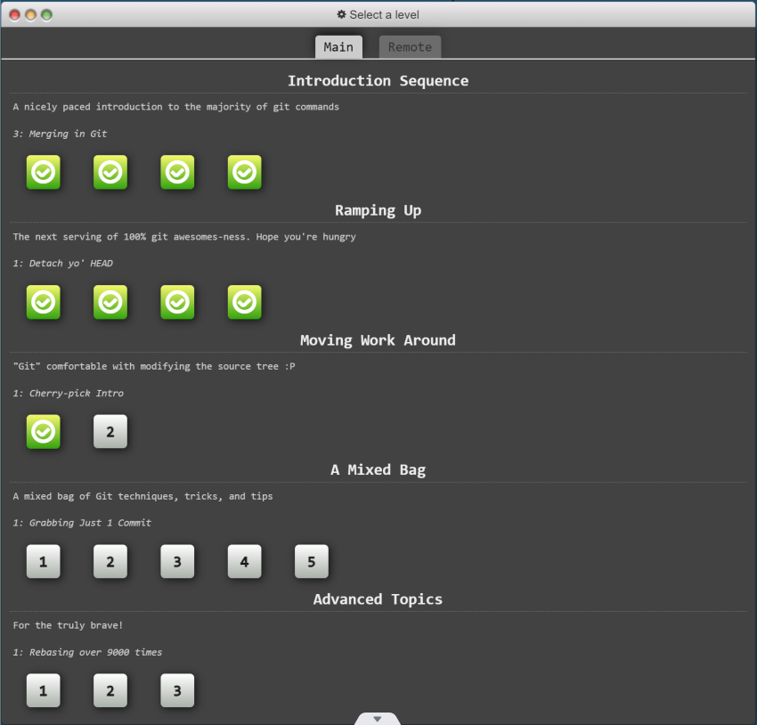
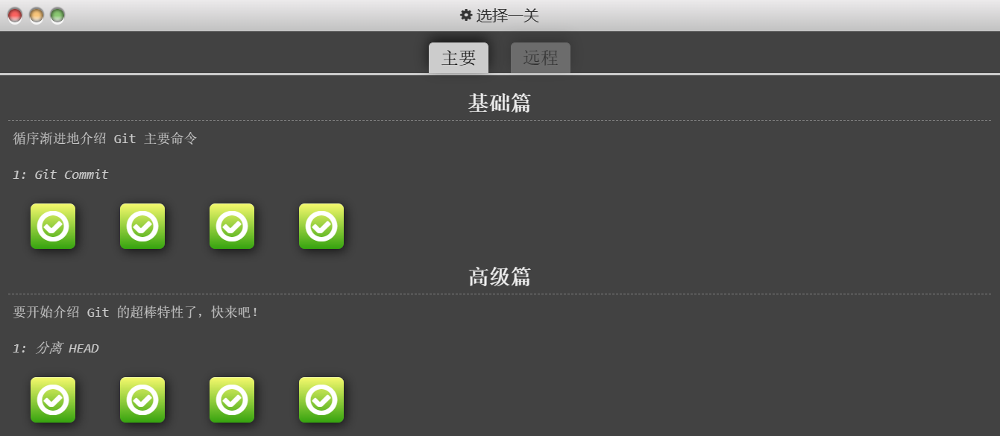

# 实验一 Git和Markdown基础

班级： 21计科02

学号： B20210302217

姓名： 刘青

Github地址：<https://github.com/RonaWhite/python.git>

---

## 实验目的

1. Git基础，使用Git进行版本控制
2. Markdown基础，使用Markdown进行文档编辑

## 实验环境

1. Git
2. VSCode
3. VSCode插件

## 实验内容和步骤

### 第一部分 实验环境的安装

1. 安装git，从git官网下载后直接点击可以安装：[git官网地址](https://git-scm.com/)
2. 从Github克隆课程的仓库：[课程的仓库地址](https://github.com/zhoujing204/python_course)，运行git bash应用（该应用包含在git安装包内），在命令行输入下面的命令（命令运行成功后，课程仓库会默认存放在Windows的用户文件夹下）

```bash
git clone https://github.com/zhoujing204/python_course.git
```

如果你在使用`git clone`命令时遇到SSL错误，请运行下面的git命令(这里假设你的Git使用了默认安装目录)：

```bash
git config --global http.sslCAInfo C:/Program Files/Git/mingw64/ssl/certs/ca-bundle.crt
```

该仓库的课程材料后续会有更新，如果需要更新课程材料，可以在本地课程仓库的目录下运行下面的命令：

```bash
git pull
```

1. 注册Github账号，创建一个新的仓库，用于存放实验报告和实验代码。
2. 安装VScode，下载地址：[Visual Studio Code](https://code.visualstudio.com/)
3. 安装下列VScode插件
   - GitLens
   - Git Graph
   - Git History
   - Markdown All in One
   - Markdown Preview Enhanced
   - Markdown PDF
   - Auto-Open Markdown Preview
   - Paste Image
   - markdownlint

### 第二部分 Git基础

教材《Python编程从入门到实践》P436附录D：使用Git进行版本控制，按照教材的步骤，完成Git基础的学习。

### 第三部分 learngitbranching.js.org

访问[learngitbranching.js.org](https://learngitbranching.js.org)，如下图所示完成Main部分的Introduction Sequence和Ramping Up两个小节的学习。



上面你学习到的git命令基本上可以应付百分之九十以上的日常使用，如果你想继续深入学习git，可以：

- 继续学习[learngitbranching.js.org](https://learngitbranching.js.org)后面的几个小节（包括Main和Remote）
- 在日常的开发中使用git来管理你的代码和文档，用得越多，记得越牢
- 在git使用过程中，如果遇到任何问题，例如：错误删除了某个分支、从错误的分支拉取了内容等等，请查询[git-flight-rules](https://github.com/k88hudson/git-flight-rules)

### 第四部分 Markdown基础

查看[Markdown cheat-sheet](http://www.markdownguide.org/cheat-sheet)，学习Markdown的基础语法

使用Markdown编辑器（例如VScode）编写本次实验的实验报告，包括[实验过程与结果](#实验过程与结果)、[实验考查](#实验考查)和[实验总结](#实验总结)，并将其导出为 **PDF格式** 来提交。

## 实验过程与结果

### 一、Git基础的学习

根据教材《Python编程从入门到实践》P440附录D的步骤，进行Git基础的学习。

#### 1.1 配置 Git

**实验过程：**

1. 打开终端。
2. 设置 Git 用户名：

    ```bash
    git config --global user.name "RonaWhite"
    ```

3. 设置 Git 用户邮箱：

    ```bash
    git config --global user.email "1186505776@qq.com"
    ```

**实验结果：**

Git 用户名和邮箱已配置，可以开始使用 Git 进行版本控制。

#### 1.2 创建项目

**实验过程：**

1. 创建一个名为 `git_practice` 的文件夹。
2. 在 `git_practice` 文件夹中创建一个简单的 Python 程序文件 `hello_world.py`，内容如下：

    ```python
    print("Hello Git world!")
    ```

**实验结果：**

成功创建项目文件夹和 Python 程序文件。

#### 1.3 忽略文件

**实验过程：**

1. 在项目根目录下创建名为 `.gitignore` 的文件。
2. 在 `.gitignore` 文件中添加以下内容：

```
    __pycache__/
```

**实验结果：**

设置了 `.gitignore` 文件，Git 将忽略目录 `__pycache__` 中的所有文件。

#### 1.4 初始化仓库

**实验过程：**

1. 打开终端。
2. 切换到项目文件夹 `git_practice`。
3. 执行以下命令初始化一个Git仓库：

    ```bash
    git init
    ```

**实验结果：**

Git 在 `git_practice` 中成功初始化了一个空仓库，并显示如下输出：

```
Initialized empty Git repository in git_practice/.git/
```

这表示 Git 已经创建了一个空的仓库，用于跟踪项目的文件变化。

#### 1.5 检查状态

**实验过程：**

1. 执行以下命令来查看项目的状态：

    ```bash
    git status
    ```

**实验结果：**

输出显示了项目的状态：

```
On branch master
Initial commit

Untracked files:
  (use "git add <file>..." to include in what will be committed)

        .gitignore
        hello_world.py

nothing added to commit but untracked files present (use "git add" to track)
```

Git 提示有两个未被跟踪的文件，即 `.gitignore` 和 `hello_world.py`。当前位于 `master` 分支，并且尚未进行任何提交。

#### 1.6 将文件加入到仓库中

**实验过程：**

1. 执行以下命令将项目中的所有文件加入到仓库中：

    ```bash
    git add .
    ```

2. 再次执行 `git status` 命令来查看状态。

**实验结果：**

输出显示了项目状态的变化：

```
On branch master
Initial commit

Changes to be committed:
  (use "git rm --cached <file>..." to unstage)

        new file:   .gitignore
        new file:   hello_world.py
```

通过 `git add .` 命令，所有未被跟踪的文件已经被加入到仓库中。Git 提示这些文件是新添加到仓库中的。

#### 1.7 执行提交

**实验过程：**

1. 执行以下命令进行第一次提交：

    ```bash
    git commit -m "Started project."
    ```

**实验结果：**

Git 创建了一个提交，用于记录项目的当前状态，并显示如下输出：

```
[master (root-commit) c03d2a3] Started project.
 2 files changed, 1 insertion(+)
 create mode 100644 .gitignore
 create mode 100644 hello_world.py
```

这表示已经成功进行了第一次提交，添加了两个新文件到仓库。

#### 1.8 查看提交历史

**实验过程：**

1. 执行以下命令来查看提交历史：

    ```bash
    git log
    ```

2. 执行以下命令来查看简洁版的提交历史：

    ```bash
    git log --pretty=oneline
    ```

**实验结果：**

输出显示了项目的提交历史，每次提交都有一个独一无二的引用ID、提交者、提交时间以及提交消息。

#### 1.9 第二次提交

**实验过程：**

1. 在 `hello_world.py` 中添加一行代码：

    ```python
    print("Oh no, I broke the project!")
    ```

2. 执行以下命令进行第二次提交：

    ```bash
    git commit -am "Extended greeting."
    ```

**实验结果：**

Git 创建了第二次提交，并显示如下输出：

```
[master 08d4d5e] Extended greeting.
 1 file changed, 1 insertion(+)
```

#### 1.10 撤销修改

**实验过程：**

1. 在 `hello_world.py` 中添加一行代码。
2. 使用以下命令放弃所做的修改，恢复到最后一个提交的状态：

    ```bash
    git checkout .
    ```

**实验结果：**

修改被成功放弃，`hello_world.py` 恢复到最后一个提交的状态，不再包含刚刚添加的代码行。

#### 1.11 检出以前的提交

Git允许检出项目的任意提交历史，而非仅限于最新提交。可通过指定提交的引用ID的前6个字符来实现此功能：

```bash
# 查看提交历史
git log --pretty=oneline

# 检出特定提交
git checkout <commit_id>
```

在这里，`<commit_id>` 是要检出的提交的引用ID。

检出以前的提交将进入Git的“分离头指针”状态，意味着离开了一个命名分支。在此状态下可以进行实验性修改和提交，也可以放弃这些修改。

若需要返回主分支，执行以下命令：

```bash
git checkout master
```

切换回主分支时，建议避免对项目进行任何修改，除非打算使用Git的高级功能。

#### 1.12 删除仓库

有时仓库的历史记录可能混乱无法恢复。在这种情况下，考虑删除仓库的历史记录，即删除`.git`目录。这不会影响当前文件的状态，但会删除所有提交，使得无法检出以前的状态。

以下是删除仓库历史记录的步骤：

```bash
# 删除.git目录
rm -rf .git

# 初始化一个新的Git仓库
git init

# 添加文件并进行首次提交
git add .
git commit -m "Starting over."
```

这样，就创建了一个全新的仓库，由此Git的基础学习全部完成。

## 二、完成learngitbranching.js.org网站学习

### 实验任务

1. 访问[learngitbranching.js.org](https://learngitbranching.js.org)。
2. 完成Main部分的Introduction Sequence和Ramping Up两个小节的学习。

### 实验过程

1. 打开浏览器，访问[learngitbranching.js.org](https://learngitbranching.js.org)。
2. 在Main部分，依次点击Introduction Sequence和Ramping Up，按照提示完成相应的操作。

3. 具体操作步骤如下：
 #### 一、基础篇

1.1 Git Commit

Git Commit命令用于将本地代码更改保存到本地仓库。要提交更改，需先将更改暂存到暂存区，然后运行git commit -m "提交信息"命令。

```bash
git commit
git commit
```

1.2 Git Branch

Git Branch用于创建新的分支。可通过以下步骤创建并切换分支：

```bash
git branch bugFix
git checkout bugFix
```

1.3 Git Merge

Git Merge命令用于合并分支。按照以下步骤可以合并分支：

``` bash
git checkout -b bugFix
git commit
git checkout master
git commit
git merge bugFix
```

1.4 Git Rebase

Git Rebase允许将一条分支上的更改应用到另一条分支上。按照以下步骤可以使用Git Rebase：

``` bash
git checkout -b bugFix
git commit
git checkout master
git commit
git checkout bugFix
git rebase master
```

#### 二、高级篇

2.1 分离HEAD

分离HEAD意味着不再位于任何分支上，可以自由浏览、实验更改并提交。

 ```bash
git checkout c4
```

2.2 相对引用（^）

分离HEAD意味着不再位于任何分支上，可以自由浏览、实验更改并提交。

 ```bash
 git checkout bugFix^
或
git chekcout bugFix
git checkout HEAD^
```

2.3 相对引用2（~）

相对引用~也表示父提交，可通过指定数字来引用更远的父提交。

 ```bash
git branch -f master c6
git branch -f bugFix c0
git checkout c1
```

2.4 撤销变更

可以使用git reset、git checkout、git revert等命令来撤销变更。

 ```bash
git reset HEAD^
git checkout pushed
git revert HEAD
```

### 实验结果

学习结果截图如下：



通过学习[learngitbranching.js.org](https://learngitbranching.js.org)的Introduction Sequence和Ramping Up，我掌握了基本的Git分支操作，包括创建分支、切换分支、合并分支等；了解了更多关于分支操作的技巧，包括交互式rebase、rebase合并等；加深了对Git分支操作的理解，从而更熟练地应用Git进行版本控制和协同开发。

## 三、学习Markdown基础

通过查看[Markdown cheat-sheet](http://www.markdownguide.org/cheat-sheet)，我学习了Markdown的基础语法，常用的Markdown基本语法示例总结如下：

### 3.1 标题

```
# 标题1
## 标题2
### 标题3
```

   结果：

# 标题1

## 标题2

### 标题3

### 3.2 粗体和斜体

   ```
   **粗体文字**
   *斜体文字*
   ```

   结果：
   **粗体文字**
   *斜体文字*

### 3.3 列表

   ```
   - 项目1
   - 项目2
     - 子项目
   ```

   结果:
   - 项目1
   - 项目2
     - 子项目

### 3.4 链接

   ```
   [文本](链接)
   ```

   结果：
   [Markdown cheat-sheet](http://www.markdownguide.org/cheat-sheet)

### 3.5 图片

   ```
   
   例如：
   
   ```

   结果：
   

### 3.6 引用

   ```
   > 引用文字
   ```

   结果：
   > 引用文字

### 3.7 代码

   ```
   `代码`
   ```

   结果：
   `代码`

### 3.8 水平线

   ```
   ---
   ```

结果
   ---

### 3.9 表格

```
    | 表头1 | 表头2 |
    |-------|-------|
    | 内容1 | 内容2 |
```

结果：
| 表头1 | 表头2 |
|-------|-------|
| 内容1 | 内容2 |

## 实验考查

### 1. 什么是版本控制？使用Git作为版本控制软件有什么优点？

版本控制是一种系统，用于记录文件内容随时间的变化，并允许用户在需要时查看、比较这些变化。它能够追踪文件的修改、删除、新增操作，并允许用户回溯到不同版本，以及在多人协作中有效地管理文件变更。Git是一种分布式版本控制系统，它可以跟踪文件的修改、历史记录和不同版本，并支持多人协作。

**优点：**

- **分布式版本控制：** 每个人的本地机器都有完整的版本历史，不需要依赖网络或中央服务器。
- **高效快速：** Git对文件和历史记录进行高效的处理，快速创建和切换分支，合并变更等。
- **强大的分支管理：** 可以轻松创建、切换、合并分支，支持并行开发和独立的工作流。
- **备份和恢复：** 可以轻松备份项目，恢复到任何历史版本。
- **协作：** 支持多人协同工作，有效管理团队协作的代码。

### 2. 如何使用Git撤销还没有Commit的修改？

要撤销还未提交（未暂存）的修改，可以使用以下命令：

```bash
git checkout -- <file>
```

这将还原指定文件到上次提交时的状态。

### 3. 如何使用Git检出（Checkout）已经以前的Commit？（实际操作）

要检出以前的提交，可以使用以下命令：

```bash
git checkout <commit_hash>
```

将 `<commit_hash>` 替换为要检出的提交哈希值。

### 4. Git中的HEAD是什么？如何让HEAD处于detached HEAD状态？（实际操作）

`HEAD` 是一个特殊的指针，指向当前所在的分支或提交。`HEAD` 指向的位置表示正在工作的地方。

要让 `HEAD` 处于 "detached HEAD" 状态，可以使用以下命令：

```bash
git checkout <commit_hash>
```

这将使 `HEAD` 指向指定的提交，而不是分支。

### 5. 什么是分支（Branch）？如何创建分支？如何切换分支？（实际操作）

分支是指向特定提交的指针，可以在不影响主分支的情况下进行独立的工作。

**创建分支：**

```bash
git branch <branch_name>
```

**切换分支：**

```bash
git checkout <branch_name>
```

### 6. 如何合并分支？git merge和git rebase的区别在哪里？（实际操作）

合并分支可以使用以下命令：

```bash
git merge <branch_name>
```

**区别：**

- **`git merge`：** 合并保留各分支的提交记录，形成新的合并提交。适用于保留分支历史的情况。
- **`git rebase`：** 将当前分支的提交应用到目标分支上，产生一个新的提交。可以产生更干净的提交历史。

### 7. 如何在Markdown格式的文本中使用标题、数字列表、无序列表和超链接？（实际操作）

**标题：**

```markdown
# 标题1
## 标题2
### 标题3
```

**数字列表：**

```markdown
1. 第一项
2. 第二项
3. 第三项
```

**无序列表：**

```markdown
- 无序项1
- 无序项2
- 无序项3
```

**超链接：**

```markdown
[链接文字](链接地址)
```

例如：

```markdown
[Google](https://www.google.com)
```

## 实验总结

在本次实验中，我学习和应用了Git和Markdown的基础知识，以及通过learngitbranching.js.org进行了分支操作的练习。此外，我也学会了如何将实验过程和结果以Markdown格式整理并导出为PDF。

在学习learngitbranching.js.org的过程中，我掌握了Git分支操作的基本原理和实际应用。我能够创建、切换、合并分支，并了解分离HEAD的含义和使用。这将对我的团队协作和项目管理有很大帮助。

另外，我也学习了Markdown的基础语法，包括标题、列表、超链接等。Markdown是一种简单易用的文本标记语言，可以方便地编辑文档和撰写报告。

**但是，在使用过程中，我遇到了一个问题：**

Git推送到GitHub时出现错误：   
"error: src refspec master does not match any  
 error: failed to push some refs to '<https://github.com/RonaWhite/python.git>'
"
这个错误是由于本地的 master 分支没有对应的远程分支，后面通过修改指令为：
```bash
git pull --rebase origin main
```
成功解决了这个问题。


总得来说，通过本次实验，我深入学习了版本控制系统 Git 的基本概念和操作，包括如何创建仓库、提交更改、分支管理以及合并分支等。对于团队协作和个人项目开发，这些技能将极大地提高我的工作效率和代码管理能力。同时，学习了 Markdown 的基本语法和常用功能，能够更优雅地撰写文档，提高文档的可读性和美观度。