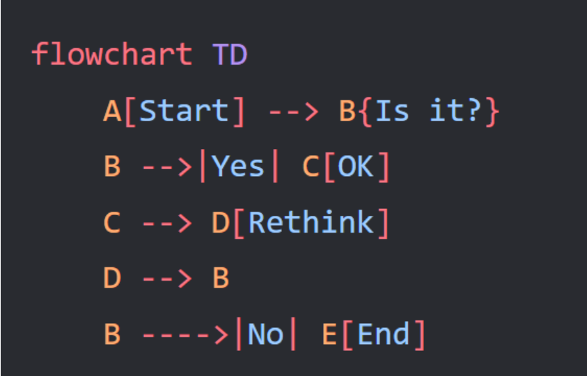
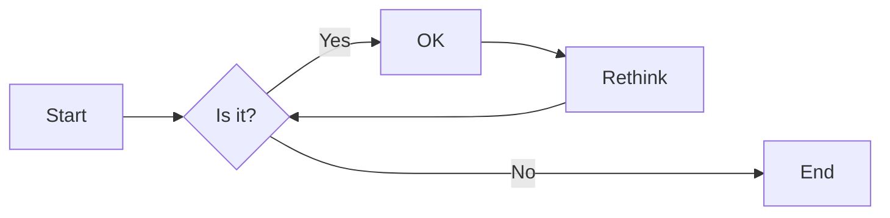
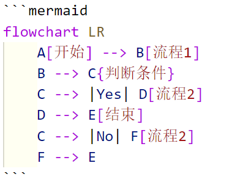
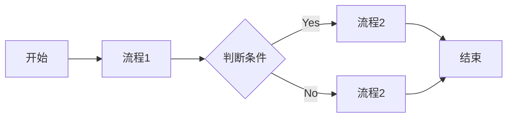
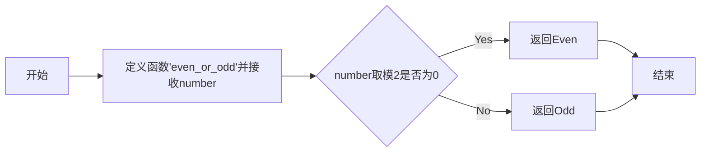

# 实验二 Python变量、简单数据类型

班级： 21计科2班

学号： B20210302217

姓名： 刘青

Github地址：<https://github.com/RonaWhite/python>

CodeWars地址：<https://www.codewars.com/users/RonaWhite>

---

## 实验目的

1. 使用VSCode编写和运行Python程序
2. 学习Python变量和简单数据类型

## 实验环境

1. Git
2. Python 3.10
3. VSCode
4. VSCode插件

## 实验内容和步骤

### 第一部分

实验环境的安装

1. 安装Python，从Python官网下载Python 3.10安装包，下载后直接点击可以安装：[Python官网地址](https://www.python.org/downloads/)
2. 为了在VSCode集成环境下编写和运行Python程序，安装下列VScode插件
   - Python
   - Python Environment Manager
   - Python Indent
   - Python Extended
   - Python Docstring Generator
   - Jupyter
   - indent-rainbow
   - Jinja

---

### 第二部分

Python变量、简单数据类型和列表简介

完成教材《Python编程从入门到实践》下列章节的练习：

- 第2章 变量和简单数据类型

---

### 第三部分

在[Codewars网站](https://www.codewars.com)注册账号，完成下列Kata挑战：

---

#### 第1题：求离整数n最近的平方数（Find Nearest square number）

难度：8kyu

你的任务是找到一个正整数n的最近的平方数
例如，如果n=111，那么nearest_sq(n)（nearestSq(n)）等于121，因为111比100（10的平方）更接近121（11的平方）。
如果n已经是完全平方（例如n=144，n=81，等等），你需要直接返回n。
代码提交地址
<https://www.codewars.com/kata/5a805d8cafa10f8b930005ba>

---

#### 第2题：弹跳的球（Bouncing Balls）

难度：6kyu

一个孩子在一栋高楼的第N层玩球。这层楼离地面的高度h是已知的。他把球从窗口扔出去。球弹了起来,  例如:弹到其高度的三分之二（弹力为0.66）。他的母亲从离地面w米的窗户向外看,母亲会看到球在她的窗前经过多少次（包括球下落和反弹的时候）？

一个有效的实验必须满足三个条件：

- 参数 "h"（米）必须大于0
- 参数 "bounce "必须大于0且小于1
- 参数 “window "必须小于h。

如果以上三个条件都满足，返回一个正整数，否则返回-1。
**注意:只有当反弹球的高度严格大于窗口参数时，才能看到球。**
代码提交地址
<https://www.codewars.com/kata/5544c7a5cb454edb3c000047/train/python>

---

#### 第3题： 元音统计(Vowel Count)

难度： 7kyu

返回给定字符串中元音的数量（计数）。对于这个Kata，我们将考虑a、e、i、o、u作为元音（但不包括y）。输入的字符串将只由小写字母和/或空格组成。

代码提交地址：
<https://www.codewars.com/kata/54ff3102c1bad923760001f3>

---

#### 第4题：偶数或者奇数（Even or Odd）

难度：8kyu

创建一个函数接收一个整数作为参数，当整数为偶数时返回”Even”当整数位奇数时返回”Odd”。
代码提交地址：
<https://www.codewars.com/kata/53da3dbb4a5168369a0000fe>

### 第四部分

使用Mermaid绘制程序流程图

安装Mermaid的VSCode插件：

- Markdown Preview Mermaid Support
- Mermaid Markdown Syntax Highlighting

使用Markdown语法绘制你的程序绘制程序流程图（至少一个），Markdown代码如下：



显示效果如下：



查看Mermaid流程图语法-->[点击这里](https://mermaid.js.org/syntax/flowchart.html)

使用Markdown编辑器（例如VScode）编写本次实验的实验报告，包括[实验过程与结果](#实验过程与结果)、[实验考查](#实验考查)和[实验总结](#实验总结)，并将其导出为 **PDF格式** 来提交。

## 实验过程与结果

### 一、变量和简单数据类型练习

#### 2-1 简单消息

```python

tmp = "Hello World!"
print(tmp)
```

运行结果：

```python
Hello World!
```

#### 2-2 多条简单消息

```python
tmp = "Hello World!"
print(tmp)

tmp = "Hello Python!"
print(tmp)
```

运行结果：

```python
Hello World!
Hello Python!
```

#### 2-3 个性化消息

```python
name = "Eric"
message = "Hello " + name.title() + ", would you like to learn some Python today?"
print(message)
```

运行结果：

```python
Hello Eric, would you like to learn some Python today?
```

#### 2-4 调整名字的大小写

```python
name = "Rona"
print(name.title())   
print(name.upper())   
print(name.lower())     
```

运行结果：

```python
Rona
RONA
rona
```

#### 2-5 名言1

```python
first_name = "Albert"
last_name = "Einstein"
full_name = first_name.title() + " " + last_name.title()
message = full_name + ' once said, "A person who never made a mistake never tried anything new."'
print(message)
```

运行结果：

```python
Albert Einstein once said, "A person who never made a mistake never tried anything new."
```

#### 2-6 名言2

```python
famous_person ="Albert Einstein"
message = "A person who never made a mistake never tried anything new."
print (famous_person+' once said,"'+ message +'"')
```

运行结果：

```python
Albert Einstein once said, "A person who never made a mistake never tried anything new."
```

#### 2-7 剔除人名中的空白

```python
person_name = "\n\tJohn Doe\t\n"

# 打印带有开头和末尾空白的人名
print("原始人名:", person_name)

# 使用lstrip()剔除开头的空白
person_name_lstrip = person_name.lstrip()
print("使用lstrip()剔除开头的空白：", person_name_lstrip)

# 使用rstrip()剔除末尾的空白
person_name_rstrip = person_name.rstrip()
print("使用rstrip()剔除末尾的空白:", person_name_rstrip)

# 使用strip()剔除开头和末尾的空白
person_name_strip = person_name.strip()
print("使用strip()剔除开头和末尾的空白：", person_name_strip)
```

运行结果：

```python
原始人名:
 John Doe  

使用lstrip()剔除开头的空白： John Doe  

使用rstrip()剔除末尾的空白:
 John Doe
使用strip()剔除开头和末尾的空白： John Doe
```

#### 2-8 文件扩展名

```python
filename = "python_notes.txt"
filename_without_extension = filename.removesuffix(".txt")

print("File name without extension:", filename_without_extension)
```

运行结果：

```python
File name without extension: python_notes
```

#### 2-9 数字8

```python
print(4+4)
print(10-2)
print(2*4)
print(16//2)
```

运行结果：

```python
8
8
8
8
```

#### 2-10 最喜欢的数

```python
number = 17
message = "我最喜欢的数是"+str(number)
print(message)
```

运行结果：

```python
我最喜欢的数是17
```

#### 2-12 Python之禅

```python
import this
```

运行结果：

```python
The Zen of Python, by Tim Peters

Beautiful is better than ugly.
Explicit is better than implicit.
Simple is better than complex.
Complex is better than complicated.
Flat is better than nested.
Sparse is better than dense.
Readability counts.
Special cases aren't special enough to break the rules.
Although practicality beats purity.
Errors should never pass silently.
Unless explicitly silenced.
In the face of ambiguity, refuse the temptation to guess.
There should be one-- and preferably only one --obvious way to do it.
Although that way may not be obvious at first unless you're Dutch.
Now is better than never.
Although never is often better than *right* now.
If the implementation is hard to explain, it's a bad idea.
If the implementation is easy to explain, it may be a good idea.
Namespaces are one honking great idea -- let's do more of those!
```

### 二、Codewars Kata挑战

#### 第1题:求离整数n最近的平方数（Find Nearest square number）

你的任务是找到一个正整数n的最近的平方数
例如，如果n=111，那么nearest_sq(n)（nearestSq(n)）等于121，因为111比100（10的平方）更接近121（11的平方）。
如果n已经是完全平方（例如n=144，n=81，等等），你需要直接返回n。

代码如下：

```python
import math  # 导入math模块以便使用数学函数

def nearest_sq(n):
    # 计算n的平方根
    sqrt_n = math.isqrt(n)
    
    # 检查最接近n的两个平方数：sqrt_n^2 和 (sqrt_n + 1)^2
    lower_square = sqrt_n ** 2  # 小于或等于n的最大平方数
    upper_square = (sqrt_n + 1) ** 2  # 大于n的最小平方数
    
    # 返回最接近的平方数
    if abs(n - lower_square) <= abs(n - upper_square):
        return lower_square
    else:
        return upper_square
```

**解题过程描述：**  

- 首先导入 `math` 模块，该模块提供了各种数学函数和常量。
- `nearest_sq` 函数接受一个参数 `n`，代表一个数字。
- 在函数内部：
  - 使用 `math.isqrt()` 计算 `n` 的整数平方根，并将其存储在 `sqrt_n` 中。
  - 通过对 `sqrt_n` 和 `sqrt_n + 1` 求平方来找到离 `n` 最近的较小和较大的平方数。
  - 根据 `n` 与两个最接近的平方数之间的绝对差来返回最接近的平方数。如果与较小平方的差小于或等于与较大平方的差，则返回较小平方；否则返回较大平方。

#### 第2题:弹跳的球（Bouncing Balls）

一个孩子在一栋高楼的第N层玩球。这层楼离地面的高度h是已知的。他把球从窗口扔出去。球弹了起来,  例如:弹到其高度的三分之二（弹力为0.66）。他的母亲从离地面w米的窗户向外看,母亲会看到球在她的窗前经过多少次（包括球下落和反弹的时候）？

一个有效的实验必须满足三个条件：

- 参数 "h"（米）必须大于0
- 参数 "bounce "必须大于0且小于1
- 参数 “window "必须小于h。

如果以上三个条件都满足，返回一个正整数，否则返回-1。
**注意:只有当反弹球的高度严格大于窗口参数时，才能看到球。**  

代码如下：

```python
def bouncing_ball(h, bounce, window):
    # 检查输入条件是否有效
    if not (h > 0 and 0 < bounce < 1 and window < h):
        return -1
    
    passes = 0  # 记录通过窗户的次数
    
    while h > window:
        passes += 1  # 小球在下落时通过窗户
        h *= bounce  # 小球弹起
        
        if h > window:
            passes += 1  # 小球在弹起时通过窗户
        
    return passes
```

**解题过程描述：**  

- 定义一个名为 `bouncing_ball` 的函数，该函数接受三个参数：小球初始高度 `h`、弹跳系数 `bounce`、窗户高度 `window`。
- 首先，检查输入条件是否有效，包括初始高度必须大于零，弹跳系数必须在0到1之间，窗户高度必须小于初始高度。如果条件无效，函数返回-1，表示无法计算。
- 创建变量 `passes` 用于记录小球通过窗户的次数，初始化为0。
- 使用循环判断小球是否还能通过窗户。如果小球高度大于窗户高度，进入循环。
- 在循环中，每次小球通过窗户时，`passes` 计数加1，然后小球弹起（高度乘以弹跳系数 `bounce`）。
- 如果小球再次高于窗户，说明小球在弹起时也通过了窗户，所以再次将 `passes` 加1。
- 循环继续，直到小球无法通过窗户为止。
- 返回通过窗户的次数 `passes`。

#### 第3题:元音统计(Vowel Count)

返回给定字符串中元音的数量（计数）。对于这个Kata，我们将考虑a、e、i、o、u作为元音（但不包括y）。输入的字符串将只由小写字母和/或空格组成。

代码如下：

```python
def get_count(sentence): 
    # 定义元音字母集合
    vowels = {'a', 'e', 'i', 'o', 'u'}

    # 初始化计数器
    count = 0

    # 遍历字符串中的每个字符
    for char in sentence:
        # 如果字符是元音字母，计数器加1
        if char in vowels:
            count += 1

    return count
```

**解题过程描述：**  

- 定义一个名为 `get_count` 的函数，该函数接受一个字符串参数 `sentence`。
- 创建集合 `vowels`，其中包含所有的元音字母。
- 初始化计数器 `count` 为0，用于记录元音字母的数量。
- 使用 `for` 循环遍历输入字符串中的每个字符。
- 在循环中，对于每个字符，检查它是否在元音字母集合中。
- 如果字符是元音字母，将计数器 `count` 加1。
- 循环结束后，返回计数器 `count`，即输入字符串中的元音字母数量。

#### 第4题:偶数或者奇数（Even or Odd）

创建一个函数接收一个整数作为参数，当整数为偶数时返回"Even"当整数位奇数时返回"Odd"。

代码如下：

```python
def even_or_odd(number):
    # 检查给定的数字是否为偶数
    if number % 2 == 0:
        return "Even"  # 如果是偶数，返回字符串 "Even"
    else:
        return "Odd"  # 如果是奇数，返回字符串 "Odd"
```

**解题过程描述：**

- 定义一个名为 `even_or_odd` 的函数，该函数接受一个参数 `number`，代表一个整数。
- 在函数内部，使用条件判断语句 `if` 来检查给定的数字是否是偶数。
- 如果 `number` 取模 2 的结果为0，即 `number` 是偶数，那么返回字符串 "Even" 表示偶数。
- 否则，即 `number` 是奇数，返回字符串 "Odd" 表示奇数。

### 三、使用Mermaid绘制程序流程图

#### 程序流程图的语法

通过学习[Mermaid流程图语法](https://mermaid.js.org/syntax/flowchart.html)，总结程序流程图的语法如下：

1. **矩形框** `[ ]` ：表示矩形框，用于表示流程图中的步骤或阶段。

2. **圆形节点** `( )` ：表示圆形节点，通常用于起始或结束节点。

3. **连接线** `-->`： 表示节点间的连接线，用于描述流程的顺序。

4. **文本插入** 使用 `--` ：可以在连接线中插入文本，用于标注流程之间的关系或描述。

#### Mermaid语法示例

**markdown代码如下：**



显示效果如下：



#### [偶数或者奇数（Even or Odd）](https://www.codewars.com/kata/53da3dbb4a5168369a0000fe)程序流程图



该流程图展示了函数 `even_or_odd` 的基本逻辑，包括参数接受和条件判断。如果数字是偶数，则返回 "Even"，否则返回 "Odd"。

## 实验考查

**1. Python中的简单数据类型有那些？我们可以对这些数据类型做哪些操作？**

Python中的简单数据类型包括：

- 整数(int): 表示整数，如 `-10`、`0`、`42`。
- 浮点数(float): 表示带有小数点的数，如 `3.14`、`-0.001`。
- 布尔值(bool): 表示逻辑值，只能是 `True` 或 `False`。
- 字符串(str): 表示文本，用单引号或双引号括起来，如 `'hello'`、`"Python"`。

对这些数据类型可以进行的操作包括：

- 整数和浮点数可以进行基本的数学运算，如加减乘除(`+`, `-`, `*`, `/`)。
- 可以进行逻辑运算，包括与(`and`), 或(`or`), 非(`not`)。
- 可以进行比较运算，如大于(`>`), 小于(`<`), 等于(`==`)等。
- 字符串可以进行拼接，即将两个字符串连接起来。
- 字符串可以进行切片，即获取字符串中的子串。
- 字符串可以进行格式化，将变量的值插入到字符串中特定的位置。

**2. 为什么说Python中的变量都是标签？**

在Python中，变量被视为标签或者名称，而不是内存中实际存储数据的容器。

- 这是因为Python的变量实际上是对象的引用，它们指向内存中的对象。
- Python采用的是一种被称为"对象-引用模型"的编程范式。当创建一个变量并将其赋值给某个值时，实际上是创建一个对象并将该对象的引用赋给变量。变量本身并不存储数据，它只是指向内存中存储数据的对象。

**3. 有哪些方法可以提高Python代码的可读性？**

可以通过以下方法提高Python代码的可读性：  

1. **良好的命名规范：** 使用有意义且描述性强的变量名、函数名、类名等。避免使用单个字符或不具有明确含义的命名。

2. **注释清晰明了：** 添加适当的注释，解释代码的功能、逻辑、算法等。尤其是对于复杂的代码块或解决特定问题的代码，注释非常重要。

3. **模块化和函数化：** 将代码分解为模块和函数，每个函数或模块专注于完成一个特定的任务。模块和函数的名字反映其功能。

4. **适当的缩进和格式化：** 使用一致的缩进风格（通常是4个空格），确保代码整齐、易读。

5. **使用空行分隔代码块：** 使用空行将代码划分成逻辑上相关的块，提高代码的可读性。

6. **使用空格和空行：** 在适当的地方使用空格和空行，使代码结构更清晰。

## 实验总结

总结一下这次实验你学习和使用到的知识，例如：编程工具的使用、数据结构、程序语言的语法、算法、编程技巧、编程思想。

在本次实验中，我学习并使用了Python的基本知识，重点是Python的变量、简单数据类型和一些常用的操作。具体总结如下：

1. **Python基础知识**: 了解了Python的基本数据类型，包括整数、浮点数、布尔值和字符串，以及对这些数据类型可以进行的操作。

2. **变量和赋值**: 理解了Python中变量的概念，以及如何通过赋值给变量来存储数据。

3. **字符串操作**: 学会了对字符串进行拼接、切片、大小写转换等操作。

4. **条件判断和逻辑运算**: 掌握了使用条件判断语句（if-elif-else）和逻辑运算符进行逻辑判断。

5. **循环**: 了解了for循环和while循环的基本用法，以及如何在循环中使用break和continue。

6. **函数**: 学会了定义和调用函数，以及函数的参数传递。

**Codewars Kata挑战**
 通过完成Codewars上的Kata挑战，包括求最近的平方数、计算小球弹跳次数、统计元音字母数量以及判断奇偶数等，提高了我对Python语法的熟练度，尤其是对条件判断和函数的应用。

**Mermaid流程图**
我还学会了使用Mermaid语法绘制程序流程图，展示了程序中不同步骤间的逻辑关系。

总的来说，这次实验帮助我建立了Python编程的基础知识和技能，包括数据类型的使用、基本算法的实现以及流程图的绘制；同时让我更加熟悉了Python的基本语法和常用操作，通过实践提高了编程能力，受益颇多。
